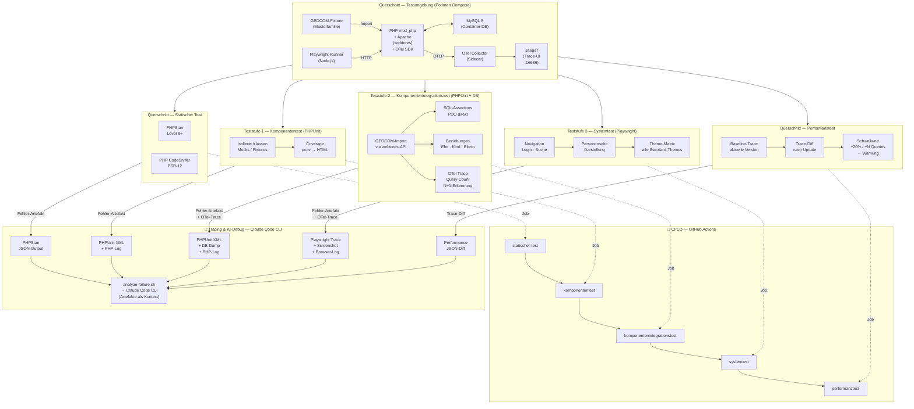

# Prompt: Big Picture — webtrees Teststrategie

Dieser Prompt ist Ausgangsbasis für die Detailplanung. Er fasst alle getroffenen
Entscheidungen zusammen und enthält den eigentlichen Prompt für das Architektur-Bild
sowie ein sofort renderbares Mermaid-Diagramm.

---

## Getroffene Designentscheidungen

| Dimension            | Entscheidung                                                                 |
|----------------------|------------------------------------------------------------------------------|
| **Scope**            | webtrees Core (nicht `sitemirror`/eigene Module) — potenzielle Open-Source-Contribution |
| **Auslöser**         | Vor jedem webtrees-Versions-Update (Regressionsschutz)                       |
| **Laufzeitumgebung** | Podman 5.8.1 + podman-compose 1.5.0 (Fedora-nativ, rootless)                |
| **PHP-Version**      | Nur PHP 8.5 (Latest Stable) — keine Vorgängerversionen, unabhängig von webtrees-Core-Support |
| **CI/CD**            | GitHub Actions (Ambition: Contribution zum webtrees-Projekt)                 |
| **Testdaten**        | GEDCOM-Fixture (Musterfamilie) als reproduzierbarer Import                   |
| **DB-Zugriff**       | Direktes SQL gegen Container-DB (MySQL im selben Compose-Stack)              |
| **Systemtest-Framework** | Playwright, Chromium only, rein funktional                                |
| **Theme-Coverage**   | Alle webtrees-Standard-Themes (funktional, kein Visual Regression)           |
| **Performance**      | Relativer Vergleich: Baseline alte Version vs. neue Version, gleiche Fixtures |
| **Reporting**        | HTML (PHPUnit Coverage HTML + Playwright HTML Reporter)                      |
| **Tracing**          | Strukturierte Fehlerartefakte pro Teststufe (Logs, Traces, DB-Dump) — lokal abrufbar |
| **KI-Debug**         | Claude Code CLI als lokales Analyse-Tool bei Testfehler; Artefakte werden als Kontext übergeben |
| **OpenTelemetry**    | OTel PHP SDK (PDO-Auto-Instrumentation) + OTel Collector Sidecar-Container; Traces für Teststufen 2–3 und Performanztest; Jaeger als lokales UI; versionierter Trace-Vergleich für Performance-Regression |
| **Code Coverage**    | pcov + php-coveralls (wie webtrees Core selbst)                              |
| **Static Analysis**  | PHPStan + PHPCS (wie webtrees Core selbst)                                   |
| **Verzeichnis**      | Eigenständiges Repo (`webtrees-testing-platform`), unabhängig von Deployment-Repo und `smoke-tests/` |
| **Repo-Platzierung** | Eigenständiges Repo (`webtrees-testing-platform`) — für Upstream-Contribution Testcode extrahierbar |
| **RE-Methodik**      | Code-first + Gap-Analyse existierender Tests + GEDCOM-5.5.1-Abgleich         |
| **Prioritäts-Domänen** | GEDCOM Import/Export (23 Testfälle), Suche & Navigation (39 Testfälle)      |
| **Testfall-Format**  | Feature-Matrix: Code-Stelle → Anforderung → Testart → Teststufe → Priorität |
| **Wartbarkeit**      | Höchste Priorität — monatelange Pause darf kein Blocker sein                 |
| **Upstream-Tests**   | Separater Branch in `../webtrees-upstream/webtrees/` — Stubs mit echten Tests füllen, als PR an webtrees Core; zunächst redundant, nach Upstream-Akzeptanz rückbaubar |
| **Terminologie**     | ISTQB-Glossar (de_DE) v4.7.1 durchgängig — Komponententest, Komponentenintegrationstest, Systemtest, Testart |
| **Stufenstruktur**   | 3 Teststufen (Komponenten-, Komponentenintegrations-, Systemtest) + Querschnitte (Testumgebung, Statischer Test, Performanztest, CI/CD, OTel, KI-Debug) |
| **Endekriterien**    | Pro Teststufe definiert; Eingangskriterien implizit durch sequentielle Job-Kette |
| **Testorakel**       | 5 Orakelquellen pro Domäne: `demo.ged`, GEDCOM-5.5.1-Standard, DB-Schema, DOM-Selektoren, Baseline-Traces |
| **Fehlermanagement** | CI-Gate (rot = blockiert); Upstream-Fehlerzustände als Issues bei `fisharebest/webtrees` |
| **Risikomanagement** | Produktrisiken tabellarisch (Wahrscheinlichkeit × Auswirkung), Projektrisiken als Prosa |
| **Testentwurfsverfahren** | Pro Domäne: Äquivalenzklassenbildung, Grenzwertanalyse, Entscheidungstabellentest, Anwendungsfall-Test, erfahrungsbasierter Test |
| **Überdeckung**      | Ratchet — Anweisungsüberdeckung (pcov) darf nur steigen; kein absoluter Zielwert |
| **Testkonventionen** | AAA-Pattern, FIRST-Prinzipien, `test_<feature>_<szenario>_<ergebnis>`, Data Provider ab ≥3 Äquivalenzklassen |
| **Verfolgbarkeit**   | `@see`-Annotation mit Feature-Matrix-IDs in Testdateien; bidirektional per `grep` |

---

## Prompt für das Big-Picture-Bild

> Diesen Prompt in ein AI-Diagramm-Tool (z. B. Eraser.io, Mermaid Live, ChatGPT mit
> Code Interpreter) oder an einen AI-Assistenten eingeben, um das Architektur-Bild
> zu erzeugen.

---

**Prompt:**

```
Erstelle ein technisches Architektur-Diagramm für eine vollständige Teststrategie
des Open-Source-Projekts "webtrees" (PHP-Genealogie-Webapplikation).

Das Diagramm soll als Schichtenmodell (von unten nach oben) aufgebaut sein:

QUERSCHNITT — Testumgebung (Container-Stack)
  - Podman Compose Stack
  - Container: PHP + Apache mod_php (webtrees), MySQL 8, Playwright-Runner (Node.js),
    OpenTelemetry Collector (Sidecar), Jaeger (lokales Trace-UI)
  - Gemeinsames Netzwerk, persistente Volumes für DB und GEDCOM-Fixtures
  - GEDCOM-Testdatei als reproduzierbarer Import-Fixture
  - webtrees PHP-Prozess mit OTel SDK instrumentiert:
      open-telemetry/opentelemetry-auto-pdo (DB-Queries automatisch)
      open-telemetry/opentelemetry-auto-psr18 (HTTP-Calls automatisch)
      OTEL_EXPORTER_OTLP_ENDPOINT zeigt auf OTel Collector im Container-Netz

QUERSCHNITT — Statischer Test (kein Laufzeit-Bedarf)
  - PHPStan (Level 8+): Typfehler, Deprecated-API
  - PHP CodeSniffer: Coding Standard (PSR-12)
  - Trigger: bei jedem Commit / PR

TESTSTUFE 1 — Komponententest (PHPUnit, isoliert)
  - Isolierte PHP-Klassen ohne Datenbankzugriff
  - Fixtures/Mocks für webtrees-Interfaces
  - Coverage-Messung via pcov
  - Reporting: HTML + Codecov-Upload

TESTSTUFE 2 — Komponentenintegrationstest (PHPUnit + echte DB)
  - webtrees vollständig gebootet im Container
  - Datenbank: MySQL im Container (kein SQLite-Workaround)
  - GEDCOM-Fixture wird per webtrees-API importiert
  - Assertions: direkter SQL-Zugriff auf DB (PDO)
  - Testfälle: Person anlegen → DB prüfen, Beziehungen (Ehe, Kind) → DB prüfen
  - OTel: jeder Testlauf erzeugt Span mit Test-ID als Attribut → Trace zeigt
    welche DB-Queries pro Testfall ausgeführt wurden (N+1-Erkennung, Query-Count)

TESTSTUFE 3 — Systemtest (Playwright)
  - Browser: Chromium (headless)
  - Basis-URL: http://webtrees-container
  - Testfälle: Login, Navigation, Personenseite, Beziehungsdarstellung
  - Theme-Matrix: alle Standard-Themes (webtrees, clouds, colors, fab, xenea)
  - Assertions: DOM-Selektor-basiert, kein Screenshot-Vergleich

QUERSCHNITT — Performanztest (Playwright-Metrics + OTel)
  - Definierte Szenarien: Startseite, Personensuche, Stammbaum-Ansicht
  - Baseline: aktuelle webtrees-Version (gespeichertes Profil + exportierte Traces)
  - Vergleich: nach Update — Schwellwert +20% Ladezeit = Warnung
  - Gleiche Container-Hardware, gleiche Datenmenge
  - OTel-Mehrwert gegenüber reiner Laufzeitmessung:
      Baseline-Trace zeigt "Startseite = 3 DB-Queries, davon 1× Full-Table-Scan"
      Regressions-Trace zeigt "+2 Queries durch neues Feature" → Ursache sofort sichtbar
      Trace-Diff wird als Artefakt gespeichert und an analyze-failure.sh übergeben

QUERSCHNITT — CI/CD Pipeline (GitHub Actions)
  - Jobs: statischer-test → komponententest → komponentenintegrationstest → systemtest → performanztest
  - Artefakte: Coverage-HTML, Playwright-Report, Performance-Diff
  - Matrix: PHP 8.5 (Latest Stable)
  - Trigger: push, pull_request, manuell (vor Version-Update)

QUERSCHNITT — OpenTelemetry (Teststufen 2–3 und Performanztest)
  - OTel Collector als Sidecar-Container im Compose-Stack
  - PHP Auto-Instrumentation: PDO-Queries, PSR-18 HTTP-Calls (keine Code-Änderung nötig)
  - Trace-Export: Jaeger lokal (UI: http://localhost:16686), OTLP für CI-Artefakte
  - Traces tragen Test-ID als Span-Attribut → Zuordnung Testfall ↔ Trace
  - Baseline-Traces werden als JSON exportiert und versioniert gespeichert
  - Trace-Diff zwischen webtrees-Versionen ist maschinenlesbar → Eingabe für analyze-failure.sh
  - Für eine webtrees-Contribution: OTel-Integration als optionales Modul konzipieren
    (ENV-Variable OTEL_SDK_DISABLED=true schaltet alles ab → kein Overhead in Produktion)

QUERSCHNITT — Tracing & KI-gestützter Debug (Claude Code CLI)
  - Jede Teststufe schreibt bei Fehler strukturierte Artefakte:
      Statischer Test: PHPStan JSON-Output
      Teststufe 1: PHPUnit XML-Ergebnis + PHP-Fehlerlog aus Container
      Teststufe 2: PHPUnit XML + DB-Dump (mysqldump, nur Testschema) + PHP-Log + OTel-Trace-JSON
      Teststufe 3: Playwright Trace (.zip), Screenshot on failure, Browser-Konsole-Log + OTel-Trace-JSON
      Performanztest: Performance-JSON-Diff (Baseline vs. aktuell) + OTel-Trace-Diff
  - Lokaler Einstiegspunkt: Skript `analyze-failure.sh` sammelt Artefakte des
    letzten fehlgeschlagenen Runs und öffnet Claude Code CLI mit vorgeladenem Kontext
  - Claude Code CLI analysiert: Fehlerursache eingrenzen, nächste Debugging-Schritte
    vorschlagen, ggf. Fix-Kandidaten im webtrees-Quellcode lokalisieren
  - Artefakte werden auch als GitHub-Actions-Upload gespeichert (7-Tage-Retention)
    damit Analyse auch ohne lokalen Container-Rebuild möglich ist

Visuelle Anforderungen:
- Klare vertikale Schichtung, Pfeile zeigen Abhängigkeiten nach oben
- Container-Stack als umrahmte Gruppe links oder unten
- CI/CD als vertikaler Balken rechts (läuft durch alle Schichten)
- Tracing & KI-Debug als zweiter vertikaler Balken links (läuft durch alle Schichten),
  mit Pfeilen von jeder Teststufe nach links ("Artefakte bei Fehler")
- Farben: Testumgebung grau, Statischer Test blau, Teststufe 1 grün, Teststufe 2 orange,
  Teststufe 3 lila, Performanztest rot, CI/CD dunkelblau, Tracing/KI-Debug gelb, OTel türkis
- Deutsch beschriftet
- Stil: technisch, klar, kein Clip-Art
```

---

## Mermaid-Diagramm (sofort renderbar)

In [Mermaid Live Editor](https://mermaid.live) oder VS Code / GitHub direkt rendern.



---

## Getroffene Infrastruktur-Entscheidungen (N1–N7)

> Entschieden am 2026-03-26. Diese Entscheidungen konkretisieren die Designentscheidungen
> oben und bilden die Grundlage für die Implementierung.

---

### N1 — Container-Runtime: Podman + podman-compose

| Aspekt | Entscheidung |
|---|---|
| **Runtime** | Podman 5.8.1 (rootless, Fedora-nativ) |
| **Orchestrierung** | podman-compose 1.5.0 (`/usr/bin/podman-compose`) |
| **Compose-Datei** | `compose.yaml` (nicht `docker-compose.yaml`) |
| **Format** | Standard Compose Specification |

**Begründung:** Podman und podman-compose sind bereits auf dem Entwicklungssystem installiert.
Podman läuft rootless (kein Daemon, keine Root-Rechte), ist auf Fedora das native
Container-Tool und liest das Standard-Compose-Format. Docker ist nicht installiert und
wird nicht benötigt.

**Einschränkung:** podman-compose unterstützt nicht alle `depends_on.condition`-Features.
Stattdessen werden explizite Health-Checks und ein `wait-for-it.sh`-Skript verwendet.

---

### N2 — Verzeichnisstruktur: Eigenständiges Repo `webtrees-testing-platform`

```
webtrees-testing-platform/
├── compose.yaml                    # Podman Compose Stack-Definition
├── Containerfile.webtrees          # PHP 8.5 + Apache mod_php
├── Containerfile.playwright        # Node.js 22 + Playwright + Chromium
├── Makefile                        # make up / down / test-all / test-N / clean
├── .env.example                    # Template: DB-Creds, OTel-Config
├── README.md                       # Deutsch: Strategie + Quickstart
├── CLAUDE.md                       # AI-Kontext: Testaufruf, Layer-Architektur, SELinux
├── docs/
│   └── testing-bigpicture-prompt.md # Dieses Dokument (Teststrategie)
├── scripts/
│   ├── setup-webtrees.sh          # Auto-Installer (config.ini.php, Migration, GEDCOM-Import)
│   ├── analyze-failure.sh         # Artefakt-Sammler → Claude Code CLI
│   ├── export-traces.sh           # OTel-Traces als JSON exportieren
│   └── wait-for-it.sh            # TCP-Port-Readiness-Check (vendored)
├── fixtures/
│   ├── demo.ged                   # webtrees Core (72 Individuen, 29 Familien)
│   └── gedcom-l-muster.ged       # Deutsches Muster (CC BY 4.0, 37 Individuen)
├── layer1-static/
│   └── run.sh                     # PHPStan + PHPCS im Container
├── layer2-unit/
│   ├── run.sh                     # PHPUnit Unit-Suite
│   └── phpunit-unit.xml           # Config (SQLite in-memory wie webtrees Core)
├── layer3-integration/
│   ├── run.sh                     # PHPUnit Integration-Suite
│   ├── phpunit-integration.xml    # Config (MySQL)
│   ├── bootstrap.php              # Autoloader (webtrees + DombrinksBlagen-Namespace)
│   └── tests/                     # 11 Integrationstests (MysqlTestCase + 10 Tests)
│       ├── MysqlTestCase.php
│       ├── AutoCompleteIntegrationTest.php
│       ├── ChartModuleIntegrationTest.php
│       ├── GedcomImportTest.php
│       ├── GedcomServiceIntegrationTest.php
│       ├── ListModuleIntegrationTest.php
│       ├── RelationshipDbTest.php
│       ├── RelationshipServiceIntegrationTest.php
│       ├── RomanNumeralsIntegrationTest.php
│       ├── SearchIntegrationTest.php
│       └── TreeOperationsTest.php
├── layer4-e2e/
│   ├── playwright.config.ts       # baseURL = http://webtrees:80
│   └── tests/
│       ├── login.spec.ts
│       ├── navigation.spec.ts
│       ├── individual.spec.ts
│       └── theme-matrix.spec.ts
├── layer5-performance/
│   ├── playwright.config.ts       # Performance-spezifische Config (timeout 60s, retries 0)
│   ├── run.sh                     # Perf-Messung + Baseline-Vergleich
│   ├── baselines/                 # Versionierte Baseline-JSONs (z.B. 2.2.5.json)
│   └── tests/
│       ├── perf-homepage.spec.ts
│       ├── perf-search.spec.ts
│       └── perf-pedigree.spec.ts
├── otel/
│   └── otel-collector-config.yaml # Collector-Pipeline (OTLP → Jaeger + File)
├── artifacts/                     # gitignored — Laufzeit-Artefakte
│   ├── layer1/ … layer5/
└── .github/workflows/
    └── webtrees-tests.yaml        # GitHub Actions Workflow (Entwurf)
```

**Begründung:** `webtrees-testing-platform` ist ein eigenständiges Repo, unabhängig vom
Deployment-Repo und `smoke-tests/` (Live-Site-Tests). Die webtrees-Source aus
`../webtrees-upstream/webtrees/` wird per read-only Bind-Mount in den Container
eingebunden — kein Code wird kopiert oder modifiziert.

`artifacts/` wird in `.gitignore` eingetragen. `layer5-performance/baselines/` ist absichtlich
versioniert — das ist der Kern des Baseline-Vergleichs.

---

### N3 — GEDCOM-Fixture: `demo.ged` (primär) + deutsches Muster (sekundär)

| Fixture | Quelle | Umfang | Zweck |
|---|---|---|---|
| `demo.ged` | `../webtrees-upstream/webtrees/tests/data/demo.ged` | 72 Individuen, 29 Familien (brit. Königshaus) | Primär-Fixture für alle Schichten |
| `gedcom-l-muster.ged` | `github/gedcom_muster/muster_GEDCOM_UTF-8.ged` | 37 Individuen, 18 Familien | i18n / Deutsch-Testing |

**Begründung:** `demo.ged` ist die kanonische Testdatei von webtrees selbst (verwendet in
`ImportGedcomTest`). Sie deckt Mehrgenerationen-Beziehungen, mehrere Ehen, Medien-Referenzen
und Quellen ab. Das deutsche Muster (CC BY 4.0, Verein für Computergenealogie) ergänzt
für Lokalisierungstests.

**Setup:** Beide Dateien werden als Kopie in `fixtures/` abgelegt. Das
`setup-webtrees.sh`-Skript importiert sie beim Container-Start als zwei separate Bäume
(`demo` und `muster`).

---

### N4 — Implementierungsreihenfolge: Bottom-up, Testumgebung → Teststufe 3

| Phase | Stufe / Querschnitt | Kern-Deliverable |
|---|---|---|
| 1 | Querschnitt — Testumgebung | `compose.yaml`, Containerfiles, `setup-webtrees.sh`, `Makefile` |
| 2 | Querschnitt — Statischer Test | `layer1-static/run.sh` (PHPStan + PHPCS im Container) |
| 3 | Teststufe 1 — Komponententest | `phpunit-unit.xml`, SQLite in-memory (wie webtrees Core) |
| 4 | Teststufe 2 — Komponentenintegrationstest | `MysqlTestCase.php`, neue Tests (GEDCOM-Import, Beziehungen, Bäume) |
| 5 | Teststufe 3 — Systemtest | `Containerfile.playwright`, Playwright-Tests (Login, Navigation, Themes) |
| 6 | Querschnitt — Performanztest | Playwright-Metrics, Baseline-JSONs, Vergleichsskript |
| 7 | Querschnitt — CI/CD, OTel, KI-Debug | `analyze-failure.sh`, OTel-Stack, GitHub Actions Workflow |

**Begründung:** Jede höhere Teststufe hängt von der Testumgebung (Container-Stack) ab.
Teststufe 1 nutzt SQLite in-memory wie webtrees Core selbst — das validiert die
Container-Umgebung ohne MySQL-Abhängigkeit. MySQL-spezifische Tests kommen erst in
Teststufe 2 mit einer eigenen `MysqlTestCase`-Basis-Klasse.

---

### N5 — `analyze-failure.sh`: Artefakt-Sammler → Claude Code CLI

**Aufruf:**
```bash
./scripts/analyze-failure.sh        # Alle Teststufen
./scripts/analyze-failure.sh 2      # Nur Teststufe 2
```

**Funktionsweise:**
1. Sammelt Artefakte aus `artifacts/` je nach Teststufe:
   - Statischer Test: PHPStan JSON, PHPCS JSON
   - Teststufe 1: PHPUnit XML + PHP-Fehlerlog (via `podman logs`)
   - Teststufe 2: PHPUnit XML + DB-Dump (`mysqldump`, nur Testschema) + PHP-Log + OTel-Trace-JSON
   - Teststufe 3: Playwright Trace (.zip) + Screenshots + Browser-Konsole-Log + OTel-Trace-JSON
   - Performanztest: Performance-JSON-Diff (Baseline vs. aktuell) + OTel-Trace-Diff
2. Formatiert alles als Markdown-Kontext-Dokument
3. Startet Claude Code CLI mit vorgeladenem Kontext

**In GitHub Actions:** Artefakte werden zusätzlich via `actions/upload-artifact` hochgeladen
(7 Tage Retention), damit Analyse auch ohne lokalen Container-Rebuild möglich ist.

---

### N6 — OTel-Integration: Nur Auto-Instrumentation, kein Core-Change

| Aspekt | Entscheidung |
|---|---|
| **Tiefe** | Nur Auto-Instrumentation (PDO + PSR-18), keine manuellen Spans |
| **Installation** | `composer require --dev` in `setup-webtrees.sh` (vendor-Volume, nicht Image-Layer) — kein webtrees-Core-Change. PHP-Extensions (`grpc`, `protobuf`) im Containerfile. Implementiert in Phase 7a. |
| **Aktivierung** | ENV-Variablen in `compose.yaml` |
| **Deaktivierung** | `OTEL_SDK_DISABLED=true` → Zero Overhead |
| **Export lokal** | Jaeger UI (http://localhost:16686) |
| **Export CI** | File-Exporter → JSON-Artefakt |
| **Upstream-Konzept** | OTel als optionales Dev-Feature vorschlagen |

**Composer-Pakete (implementiert — Phase 7a):**

- `open-telemetry/sdk`
- `open-telemetry/exporter-otlp`
- `open-telemetry/opentelemetry-auto-pdo`
- `open-telemetry/opentelemetry-auto-psr18`

Installation: bedingt in `setup-webtrees.sh` (nur wenn `OTEL_SDK_DISABLED != true`).
PHP-Extensions `protobuf` + `grpc` im `Containerfile.webtrees` (via `pecl install`).

**ENV-Variablen (in compose.yaml):**
```yaml
OTEL_PHP_AUTOLOAD_ENABLED: "true"
OTEL_SERVICE_NAME: "webtrees"
OTEL_EXPORTER_OTLP_ENDPOINT: "http://otel-collector:4317"
OTEL_EXPORTER_OTLP_PROTOCOL: "grpc"
OTEL_SDK_DISABLED: "false"
OTEL_TRACES_EXPORTER: "otlp"
OTEL_METRICS_EXPORTER: "none"
OTEL_LOGS_EXPORTER: "none"
```

**OTel Collector Config (`otel/otel-collector-config.yaml`):**
```yaml
receivers:
  otlp:
    protocols:
      grpc:
        endpoint: 0.0.0.0:4317
exporters:
  otlp/jaeger:
    endpoint: jaeger:4317
    tls:
      insecure: true
  file:
    path: /artifacts/traces.json
service:
  pipelines:
    traces:
      receivers: [otlp]
      exporters: [otlp/jaeger, file]
```

**Begründung:** Auto-Instrumentation fängt alle PDO-Queries und PSR-18-HTTP-Calls automatisch
ab — ohne eine Zeile webtrees-Code zu ändern. Das liefert Visibility für Teststufe 2–3 und Performanztest
(Query-Count, N+1-Erkennung, Trace-Diff). Manuelle Spans (z.B. "diese Query gehört zum
Stammbaum-Rendering") wären wertvoller, erfordern aber Core-Änderungen und werden erst bei
einer Upstream-Contribution relevant.

---

### N7 — GitHub Actions Workflow

| Aspekt | Entscheidung |
|---|---|
| **Datei** | `.github/workflows/webtrees-tests.yaml` |
| **Trigger** | `push` + `pull_request`, `workflow_dispatch` |
| **Matrix** | PHP 8.5 (Latest Stable, keine Vorgängerversionen) |
| **Runner** | `ubuntu-latest` (Podman vorinstalliert) |
| **Job-Kette** | `testumgebung` → `statischer-test` → `komponententest` → `komponentenintegrationstest` → `systemtest` → `performanztest` |
| **Artefakte** | Coverage-HTML, Playwright-Report, Performance-Diff, OTel-Traces (7 Tage Retention) |

**Setup-Schritt (in jedem Job):**
```yaml
- name: Install podman-compose
  run: pip install podman-compose
```

**`workflow_dispatch` Input (für manuelles Testen vor Version-Update):**
```yaml
inputs:
  webtrees_ref:
    description: 'webtrees git ref to test (branch, tag, commit)'
    default: 'main'
```

**Begründung:** Die Job-Kette spiegelt die Stufenhierarchie wider — bei einem Fehler in einer
niedrigeren Teststufe brechen die höheren ab. Die PHP-Matrix testet ausschließlich mit PHP 8.5
(Latest Stable) — Vorgängerversionen werden bewusst nicht getestet, unabhängig davon welche
Versionen webtrees Core offiziell unterstützt. `workflow_dispatch` erlaubt manuelles Testen
eines spezifischen webtrees-Refs vor einem Versions-Update.

---

## Container-Stack-Spezifikation

### 6 Container, 1 Netzwerk

| Container | Image | Zweck | Host-Port | Volume-Mounts |
|---|---|---|---|---|
| `webtrees` | `Containerfile.webtrees` | PHP 8.5 + Apache mod_php + webtrees | 8080:80 | `../webtrees-upstream/webtrees/` → `/var/www/html` (ro), Named Vol → `/var/www/html/data/` (rw), `fixtures/` → `/fixtures` (ro) |
| `mysql` | `docker.io/library/mysql:8.0` | Datenbank | 3306:3306 | Named Vol → `/var/lib/mysql` |
| `playwright` | `Containerfile.playwright` | Node.js 22 + Chromium (headless) | — | `layer4-e2e/` + `layer5-performance/` → `/tests` (ro), `artifacts/` → `/artifacts` (rw) |
| `otel-collector` | `docker.io/otel/opentelemetry-collector-contrib` | OTel Sidecar (OTLP gRPC) | 4317:4317 | `otel/otel-collector-config.yaml` → `/etc/otelcol/config.yaml` (ro), `artifacts/` → `/artifacts` (rw) |
| `jaeger` | `docker.io/jaegertracing/all-in-one` | Trace-Visualisierung | 16686:16686 | — |
| `adminer` | `docker.io/library/adminer` | DB-Admin (optional, nur Debug) | 8081:8080 | — |

### Netzwerk-Topologie

```
webtrees-test-net (Bridge)
├── webtrees  ←→  mysql        (PDO, Port 3306)
├── webtrees  →   otel-collector (OTLP gRPC, Port 4317)
├── otel-collector → jaeger    (OTLP, Port 4317)
├── playwright →  webtrees     (HTTP, Port 80)
└── adminer   →   mysql        (Port 3306)
```

### MySQL-Konfiguration

```yaml
environment:
  MYSQL_ROOT_PASSWORD: webtrees_test
  MYSQL_DATABASE: webtrees_test
  MYSQL_USER: webtrees
  MYSQL_PASSWORD: webtrees_test
command: >
  --character-set-server=utf8mb4
  --collation-server=utf8mb4_bin
```

Collation `utf8mb4_bin` entspricht `DB::COLLATION_UTF8[DB::MYSQL]` in webtrees Core.

### setup-webtrees.sh — Automatischer Installer

1. `composer install` im Container (Dependencies in gemountetes Volume)
2. `data/config.ini.php` generieren (MySQL-Credentials des Containers)
3. DB-Migration via `MigrationService::updateSchema()`
4. GEDCOM-Import: `demo.ged` → Baum `demo`, `gedcom-l-muster.ged` → Baum `muster`
5. Test-Admin-User anlegen (`admin` / `admin`)

Der Setup-Wizard wird vollständig umgangen (programmatischer Install).

---

## Fachliche Anforderungen — Reverse-Engineering-Methodik

> Die fachlichen Anforderungen werden nicht aus einer Spezifikation abgeleitet (es gibt keine),
> sondern systematisch aus dem Code reverse-engineered. Ergänzende Quellen: existierende
> Tests (Gap-Analyse) und der GEDCOM 5.5.1-Standard (Compliance-Abgleich).

---

### RE-Methodik: 4 Schritte

**Schritt 1 — Code-Topologie erfassen (Feature-Discovery)**

Jedes Feature wird als Call-Chain identifiziert:

```
Route (WebRoutes.php)
  → RequestHandler (Http/RequestHandlers/)
    → Service (Services/)
      → DB / GedcomRecord / Elements
```

Die **öffentlichen Methoden der Service-Klassen** sind die fachlichen Fähigkeiten.
Jede public Method = mindestens ein Testfall. Private Methoden werden indirekt über
die public API getestet.

**Schritt 2 — Gap-Analyse der existierenden Tests**

Nicht die Dateianzahl zählt, sondern die **Assertionsdichte**:
- **Stub-Test** (`testClass()` / 1 Assertion "Klasse existiert") = **ungetestet**
- **Trivialer Test** (2–3 Assertions, keine fachliche Logik) = **minimal getestet**
- **Substanzieller Test** (fachliche Assertions, Fixtures, Datenprüfung) = **getestet**

Ein Code-Analyse-Skript kann diese Klassifizierung automatisieren:
`grep -c 'assert' tests/app/Services/*Test.php` zeigt die Assertionsdichte pro Datei.

**Schritt 3 — GEDCOM-Standard-Abgleich (Domäne Import/Export)**

| Prüfpunkt | Quelle | Methode |
|---|---|---|
| Unterstützte Tags | `app/Elements/` (216 Klassen) vs. GEDCOM 5.5.1 Tag-Liste | Diff |
| Encoding-Varianten | `GedcomEncodingFilter` | Code-Lesen |
| Custom-Tags (Ancestry, FamilySearch, etc.) | `app/Gedcom.php` (13 Custom-Tag-Klassen) | Code-Lesen |
| Zeilenlänge, CONC/CONT | `GedcomExportService::wrapLongLines()` | Unit-Test |
| Date-Formate | `app/Date/` Klassen | Vergleich mit GEDCOM-Spec |

**Schritt 4 — Feature-Matrix aufbauen**

Für jede Prioritäts-Domäne: tabellarische Zuordnung
Code-Stelle → abgeleitete Anforderung → Testart → Priorität → Teststufe.

---

### Befund: Gap-Analyse der existierenden webtrees-Tests

> Stand: webtrees 2.2.6-dev. Analyse vom 2026-03-26.

**Gesamtbild:**
- 1233 Testdateien in `tests/app/`, 5 in `tests/feature/`
- **~95% sind Stub-Tests** (nur `testClass()` — verifiziert, dass die PHP-Klasse existiert)
- **~4% sind triviale Tests** (wenige Assertions, keine fachliche Tiefe)
- **~1% sind substanzielle Tests** (echte fachliche Assertions mit Datenprüfung)

#### Domäne: GEDCOM Import/Export

| Komponente | Public Methods | Test-Status | Assertions |
|---|---|---|---|
| `GedcomImportService` | 3 (`importRecord`, `updatePlaces`, `updateRecord`) | Stub | 1 (`testClass`) |
| `GedcomExportService` | 5 (`downloadResponse`, `export`, `createHeader`, `wrapLongLines`, Konstruktor) | Stub | 1 (`testClass`) |
| `ImportGedcomAction` (Handler) | 1 | Stub | 1 |
| `ImportGedcomPage` (Handler) | 1 | Stub | 1 |
| `ExportGedcomClient` (Handler) | 1 | Stub | 1 |
| `ExportGedcomServer` (Handler) | 1 | Stub | 1 |
| `GedcomEncodingFilter` | — | Substanziell | Encoding-Tests vorhanden |
| `ImportGedcomTest` (Feature) | — | Minimal | 1 Test: `demo.ged` importieren (keine Ergebnisprüfung) |
| Element-Klassen | 216 | 212 Tests | Meist Pattern-Validierung (gut) |

**Ungetestete Kernlogik (Import):**
- Record-Import mit Typ-Erkennung (INDI, FAM, SOUR, …)
- Place-Hierarchie-Aufbau beim Import
- Date-Parsing und Index-Aktualisierung
- Name-Extraktion und Soundex-Generierung
- Inline-Media-Konvertierung
- Legacy-Format-Konvertierung (TNG, PLAC_DEFN)

**Ungetestete Kernlogik (Export):**
- 4 Export-Formate: GEDCOM, ZIP, ZIP+Media, GEDZIP
- Privacy-Filterung nach Access-Level (PRIV_NONE, PRIV_USER, PRIV_PRIVATE, PRIV_HIDE)
- Encoding-Konvertierung (UTF-8 → ANSEL, Windows-1252, etc.)
- Zeilenumbrüche (CRLF/LF) und CONC/CONT-Wrapping
- Header-Generierung mit Metadaten
- Media-Datei-Einbettung in ZIP-Export

#### Domäne: Suche und Navigation

| Komponente | Public Methods | Test-Status | Assertions |
|---|---|---|---|
| `SearchService` | 20 Suchmethoden | Minimal | 1 Testmethode, prüft nur "Collection nicht leer" |
| `SearchGeneralPage` (Handler) | 1 | Stub | 1 |
| `SearchAdvancedPage` (Handler) | 1 | Stub | 1 |
| `SearchPhoneticPage` (Handler) | 1 | Stub | 1 |
| `SearchQuickAction` (Handler) | 1 | Stub | 1 |
| `SearchReplacePage` (Handler) | 1 | Stub | 1 |
| 13 Chart-Module | je 1–3 | Stub | je 1 (`testClass`) |
| 10 List-Module | je 1–3 | Stub | je 1 (`testClass`) |
| `IndividualListTest` (Feature) | — | **Substanziell** | 7 Testmethoden, ~50 Assertions (Collation, Initialen, Nachnamen) |
| 16 AutoComplete/TomSelect | je 1 | Stub | je 1 |

**Ungetestete Kernlogik (Suche):**
- Allgemeine Suche: Query-Parsing (Anführungszeichen, CJK-Splitting, Leerzeichen)
- Suche über 6 Record-Typen (Individuals, Families, Sources, Notes, Repositories, Locations)
- Erweiterte Suche: 75 GEDCOM-Felder mit Datum-Modifikatoren (±0 bis ±20 Jahre)
- Phonetische Suche: Russell-Soundex und Daitch-Mokotoff-Soundex
- Paginierung, Offset, Limit
- Cross-Tree-Suche (über mehrere Stammbäume)
- Zugriffskontrolle auf Suchergebnisse
- Search-and-Replace (Bulk-Editor, erfordert Edit-Recht)

**Ungetestete Kernlogik (Navigation):**
- 13 Chart-Typen: kein einziger Rendering-Test
- Chart-Parameter und -Optionen (Generationstiefe, Layout, etc.)
- 10 List-Module: nur IndividualList substanziell getestet
- Sortierung und Collation (locale-spezifisch)
- AutoComplete/TomSelect-AJAX-Endpoints (16 Stück)

---

### Feature-Matrix: GEDCOM Import/Export

> Abgeleitet aus Code-Analyse von `GedcomImportService`, `GedcomExportService`,
> `GedcomEncodingFilter`, `Elements/`, Request-Handlern und dem GEDCOM 5.5.1-Standard.
>
> Teststufen: 1 = Komponententest, 2 = Komponentenintegrationstest, 3 = Systemtest

| # | Feature | Abgeleitete Anforderung | Teststufe | Prio |
|---|---|---|---|---|
| G01 | Record-Import (INDI) | Individuum importieren → korrekte DB-Einträge (name, date, place) | 2 | Hoch |
| G02 | Record-Import (FAM) | Familie importieren → Beziehungen korrekt verknüpft (HUSB, WIFE, CHIL) | 2 | Hoch |
| G03 | Record-Import (SOUR, NOTE, REPO, OBJE) | Nebenrecords importieren → DB-Einträge korrekt | 2 | Mittel |
| G04 | Place-Hierarchie | Import mit PLAC-Tags → Orts-Hierarchie in `place_location` aufgebaut | 2 | Hoch |
| G05 | Date-Parsing | GEDCOM-Datumsformate (exakt, Bereich, vor/nach, ca.) → korrekte date1/date2-Felder | 1 | Hoch |
| G06 | Name-Extraktion | NAME-Tags → Vorname, Nachname, Suffix korrekt gesplittet + Soundex generiert | 1 | Hoch |
| G07 | Encoding (UTF-8) | UTF-8-GEDCOM importieren → keine Zeichenverluste | 2 | Hoch |
| G08 | Encoding (ANSEL, CP1252) | Nicht-UTF-8-GEDCOM importieren → korrekte Konvertierung | 2 | Mittel |
| G09 | Inline-Media | Eingebettete OBJE-Records → separate Media-Objekte erzeugt | 2 | Mittel |
| G10 | Legacy-Formate | TNG-PLAC, _PLAC_DEFN → korrekt konvertiert | 2 | Niedrig |
| G11 | Custom-Tags | Ancestry/FamilySearch/RootsMagic-Tags → erkannt und nicht verworfen | 1 | Mittel |
| G12 | XREF-Vergabe | Neue Records erhalten eindeutige XREFs, keine Kollisionen | 2 | Hoch |
| G13 | Export GEDCOM | Baum exportieren → valide GEDCOM-Datei, importierbar | 2 | Hoch |
| G14 | Export ZIP | Export als ZIP → Datei enthält .ged + korrekte Struktur | 2 | Mittel |
| G15 | Export ZIP+Media | Export mit Mediendateien → Dateien im Archiv vorhanden | 2 | Mittel |
| G16 | Export Privacy | Export mit Access-Level → geschützte Records ausgeblendet/anonymisiert | 2 | Hoch |
| G17 | Export Encoding | Export mit gewähltem Encoding (UTF-8, ANSEL) → korrekte Ausgabe | 1 | Mittel |
| G18 | Export CONC/CONT | Lange Zeilen → korrekt in CONC/CONT aufgeteilt (max. 253 Zeichen) | 1 | Mittel |
| G19 | Export Header | HEAD-Record enthält korrekte Metadaten (Source, Date, GEDC Version) | 1 | Mittel |
| G20 | Import → Export Roundtrip | demo.ged importieren → exportieren → Diff minimal (nur Metadaten) | 3 | Hoch |
| G21 | Upload-Validierung | Ungültige Datei (kein GEDCOM) → Fehlermeldung, kein Import | 3 | Mittel |
| G22 | Element-Validierung | 216 Element-Klassen → Tag-Patterns und erlaubte Kinder korrekt | 1 | Mittel |
| G23 | GEDCOM 5.5.1 Compliance | Unterstützte Tags vs. Standard-Tag-Liste → Abweichungen dokumentiert | 1 | Niedrig |

---

### Feature-Matrix: Suche und Navigation

> Abgeleitet aus Code-Analyse von `SearchService` (20 public Methods),
> 9 Search-Handlern, 13 Chart-Modulen, 10 List-Modulen, 16 AutoComplete-Handlern.
>
> Teststufen: 1 = Komponententest, 2 = Komponentenintegrationstest, 3 = Systemtest

| # | Feature | Abgeleitete Anforderung | Teststufe | Prio |
|---|---|---|---|---|
| S01 | Allgemeine Suche (Personen) | Suchbegriff → passende Individuen zurückgegeben | 2 | Hoch |
| S02 | Allgemeine Suche (Familien) | Suchbegriff → passende Familien zurückgegeben | 2 | Hoch |
| S03 | Allgemeine Suche (Quellen, Notizen, Repos) | Suchbegriff → passende Records je Typ | 2 | Mittel |
| S04 | Query-Parsing | Anführungszeichen, Mehrwort-Suche, CJK-Splitting korrekt | 1 | Hoch |
| S05 | Erweiterte Suche (Felder) | 75 GEDCOM-Felder → Feld-spezifische Filterung | 2 | Hoch |
| S06 | Erweiterte Suche (Datum-Modifikatoren) | Geburtsdatum ±5 Jahre → korrekte Eingrenzung | 2 | Hoch |
| S07 | Phonetische Suche (Russell) | Russell-Soundex → ähnlich klingende Namen gefunden | 2 | Mittel |
| S08 | Phonetische Suche (Daitch-Mokotoff) | DM-Soundex → osteuropäische Namensvarianten gefunden | 2 | Mittel |
| S09 | Quick-Search (XREF) | "I123" eingeben → direkt zum Record weitergeleitet | 3 | Mittel |
| S10 | Paginierung | Suche mit >50 Ergebnissen → Offset/Limit korrekt | 2 | Mittel |
| S11 | Cross-Tree-Suche | Suche über 2+ Bäume → Ergebnisse aus allen Bäumen | 2 | Mittel |
| S12 | Zugriffskontrolle (Suche) | Eingeschränkte Records → nicht in Suchergebnissen für Visitor | 2 | Hoch |
| S13 | Search-and-Replace | Bulk-Ersetzung in GEDCOM → nur bei Edit-Recht möglich | 3 | Mittel |
| S14 | Chart: Stammbaum (Pedigree) | Person mit 3+ Generationen → Chart rendert korrekt | 3 | Hoch |
| S15 | Chart: Nachkommen | Person mit Kindern/Enkeln → Descendancy-Chart korrekt | 3 | Mittel |
| S16 | Chart: Beziehungsfinder | 2 Personen → Verwandtschaftspfad gefunden und dargestellt | 3 | Hoch |
| S17 | Chart: Fächerchart (Fan) | Person → Kreisförmige Ahnentafel gerendert | 3 | Niedrig |
| S18 | Chart: alle 13 Typen | Jeder Chart-Typ → rendert ohne Fehler (Smoke) | 3 | Mittel |
| S19 | Liste: Personen (Nachnamen) | Nachnamen-Initialen → korrekte Filterung, Collation | 2 | Hoch |
| S20 | Liste: alle 10 Typen | Jeder List-Typ → rendert ohne Fehler, zeigt Einträge | 3 | Mittel |
| S21 | AutoComplete (Personen) | Tipp-Vorschläge → passende Individuen per AJAX | 2 | Mittel |
| S22 | AutoComplete (Orte) | Ort eintippen → Ortsvorschläge korrekt | 2 | Mittel |
| S23 | Navigation: Personenseite | XREF aufrufen → Fakten, Familien, Events korrekt dargestellt | 3 | Hoch |
| S24 | Navigation: Familienseite | Familien-XREF → Ehepartner, Kinder, Events korrekt | 3 | Hoch |
| S25 | Theme-Matrix (Navigation) | Jedes der 5 Standard-Themes → alle Seiten rendern fehlerfrei | 3 | Mittel |
| S26 | Navigation: Quellenseite | Quellen-XREF aufrufen → Titel, Zitate, verknüpfte Records dargestellt | 3 | Hoch |
| S27 | Navigation: Medienseite | Medien-XREF aufrufen → Bild/Datei-Info, verknüpfte Records dargestellt | 3 | Mittel |
| S28 | Navigation: Notizseite | Notiz-XREF aufrufen → Notiztext dargestellt | 3 | Mittel |
| S29 | Navigation: Aufbewahrungsort-Seite | Repository-XREF aufrufen → Name, Adresse, verknüpfte Quellen | 3 | Mittel |
| S30 | Navigation: Einreicherseite | Submitter-XREF aufrufen → Name dargestellt | 3 | Niedrig |
| S31 | Kalenderansicht | Kalender (Monats-/Jahresansicht) aufrufen → rendert, Events sichtbar | 3 | Hoch |
| S32 | Anmeldeseite (Login) | /login aufrufen → Formular sichtbar, Login/Fehler funktional | 3 | Hoch |
| S33 | Registrierungsseite | /register aufrufen → Formular sichtbar, keine HTTP-Fehler | 3 | Mittel |
| S34 | Passwort-Zurücksetzung | /password-request aufrufen → Formular sichtbar | 3 | Mittel |
| S35 | Benutzerseite (Meine Seite) | /my-page aufrufen → Benutzer-Blöcke gerendert, keine HTTP-Fehler | 3 | Hoch |
| S36 | Kontaktseite | /contact aufrufen → Kontaktformular sichtbar | 3 | Mittel |
| S37 | Berichtsliste | /report aufrufen → verfügbare Berichte gelistet | 3 | Mittel |
| S38 | Erweiterte Suche (Seitenaufruf) | /search-advanced aufrufen → Formular mit Feldfiltern sichtbar | 3 | Hoch |
| S39 | Phonetische Suche (Seitenaufruf) | /search-phonetic aufrufen → Formular sichtbar | 3 | Mittel |

> **E2E-Gap-Analyse (2026-03-27):** Abgleich der vorhandenen Playwright-Specs (`layer4-e2e/tests/`)
> mit den 170 GET-Routen in `WebRoutes.php` (webtrees Upstream). Von ~47 für eingeloggte
> Nicht-Admin-Nutzer erreichbaren Seiten-Routen werden 8 URLs in den bestehenden Specs
> abgedeckt. S26–S39 schließen die wichtigsten Lücken. Nicht aufgenommen: Editor-Formulare
> (Add/Edit-Seiten, erfordern Schreibrechte), Admin-Panel-Seiten, AJAX-Endpoints (TomSelect),
> Asset-Routen. Korrektur: S24 (Familienseite) war fehlzugeordnet — `navigation.spec.ts`
> testet `/tree/demo/family-list` (→ S20), nicht `/tree/demo/family/{xref}`.

---

### Testfall-Verteilung nach Teststufe

| Teststufe | GEDCOM (G01–G23) | Suche/Nav (S01–S39) | Gesamt |
|---|---|---|---|
| Teststufe 1 — Komponententest | G05, G06, G11, G17, G18, G19, G22, G23 (8) | S04 (1) | **9** |
| Teststufe 2 — Komponentenintegrationstest | G01–G04, G07–G10, G12–G16 (13) | S01–S03, S05–S08, S10–S12, S19, S21, S22 (13) | **26** |
| Teststufe 3 — Systemtest | G20, G21 (2) | S09, S13–S18, S20, S23–S39 (25) | **27** |
| **Summe** | **23** | **39** | **62** |

### Prioritätsverteilung

| Priorität | Anzahl | Anteil |
|---|---|---|
| Hoch | 26 | 42% |
| Mittel | 32 | 52% |
| Niedrig | 4 | 6% |

---

### Entscheidung: Reverse-Engineering-Quellen

| Quelle | Einsatz | Methode |
|---|---|---|
| **Code-first** | Primär — alle Anforderungen werden aus dem Code abgeleitet | Service-API → Feature, Route → Handler → Testbedingung |
| **Gap-Analyse existierende Tests** | Priorisierung — Stub-Tests = ungetestet = hohe Prio | Assertionsdichte messen, Stubs identifizieren |
| **GEDCOM 5.5.1 Standard** | Compliance — Tag-Abdeckung, Encoding, Date-Formate | Element-Klassen vs. Standard-Tags abgleichen |

Die Domänen **Beziehungsberechnung** und **Privacy/Zugriffskontrolle** sind bewusst als
niedrigere Priorität eingestuft, können aber in einer späteren Phase ergänzt werden.

---

## Endekriterien pro Teststufe

> Eingangskriterien sind implizit durch die sequentielle Job-Kette definiert:
> Jede Stufe startet nur, wenn alle vorgelagerten Stufen erfolgreich waren.

| Teststufe / Querschnitt | Endekriterien |
|---|---|
| Statischer Test | PHPStan Level 8: 0 Errors; PHPCS PSR-12: 0 Violations |
| Teststufe 1 — Komponententest | Alle Feature-Matrix-Komponententests grün (G05, G06, G11, G17–G19, G22, G23, S04); Anweisungsüberdeckung ≥ vorheriger Wert (Ratchet) |
| Teststufe 2 — Komponentenintegrationstest | Alle Feature-Matrix-Integrationstests grün (G01–G04, G07–G10, G12–G16, S01–S03, S05–S08, S10–S12, S19, S21, S22) |
| Teststufe 3 — Systemtest | Alle 5 Standard-Themes rendern fehlerfrei; alle E2E-Testfälle grün (G20, G21, S09, S13–S18, S20, S23–S39) |
| Performanztest | Kein Szenario >20% über Baseline; kein Szenario mit >+2 DB-Queries gegenüber Baseline |

---

## Testorakel — Orakelquellen pro Domäne

> Ein **Testorakel** (ISTQB) ist die Informationsquelle zur Ermittlung erwarteter Ergebnisse.
> Konkrete erwartete Werte werden im Testcode definiert, nicht in diesem Dokument.

| Orakel | Gilt für Feature-Matrix-IDs | Methode |
|---|---|---|
| `demo.ged` (bekannte Inhalte: 72 Individuen, 29 Familien) | G01–G04, G07–G12, S01–S03, S19 | DB-Count, Feldwerte prüfen, Beziehungsstruktur verifizieren |
| GEDCOM 5.5.1-Standard (Kapitel 2–4) | G05, G17–G19, G22, G23 | Spec-Abgleich: Tag-Liste, Datumsformate, Encoding-Regeln, CONC/CONT |
| webtrees-DB-Schema (`DB::MYSQL` Constraints) | G12, G13, S10 | XREF-Eindeutigkeit, Fremdschlüssel, Collation-Verhalten |
| Erwartetes DOM (Playwright-Selektoren) | S09, S13–S18, S20, S23–S39 | Element-Existenz, Struktur, Textinhalt; kein Screenshot-Vergleich |
| Vorversion (Baseline-Traces) | Performanztest | Trace-Diff: Ladezeit ≤+20%, Query-Count ≤+2 |

---

## Testentwurfsverfahren pro Domäne

> ISTQB-Testentwurfsverfahren (Testverfahren) beschreiben, **wie** Testbedingungen und
> Testfälle systematisch abgeleitet werden. Zuordnung pro Domäne, nicht pro Einzeleintrag.

| Verfahren (ISTQB) | Domäne / Feature-Matrix-IDs | Begründung |
|---|---|---|
| **Äquivalenzklassenbildung** | G05, G08, G17, S04, S07–S08 | Eingaben mit klar abgrenzbaren Klassen: 5 GEDCOM-Datumstypen, 4 Encoding-Varianten, Suchsyntax-Varianten, 2 Soundex-Algorithmen |
| **Grenzwertanalyse** | G18, S06, S10 | Numerische Grenzen: Zeilenlänge exakt 253/254 Zeichen (CONC/CONT), Datumstoleranz ±0/±1/±20 Jahre, Paginierung 0/1/50/51 Ergebnisse |
| **Entscheidungstabellentest** | G16, S12 | Kombinatorik: 4 Access-Levels × 6 Record-Typen = 24 Privacy-Kombinationen; Rolle × Record-Sichtbarkeit |
| **Anwendungsfall-Test** | G20, G21, S09, S13–S18, S23–S39 | Systemtest-Szenarien mit Nutzerinteraktion: Import-Export-Roundtrip, Chart-Rendering, Seitennavigation, Record-Seiten, Auth-Formulare, Kalender |
| **Erfahrungsbasierter Test** | G10, G11, S17 | Keine formale Spezifikation verfügbar: Legacy-Formate (TNG), Custom-Tags (Ancestry, FamilySearch), Nischen-Charts |

---

## Produktrisiken und Projektrisiken

### Produktrisiken

> Leiten die Priorisierung der Feature-Matrix her (ISTQB: **risikobasiertes Testen**).

| Risiko-ID | Risiko | Wahrscheinlichkeit | Auswirkung | Maßnahme (Feature-Matrix-IDs) |
|---|---|---|---|---|
| R1 | GEDCOM-Import verliert Daten (Records, Beziehungen, Orte) | Mittel | Kritisch | G01–G04, G07–G09 (alle Hoch) |
| R2 | Privacy-Leak beim Export (geschützte Records sichtbar) | Niedrig | Kritisch | G16 (Hoch) |
| R3 | Suche liefert falsche/unvollständige Ergebnisse | Mittel | Hoch | S01–S02, S04, S12 (alle Hoch) |
| R4 | Import-Export-Roundtrip nicht verlustfrei | Mittel | Hoch | G20 (Hoch) |
| R5 | Charts rendern fehlerhaft nach Update | Mittel | Mittel | S14, S16, S18 (Hoch/Mittel) |
| R6 | Encoding-Konvertierung fehlerhaft (Zeichenverlust) | Niedrig | Hoch | G07, G08, G17 (Hoch/Mittel) |
| R7 | Performance-Regression nach webtrees-Update | Mittel | Mittel | Performanztest mit Baseline-Vergleich |

### Projektrisiken

- **Upstream lehnt PR ab:** Saubere Commit-Historie, webtrees-Coding-Standards (PSR-12, PHPStan Level 2), kleine fokussierte PRs pro Domäne minimieren das Risiko. Fallback: Tests bleiben im eigenen Repo nutzbar.
- **Container-Stack funktioniert nicht auf GitHub Actions:** Phase 1 (Testumgebung) wird als erstes implementiert und auf GitHub Actions validiert, bevor weitere Teststufen aufgebaut werden.
- **Monatelange Pause zwischen Implementierungsphasen:** Wartbarkeit ist höchste Priorität (Designentscheidung). Testkonventionen, Verfolgbarkeit und selbstdokumentierende Testnamen adressieren dieses Risiko.
- **webtrees-Update ändert interne APIs:** Tests basieren auf öffentlichen Service-APIs, nicht auf internen Implementierungsdetails. Komponentenintegrationstests nutzen die webtrees-API, nicht direkte DB-Manipulation.

---

## Überdeckungsstrategie — Ratchet

> Anweisungsüberdeckung (ISTQB: Statement Coverage) via pcov, gemessen im Komponententest.

**Strategie:** Die Anweisungsüberdeckung darf nur steigen, niemals sinken.

| Aspekt | Entscheidung |
|---|---|
| **Überdeckungsart** | Anweisungsüberdeckung (pcov) |
| **Zielwert** | Kein absoluter Wert — Ratchet-Prinzip |
| **Mechanismus** | CI prüft: aktuelle Überdeckung ≥ vorherige Überdeckung |
| **Baseline** | Wird beim ersten vollständigen Testlauf automatisch gesetzt |
| **Scope** | Service-Klassen der Feature-Matrizen (G01–G23, S01–S25) |
| **Reporting** | Coverage-HTML als CI-Artefakt (7 Tage Retention) |

**Begründung:** Das Projekt startet bei ~0% substanzieller Überdeckung (95% Stub-Tests).
Ein willkürlicher Zielwert (z. B. 80%) wäre spekulativ. Die Ratchet-Strategie schützt
gegen Rückschritte und garantiert monotones Wachstum. Jeder echte Test ist ein Gewinn.

---

## Fehlermanagement

> Pragmatischer Prozess für ein Ein-Personen-Projekt. Kein formaler Issue-Lifecycle.

**Prinzip:** CI-Gate = Fehlermanagement. Rot = blockiert, Grün = freigegeben.

| Fehlerzustand in... | Vorgehen |
|---|---|
| **Eigener Testinfrastruktur** | Direkt im Code beheben (Fix-Commit), kein separater Issue-Tracker |
| **webtrees Core** | Issue bei `fisharebest/webtrees` erstellen; Referenz auf Feature-Matrix-ID; ggf. Fix-PR |
| **Testdaten (Fixture)** | Fixture korrigieren, Testerwartungen anpassen |

`analyze-failure.sh` unterstützt die Grundursachenanalyse (ISTQB: Grundursachenanalyse)
durch Artefakt-Sammlung und Claude Code CLI als Analyse-Tool.

---

## Testkonventionen

> Verbindliche Regeln für alle PHPUnit-Tests in diesem Repo und im Upstream-Branch.
> Basiert auf ISTQB-Grundprinzipien und Mariia Vain "Unit Testing Best Practices in PHP".

### AAA-Pattern (Arrange-Act-Assert)

Jeder Test folgt der Dreigliederung:

```php
public function test_import_indi_record_creates_correct_db_entries(): void
{
    // Arrange — Testobjekt und Testdaten vorbereiten
    $service = new GedcomImportService();
    $gedcom  = file_get_contents(__DIR__ . '/fixtures/single-indi.ged');

    // Act — zu testende Aktion ausführen
    $service->importRecord($tree, $gedcom);

    // Assert — erwartetes Ergebnis prüfen
    $this->assertSame(1, DB::table('individuals')->count());
}
```

Die Kommentare `// Arrange`, `// Act`, `// Assert` sind optional — die Struktur muss erkennbar sein.

### FIRST-Prinzipien

| Prinzip | Regel | Umsetzung |
|---|---|---|
| **Fast** | Tests sollen schnell laufen | Keine Sleeps; DB-Fixtures minimal; Teststufe 1 mit SQLite in-memory |
| **Independent** | Tests sind voneinander unabhängig | Kein shared State zwischen Testmethoden; jeder Test baut eigene Fixtures auf |
| **Repeatable** | Gleiche Ergebnisse in jeder Umgebung | Container-Stack garantiert identische Umgebung; deterministische Fixtures |
| **Self-validating** | Test entscheidet selbst: bestanden/fehlgeschlagen | PHPUnit-Assertions; kein manuelles Prüfen von Logdateien |
| **Timely** | Tests zeitnah zum Code schreiben | Feature-Matrix als Leitfaden; Tests vor oder parallel zum Feature |

### Namenskonvention

**Format:** `test_<feature>_<szenario>_<erwartetes_ergebnis>`

```
test_import_indi_record_creates_correct_db_entries
test_export_with_privacy_hides_restricted_records
test_search_with_quoted_phrase_returns_exact_match
test_date_parsing_with_range_sets_both_date_fields
test_conc_wrapping_at_253_chars_splits_correctly
```

- Englisch (Upstream-Kompatibilität)
- Snake_case (PHP-Konvention für Testmethoden)
- Kein `testXyz`-CamelCase (schlechter lesbar bei langen Namen)

### Data Provider

**Pflicht bei ≥3 Äquivalenzklassen.** Verhindert Codeduplizierung und macht Testfälle erweiterbar.

```php
/**
 * @see docs/testing-bigpicture-prompt.md G05
 */
#[DataProvider('gedcomDateProvider')]
public function test_date_parsing_creates_correct_fields(
    string $gedcomDate, string $expectedDate1, string $expectedDate2
): void {
    // ...
}

public static function gedcomDateProvider(): array
{
    return [
        'exact date'   => ['1 JAN 1900', '1900-01-01', ''],
        'date range'   => ['BET 1900 AND 1910', '1900-00-00', '1910-00-00'],
        'before date'  => ['BEF 1900', '', '1900-00-00'],
        'after date'   => ['AFT 1900', '1900-00-00', ''],
        'approx date'  => ['ABT 1900', '1900-00-00', ''],
    ];
}
```

### Ein Verhalten pro Test

Jede Testmethode prüft **ein logisches Verhalten**. Mehrere Assertions sind erlaubt,
wenn sie dasselbe Verhalten aus verschiedenen Perspektiven prüfen. Verboten: ein Test,
der Import UND Export UND Suche in einer Methode prüft.

### Private Methoden

Private und protected Methoden werden **ausschließlich indirekt** über die öffentliche
API getestet. Wenn eine private Methode schwer testbar ist, deutet das auf Refactoring-Bedarf hin.

---

## Verfolgbarkeit

> ISTQB: Fähigkeit, explizite Beziehungen zwischen Arbeitsergebnissen darzustellen.

**Mechanismus:** `@see`-Annotation mit Feature-Matrix-IDs in jeder Testdatei.

```php
/**
 * @covers \Fisharebest\Webtrees\Services\GedcomImportService
 * @see docs/testing-bigpicture-prompt.md G01, G02, G04
 */
class GedcomImportServiceTest extends MysqlTestCase
{
    // ...
}
```

**Bidirektionale Abfrage:**
- Vorwärts (Anforderung → Test): `grep -r "G01" layer*/`
- Rückwärts (Test → Anforderung): `@see`-Zeile in der Testdatei

Keine separate Traceability-Matrix im Dokument — die Verfolgbarkeit lebt im Code und
kann bei Bedarf per Skript extrahiert werden.

---

## Implementierungs-Fahrplan

> Status: **Phasen 1–7, 7a, 5b implementiert.** Phase 5c geplant (Theme-Integration).
> Abdeckung 69% (43/62 Features). Verbleibend: 11 offene Features (G-Features: 6 Offen, S-Features: 5 Offen).

| Phase | Status | Ergebnis |
|---|---|---|
| Phase 1 — Testumgebung (Container-Stack) | **Verifiziert** | 5-Container-Stack stabil (webtrees, MySQL, Playwright, OTel-Collector, Jaeger). SELinux `:z` Labels, vendor-Volume Overlay, Apache FallbackResource, PHP-Healthcheck. |
| Phase 2 — Statischer Test | **Verifiziert** | `layer1-static/run.sh` läuft. 704 PHPStan-Findings + 2150 PHPCS-Warnings — alles upstream webtrees-Core (2.2.6-dev), kein eigener Code betroffen. |
| Phase 3 — Komponententest | **Verifiziert** | 3278/3283 webtrees Core-Tests pass. 5 Failures in `MaintenanceModeServiceTest` (read-only Bind-Mount, erwartbar). 76 Warnings (fehlende Locale-Dateien). |
| Phase 4 — Komponentenintegrationstest | **Verifiziert** | 129 eigene Tests grün über 11 Testklassen (MysqlTestCase + 10 Tests). Umfasst GEDCOM-Import, Beziehungen, Bäume, Suche, Charts, Listen, AutoComplete, RomanNumerals, GedcomService, RelationshipService. |
| Phase 5 — Systemtest | **Verifiziert** | 13/13 Playwright E2E-Tests grün. Login, Navigation, Individual Page, Theme-Rendering, Source List, Pedigree. |
| Phase 7a — OTel PHP-Instrumentation aktivieren | **Implementiert** | PHP-Extensions (`protobuf`, `grpc`) im Containerfile. Composer-Pakete (`open-telemetry/sdk`, `exporter-otlp`, `auto-pdo`, `auto-psr18`) bedingt in `setup-webtrees.sh`. N6-Doku aktualisiert. |
| Phase 5b — Systemtest (E2E-Routenabdeckung) | **Implementiert** | Theme-Matrix rewritten (5 Themes × 10 Seiten = 50 Tests). 6 neue Spec-Dateien: `family.spec.ts` (S24, 3 Tests), `records.spec.ts` (S26–S30, 4 Tests), `calendar.spec.ts` (S31, 2 Tests), `search-forms.spec.ts` (S38–S39, 2 Tests), `auth.spec.ts` (S33–S34, 2 Tests), `user-pages.spec.ts` (S35–S37, 3 Tests). Korrektur: `navigation.spec.ts` S24→S20. S28 übersprungen (kein NOTE-Record in `demo.ged`). |
| Phase 5c — Systemtest (Theme-Integration in Einzel-Specs) | **Geplant** | Auflösung `theme-matrix.spec.ts` — Theme-Loop in jede tree-gebundene Spec integriert. 3 neue Specs (`homepage`, `pedigree`, `source-list`). Alle fachlichen Assertions × 5 Themes. S25 aufgelöst als Querschnittsanforderung. Shared Utility `theme-switch.ts`. Ziel: 130 Testfälle (vorher 74). |
| Phase 6 — Performanztest | **Verifiziert** | 3/3 Playwright-Perf-Tests grün. Erste Baselines: Homepage 619ms, Pedigree 655ms, Suche 561ms. |
| Phase 7 — Querschnitt (CI/CD, OTel, KI-Debug) | **Implementiert** | `analyze-failure.sh`, `export-traces.sh`, `webtrees-tests.yaml` (GitHub Actions). OTel-Collector + Jaeger laufen. |

---

## Upstream-Contribution: Test-Stubs mit echten Tests füllen

> **Separates Vorhaben**, unabhängig von diesem Repo.
> Ziel: PR an `fisharebest/webtrees` — Testabdeckung im Core verbessern.

### Abgrenzung

| Aspekt | `webtrees-testing-platform/` (dieses Repo) | Upstream-Branch (`../webtrees-upstream/webtrees/`) |
|---|---|---|
| **Ort** | `webtrees-testing-platform/` (dieses Repo) | `../webtrees-upstream/webtrees/` (Branch) |
| **Abhängigkeit** | Bindet `../webtrees-upstream/webtrees/` nur lesend ein | Ändert webtrees-Code direkt (nur `tests/`) |
| **Zweck** | Eigene Testinfrastruktur (Container, OTel, Playwright) | Bestehende Stubs → echte Tests |
| **Zielgruppe** | Eigenbedarf (Regressionstests vor Updates) | Upstream-Community (PR) |
| **Redundanz** | Zunächst bewusst redundant | Nach Upstream-Akzeptanz: dieses Repo nutzt Core-Tests statt eigener |
| **Testframework** | PHPUnit + Playwright (eigene Infra) | PHPUnit (webtrees-eigene Infra: `TestCase.php`, SQLite in-memory) |

### Vorgehen

1. **Branch erstellen** in `../webtrees-upstream/webtrees/` (z. B. `fill-test-stubs`)
2. **Stubs identifizieren** — alle Testdateien mit nur `testClass()`-Methode (siehe Gap-Analyse: ~95%)
3. **Priorisierung** — Feature-Matrizen G01–G23 und S01–S25 als Leitfaden:
   - Zuerst Komponententest-Stubs (Teststufe 1): `GedcomExportServiceTest`, `SearchServiceTest` etc.
   - Dann Komponentenintegrationstest-Stubs (Teststufe 2): Handler-Tests für Import/Export, Suche
4. **Tests schreiben** — innerhalb der bestehenden webtrees-Test-Infrastruktur:
   - `TestCase.php` als Basisklasse (SQLite in-memory, `importTree()`)
   - PHPUnit 12.x Assertions
   - `demo.ged` als Fixture (bereits in `tests/data/`)
   - Bestehende Coding-Standards (PSR-12, PHPStan Level 2)
5. **PR vorbereiten** — saubere Commit-Historie, ein Commit pro Service/Domäne

### Scope der Stub-Befüllung

| Domäne | Stubs → echte Tests | Orientierung |
|---|---|---|
| GEDCOM Import | `GedcomImportServiceTest` | G01–G04, G07–G12 |
| GEDCOM Export | `GedcomExportServiceTest` | G13–G19 |
| Suche | `SearchServiceTest` | S01–S08, S10–S12 |
| Handler (Import) | `ImportGedcomActionTest`, `ImportGedcomPageTest` | G20, G21 |
| Handler (Export) | `ExportGedcomClientTest`, `ExportGedcomServerTest` | G13 |
| Handler (Suche) | `SearchGeneralPageTest`, `SearchAdvancedPageTest`, `SearchPhoneticPageTest` | S01, S05, S07 |
| Charts | 13 Chart-Modul-Tests | S14–S18 (Rendering-Smoke) |
| Lists | 10 List-Modul-Tests | S19, S20 |
| AutoComplete | 16 TomSelect-Handler-Tests | S21, S22 |

### Abgrenzung zu diesem Repo

- **Kein Container-Stack nötig** — webtrees Core-Tests laufen mit SQLite in-memory
- **Kein Playwright** — nur PHPUnit, Handler-Tests über `RequestHandler`-Interface
- **Kein OTel** — reine Assert-basierte Tests
- **Bestehende CI nutzen** — webtrees hat `.github/workflows/phpunit.yaml`

### Redundanz und Rückbau

Zunächst entstehen ähnliche Tests an zwei Stellen:
- Dieses Repo: Teststufe 1 und 2 → eigene Testfälle
- `../webtrees-upstream/webtrees/tests/app/` → gefüllte Stubs

**Nach Upstream-Akzeptanz:**
- Dieses Repo entfernt redundante Komponenten- und Komponentenintegrationstests
- Dieses Repo konzentriert sich auf Bereiche, die Upstream nicht abdeckt: Testumgebung (Container-Stack), Systemtest mit Playwright (Teststufe 3), Performance-Baselines (Performanztest), OTel-Tracing
- Die Feature-Matrizen G01–G23 und S01–S25 bleiben als Referenz erhalten

### Status

| Schritt | Status | Ergebnis |
|---|---|---|
| Branch erstellen | Geplant | — |
| Stub-Inventur automatisieren | **Erledigt** | 202 Stubs identifiziert (26 Service, 176 Module). |
| Prio 1: Basis-Service-Stubs | **Erledigt** | 3 Service-Stubs gefüllt: `GedcomImportServiceTest`, `GedcomExportServiceTest`, `TreeServiceTest`. |
| Prio 2a: Service-Tests vertiefen | **Erledigt** | 5 Service-Tests erweitert: `GedcomImportServiceTest` (15→), `GedcomExportServiceTest` (11→), `GedcomServiceTest` (11→), `RelationshipServiceTest` (5→), `SearchServiceTest` (12→). |
| Prio 2b: Chart/List-Smoke | **Erledigt** | 11 Module-Tests von Stubs gefüllt: 6 Chart-Module (Ancestors, Pedigree, Descendancy, CompactTree, Fan, Hourglass), 7 List-Module (Individual, Family, Source, Repository, Note, Media, Submitter). 27 Tests. |
| Prio 3a: AutoComplete/Suche | **Erledigt** | 3 AutoComplete-Handler-Tests gefüllt (Place, Surname, Citation). 4 neue SearchService-Tests (Place, Media, Submitter). 1 Test übersprungen (upstream Bug). |
| Prio 3b: Encoding/Media | **Erledigt** | 3 neue GedcomImportService-Tests (multi-line CONT/CONC, empty fields, media objects). FamilyList + MediaList Module-Tests. |
| Prio 4: Restliche Stubs | **Erledigt** | `RomanNumeralsServiceTest` vollständig gefüllt (38 Tests via DataProvider). |
| Upstream-Bug dokumentiert | **Erledigt** | `FamilyFactory::mapper()` TypeError bei Privat-Familien (betrifft PRIV_NONE/PRIV_USER Export + Citation AutoComplete). |
| PR vorbereiten und einreichen | Geplant | — |
| **Gesamt** | **137 Tests** | **450 Assertions, 1 Skipped (upstream Bug), 0 Failures** |

### Abdeckungsmatrix: Feature-Matrix → Testabdeckung

#### GEDCOM Import/Export (G01–G23)

| # | Feature | Upstream (SQLite) | Eigene Infra (MySQL) | Eigene Infra (Playwright) | Status |
|---|---|---|---|---|---|
| G01 | Record-Import (INDI) | `GedcomImportServiceTest` ✅ | `GedcomImportTest` ✅ | — | **Abgedeckt** |
| G02 | Record-Import (FAM) | `GedcomImportServiceTest` ✅ | `GedcomImportTest` + `RelationshipDbTest` ✅ | — | **Abgedeckt** |
| G03 | Record-Import (Nebenrecords) | `GedcomImportServiceTest` ✅ | `GedcomImportTest` ✅ | — | **Abgedeckt** |
| G04 | Place-Hierarchie | `GedcomImportServiceTest` ✅ | `GedcomImportTest` ✅ | — | **Abgedeckt** |
| G05 | Date-Parsing | `GedcomImportServiceTest` ✅ | — | — | **Abgedeckt** |
| G06 | Name-Extraktion + Soundex | `GedcomImportServiceTest` ✅ | — | — | **Abgedeckt** |
| G07 | Encoding (UTF-8) | `GedcomImportServiceTest` ✅ | `GedcomImportTest` ✅ | — | **Abgedeckt** |
| G08 | Encoding (ANSEL, CP1252) | `GedcomImportServiceTest` (CONT/CONC, empty fields) ✅ | — | — | **Teilweise** |
| G09 | Inline-Media | `GedcomImportServiceTest` (media objects) ✅ | — | — | **Teilweise** |
| G10 | Legacy-Formate | — | — | — | **Offen** (Prio 4) |
| G11 | Custom-Tags | `GedcomImportServiceTest` (media files) ✅ | — | — | **Teilweise** |
| G12 | XREF-Eindeutigkeit | `GedcomImportServiceTest` ✅ | `GedcomImportTest` ✅ | — | **Abgedeckt** |
| G13 | Export GEDCOM | `GedcomExportServiceTest` ✅ | `TreeOperationsTest` ✅ | — | **Abgedeckt** |
| G14 | Export ZIP | — (upstream-Tests decken Sort by XREF ab, nicht ZIP-Format) | — | — | **Offen** |
| G15 | Export ZIP+Media | — (upstream-Tests decken Download-Response ab, nicht ZIP+Media) | — | — | **Offen** |
| G16 | Export Privacy | `GedcomExportServiceTest` ✅ (PRIV_HIDE; PRIV_NONE/USER → upstream Bug) | — | — | **Abgedeckt** (mit Einschränkung) |
| G17 | Export Encoding | `GedcomExportServiceTest` (CONC) ✅ | — | — | **Teilweise** (Prio 3b) |
| G18 | Export CONC/CONT | `GedcomExportServiceTest` ✅ | — | — | **Abgedeckt** |
| G19 | Export Header | `GedcomExportServiceTest` ✅ | — | — | **Abgedeckt** |
| G20 | Import→Export Roundtrip | `GedcomExportServiceTest` (INDI/FAM-Counts nach Export) ✅ | — | — | **Abgedeckt** |
| G21 | Upload-Validierung | — | — | — | **Offen** |
| G22 | Element-Validierung | — (212 Element-Tests existieren upstream) | — | — | **Vorhanden** |
| G23 | GEDCOM 5.5.1 Compliance | — | — | — | **Offen** (Prio 4) |

#### Suche und Navigation (S01–S39)

| # | Feature | Upstream (SQLite) | Eigene Infra (MySQL) | Eigene Infra (Playwright) | Status |
|---|---|---|---|---|---|
| S01 | Allg. Suche (Personen) | `SearchServiceTest` ✅ (8 Tests) | — | — | **Abgedeckt** |
| S02 | Allg. Suche (Familien) | `SearchServiceTest` ✅ | — | — | **Abgedeckt** |
| S03 | Allg. Suche (SOUR, NOTE, REPO) | `SearchServiceTest` ✅ (Sources, Repos, Submitters) | — | — | **Abgedeckt** |
| S04 | Query-Parsing | `SearchServiceTest` ✅ (Multi-word, non-matching) | — | — | **Abgedeckt** |
| S05 | Erweiterte Suche (Felder) | — | — | — | **Offen** |
| S06 | Erweiterte Suche (Datum) | — | — | — | **Offen** |
| S07 | Phonetische Suche (Russell) | `GedcomImportServiceTest` (Soundex generation) ✅ | — | — | **Teilweise** |
| S08 | Phonetische Suche (DM) | `GedcomImportServiceTest` (DM Soundex generation) ✅ | — | — | **Teilweise** |
| S09 | Quick-Search (XREF) | — | — | `navigation.spec.ts` ✅ | **Abgedeckt** |
| S10 | Paginierung | `SearchServiceTest` (Place search with limits) ✅ | — | — | **Teilweise** |
| S11 | Cross-Tree-Suche | — | — | — | **Offen** |
| S12 | Zugriffskontrolle (Suche) | `SearchServiceTest` ✅ (Guest vs Admin) | — | — | **Abgedeckt** |
| S13 | Search-and-Replace | — | — | — | **Offen** |
| S14 | Chart: Pedigree | `PedigreeChartModuleTest` ✅ (4 Styles) | — | `theme-matrix.spec.ts` ✅ | **Abgedeckt** |
| S15 | Chart: Nachkommen | `DescendancyChartModuleTest` ✅ (3 Styles) | — | — | **Abgedeckt** |
| S16 | Chart: Beziehungsfinder | `RelationshipServiceTest` ✅ (nameFromPath) | — | — | **Abgedeckt** |
| S17 | Chart: Fächerchart | `FanChartModuleTest` ✅ | — | — | **Abgedeckt** |
| S18 | Chart: alle 13 Typen (Smoke) | 6 Chart-Tests ✅ + `StatisticsChartModuleTest` ✅ | — | — | **Abgedeckt** (7/13, Rest: Timeline, Lifespan, FamilyBook, Relationships, Branches) |
| S19 | Liste: Personen (Nachnamen) | `IndividualListModuleTest` ✅ (handle, show_all, listIsEmpty) | — | `navigation.spec.ts` ✅ | **Abgedeckt** |
| S20 | Liste: alle 10 Typen (Smoke) | 7 List-Tests ✅ (Individual, Family, Source, Repository, Note, Media, Submitter) | — | — | **Abgedeckt** (7/10, Rest: Location, Place, Branches) |
| S21 | AutoComplete (Personen) | `AutoCompleteSurnameTest` ✅ | — | — | **Abgedeckt** |
| S22 | AutoComplete (Orte) | `AutoCompletePlaceTest` ✅ (match + no-match) | — | — | **Abgedeckt** |
| S23 | Navigation: Personenseite | — | — | `individual.spec.ts` ✅ | **Abgedeckt** |
| S24 | Navigation: Familienseite | — | — | `family.spec.ts` ✅ (3 Tests) | **Abgedeckt** |
| S25 | Theme-Matrix | — | — | `theme-matrix.spec.ts` ✅ (5 Themes × 10 Seiten = 50 Tests) | **Abgedeckt** |
| S26 | Navigation: Quellenseite | — | — | `records.spec.ts` ✅ | **Abgedeckt** |
| S27 | Navigation: Medienseite | — | — | `records.spec.ts` ✅ | **Abgedeckt** |
| S28 | Navigation: Notizseite | — | — | — | **Offen** (kein NOTE-Record in `demo.ged`) |
| S29 | Navigation: Aufbewahrungsort | — | — | `records.spec.ts` ✅ | **Abgedeckt** |
| S30 | Navigation: Einreicherseite | — | — | `records.spec.ts` ✅ | **Abgedeckt** |
| S31 | Kalenderansicht | — | — | `calendar.spec.ts` ✅ (Monat + Jahr) | **Abgedeckt** |
| S32 | Anmeldeseite (Login) | — | — | `login.spec.ts` ✅ | **Abgedeckt** |
| S33 | Registrierungsseite | — | — | `auth.spec.ts` ✅ | **Abgedeckt** |
| S34 | Passwort-Zurücksetzung | — | — | `auth.spec.ts` ✅ | **Abgedeckt** |
| S35 | Benutzerseite (Meine Seite) | — | — | `user-pages.spec.ts` ✅ | **Abgedeckt** |
| S36 | Kontaktseite | — | — | `user-pages.spec.ts` ✅ | **Abgedeckt** |
| S37 | Berichtsliste | — | — | `user-pages.spec.ts` ✅ | **Abgedeckt** |
| S38 | Erweiterte Suche (Seitenaufruf) | — | — | `search-forms.spec.ts` ✅ | **Abgedeckt** |
| S39 | Phonetische Suche (Seitenaufruf) | — | — | `search-forms.spec.ts` ✅ | **Abgedeckt** |

#### Zusammenfassung Abdeckung

| Status | G-Features | S-Features (S01–S39) | Gesamt |
|---|---|---|---|
| **Abgedeckt** | 12 | 31 | **43** (69%) |
| **Teilweise** | 4 | 3 | **7** (11%) |
| **Vorhanden** (upstream) | 1 | 0 | **1** (2%) |
| **Offen** | 6 | 5 | **11** (18%) |
| Davon upstream Bug | 1 (G16 Teilaspekt) | 0 | **1** (2%) |

### Detailplan: Offene Stubs nach Arbeitspaketen

#### Prio 2a — Service-Tests vertiefen (upstream, SQLite)

> **Ziel:** Bestehende Service-Tests um fehlende Feature-Matrix-Abdeckung ergänzen.
> **Muster:** `$uses_database = true`, `$this->importTree('demo.ged')`, DB-Queries.
> **Geschätzter Umfang:** ~50 neue Tests.

| AP | Datei | Neue Tests | Feature-IDs | Vorgehen |
|---|---|---|---|---|
| 2a-1 | `GedcomImportServiceTest` | +3 | G05, G06 | `importTree('demo.ged')` → DB-Queries auf `dates`-Tabelle (date1, date2 korrekt geparst), `name`-Tabelle (n_givn, n_surn, n_soundex_surn_std korrekt). |
| 2a-2 | `GedcomExportServiceTest` | +3 | G16 | `export()` mit verschiedenen `$access_level` (PRIV_NONE, PRIV_USER, PRIV_HIDE) → prüfen, dass geschützte Records fehlen/vorhanden. Braucht Admin-User + Tree mit Privacy-Einstellungen. |
| 2a-3 | `SearchServiceTest` | +8 | S01, S02, S04, S12 | Erweitern: `searchIndividuals` mit Mehrwort-Queries und Anführungszeichen (S04), negative Suche (kein Ergebnis), Zugriffskontrolle (S12: Visitor sieht keine privaten Records). Einzelne assert-Prüfungen statt nur `assertNotEmpty`. |
| 2a-4 | `GedcomServiceTest` | +5 | G05 (Teilaspekt) | Stub füllen: `canonicalTag()` mit Standard-Tags und Aliasen, `readLatitude()`/`readLongitude()` mit validen/invaliden Werten. Kein DB nötig (`$uses_database = false`). |
| 2a-5 | `RelationshipServiceTest` | +4 | — (Ergänzung) | Stub füllen: `getCloseRelationshipName()` braucht 2 `Individual`-Objekte → `importTree('demo.ged')`, bekannte Personen (Elizabeth II → Philip). `nameFromPath()` mit bekannten Beziehungspfaden. |

#### Prio 2b — Handler-Tests und Chart/List-Smoke (upstream, SQLite)

> **Ziel:** HTTP-Request-Handler für Import/Export/Suche/Charts/Lists testen.
> **Muster:** `self::createRequest()` → Handler `handle($request)` → `assertSame(200, $response->getStatusCode())`.
> **Referenz:** `StatisticsChartModuleTest.php` (225 Zeilen, DataProviders, Response-Checks).
> **Geschätzter Umfang:** ~40 neue Tests.

| AP | Datei(en) | Neue Tests | Feature-IDs | Vorgehen |
|---|---|---|---|---|
| 2b-1 | `ImportGedcomPageTest` | +2 | G21 | Admin-User + Tree → `handle(GET)` → 200 + HTML enthält Upload-Formular. |
| 2b-2 | `ImportGedcomActionTest` | +2 | G21 | POST mit `createUploadedFile('demo.ged')` → Redirect/200. POST mit ungültiger Datei → Fehler. |
| 2b-3 | `ExportGedcomClientTest`, `ExportGedcomServerTest`, `ExportGedcomPageTest` | +3 | G13, G20 | Admin + Tree → `handle(GET)` → 200/Download. Response enthält GEDCOM-Header. |
| 2b-4 | `SearchGeneralPageTest`, `SearchGeneralActionTest` | +3 | S01, S05 | GET zeigt Suchformular. POST mit `query=Windsor` → 200 + Ergebnisse. |
| 2b-5 | `SearchAdvancedPageTest`, `SearchAdvancedActionTest` | +3 | S05, S06 | GET zeigt erweitertes Formular. POST mit Feld-Filtern → 200. |
| 2b-6 | `SearchPhoneticPageTest`, `SearchPhoneticActionTest` | +3 | S07, S08 | GET zeigt phonetisches Formular. POST mit Name → 200 + Ergebnisse. |
| 2b-7 | 12 Chart-Modul-Tests (alle außer `StatisticsChartModule`) | +12 | S14–S18 | Pro Chart: `importTree` → `self::createRequest(attributes: ['tree' => $tree])` → `handle()` → `assertSame(200, ...)`. Folgt `StatisticsChartModuleTest`-Muster. Benötigt jeweils Root-Individual (`X1030` aus demo.ged) als Request-Attribut. |
| 2b-8 | 10 List-Modul-Tests | +10 | S19, S20 | Pro Liste: `importTree` → `createRequest(attributes: ['tree' => $tree])` → `handle()` → 200. `IndividualListModule` braucht `surname`-Parameter. |
| 2b-9 | `SearchReplacePageTest`, `SearchReplaceActionTest` | +2 | S13 | GET zeigt Replace-Formular (Admin-Recht). POST mit Ersetzung → 200. |

#### Prio 3a — AutoComplete/TomSelect und Suche-Vertiefung (upstream, SQLite)

> **Ziel:** AJAX-Endpoints und feinere Suchszenarien testen.
> **Muster:** `createRequest(query: ['query' => 'wind'])` → Handler → JSON-Response mit Ergebnissen.
> **Geschätzter Umfang:** ~25 neue Tests.

| AP | Datei(en) | Neue Tests | Feature-IDs | Vorgehen |
|---|---|---|---|---|
| 3a-1 | 11 `TomSelect*Test` + 4 `AutoComplete*Test` | +15 | S21, S22 | Pro Handler: `importTree` → `createRequest(query: ['query' => 'bekannter Suchbegriff'])` → `handle()` → JSON-Response mit `assertJson`-Prüfung. |
| 3a-2 | `SearchServiceTest` | +4 | S07, S08, S10 | Phonetische Suche: `searchIndividualNames` mit Soundex-Varianten. Paginierung: Suche mit limit/offset. |
| 3a-3 | `SearchServiceTest` | +3 | S03 | Suche über Quellen, Notizen, Repositories mit gezielten Assertions (nicht nur `assertNotEmpty`). |
| 3a-4 | `IndividualListModuleTest` | +3 | S19 | Stub füllen: Handler-Test mit `surname`-Parameter, Initialen-Filterung. Ergänzt existierenden Feature-Test. |

#### Prio 3b — Encoding, Media, Cross-Tree, Sonstige (upstream, SQLite)

> **Ziel:** Spezialszenarien abdecken, die Test-Fixtures oder spezielle GEDCOM-Dateien brauchen.
> **Geschätzter Umfang:** ~15 neue Tests.

| AP | Datei(en) | Neue Tests | Feature-IDs | Vorgehen |
|---|---|---|---|---|
| 3b-1 | `GedcomImportServiceTest` | +2 | G08 | ANSEL/CP1252-kodierte Fixture-Datei nötig (ggf. programmatisch erzeugen). Import → UTF-8 in DB prüfen. |
| 3b-2 | `GedcomImportServiceTest` | +1 | G09 | GEDCOM mit Inline-OBJE → separates Media-Objekt in `media`-Tabelle. Fixture nötig. |
| 3b-3 | `GedcomImportServiceTest` | +1 | G11 | GEDCOM mit Custom-Tags (_MILT, _DEG etc.) → Record importiert, Tags nicht verworfen. |
| 3b-4 | `GedcomExportServiceTest` | +2 | G17 | Export mit Encoding ANSEL/CP1252 → Byte-Prüfung auf Nicht-UTF-8. |
| 3b-5 | `SearchServiceTest` | +2 | S11 | `importTree` für 2 Bäume → `searchIndividuals([$tree1, $tree2], ...)` → Ergebnisse aus beiden. |
| 3b-6 | `SearchReplaceActionTest` | +2 | S13 | Bulk-Ersetzung in GEDCOM → Ergebnis prüfen. Ohne Edit-Recht → Zugriffsfehler. |
| 3b-7 | Chart-Smoke (FanChart, Hourglass) | +3 | S17 | Charts, die in Prio 2b nur Smoke-Tests bekommen → ggf. Parameter-Varianten (Generationstiefe). |
| 3b-8 | `PendingChangesServiceTest` | +2 | — | Stub füllen: `pendingChangesExist()` + `acceptRecord()` → Änderung in DB sichtbar. |

#### Prio 4 — Niedrigprioritäre Stubs und Compliance

> **Ziel:** Restliche Service-Stubs füllen und GEDCOM-Compliance prüfen.
> **Geschätzter Umfang:** ~30 Tests. Kann nach dem ersten PR separat erfolgen.

| AP | Datei(en) | Feature-IDs | Vorgehen |
|---|---|---|---|
| 4-1 | `CalendarServiceTest` | — | `calendarMonthsInYear()` mit verschiedenen Kalendern. `getCalendarEvents()` + `getAnniversaryEvents()` braucht Tree + importierte Daten. |
| 4-2 | `ChartServiceTest` | — | `sosaStradonitzAncestors()` mit Individual aus demo.ged → Collection prüfen. |
| 4-3 | `ClipboardServiceTest` | — | `copyFact()`, `pasteFact()`, `emptyClipboard()` → Session-basiert, braucht Fact-Objekt. |
| 4-4 | `IndividualFactsServiceTest` | — | `individualFacts()` mit Individual → Collection von Facts. Mock oder importTree nötig. |
| 4-5 | `LinkedRecordServiceTest` | — | `linkedFamilies()`, `linkedIndividuals()` mit GedcomRecord aus importTree → Collection prüfen. |
| 4-6 | Übrige 15 Service-Stubs | — | `AdminService`, `DataFixService`, `DatatablesService`, `HomePageService`, `HousekeepingService`, `LeafletJsService`, `MapDataService`, `MediaFileService`, `MessageService`, `MigrationService`, `RomanNumeralsService`, `ServerCheckService`, `SiteLogsService`, `CaptchaService`, `UpgradeService`. Individuell je nach API. |
| 4-7 | G10, G23 | G10, G23 | Legacy-Format-Konvertierung und GEDCOM-5.5.1-Compliance → braucht spezialisierte Fixtures und Tag-Listen-Abgleich. |

### Voraussetzungen und Abhängigkeiten

| Arbeitspaket | Benötigte Vorarbeit | Neue Fixtures nötig? |
|---|---|---|
| 2a-1 bis 2a-5 | Keine — bestehende Tests erweitern | Nein (`demo.ged` reicht) |
| 2b-1 bis 2b-9 | Muster aus `StatisticsChartModuleTest` verstehen | Nein |
| 3a-1 bis 3a-4 | JSON-Response-Assertions klären (kein `assertJson` in PHPUnit) | Nein |
| 3b-1, 3b-2 | ANSEL/CP1252-Fixture und Inline-OBJE-Fixture erzeugen | **Ja** |
| 3b-5 | Zweite Fixture-Datei für Cross-Tree (oder `demo.ged` zweimal importieren) | Nein |
| 4-1 bis 4-7 | Individuelle API-Analyse pro Service | Teilweise |

---

## Detailplan: OTel PHP-Instrumentation aktivieren (Phase 7a)

> **Scope:** Querschnitt — OTel. Aktiviert die PHP-seitige Auto-Instrumentation, die in N6
> spezifiziert aber noch nicht implementiert ist. OTel Collector + Jaeger laufen bereits
> als Container (Phase 7). Was fehlt: die PHP-Pakete und deren Einbindung.
>
> **Begründung Vorrang:** OTel-Traces sind ein Diagnose- und Analysewerkzeug, das bei der
> Verifikation und beim Bugfixing aller Teststufen hilft (N+1-Erkennung, Query-Count,
> Trace-Diff für Performance-Regression). Die Traces müssen verfügbar sein, bevor weitere
> Testimplementierungen (Phase 5b) stattfinden, da sie die Grundursachenanalyse bei
> Testfehlern wesentlich beschleunigen.

### 7a-1 — OTel-Composer-Pakete im setup-webtrees.sh installieren

| Aspekt | Detail |
|---|---|
| **Datei** | `scripts/setup-webtrees.sh` |
| **Änderung** | Nach `composer install` einen bedingten `composer require --dev`-Block einfügen |
| **Pakete** | `open-telemetry/sdk`, `open-telemetry/exporter-otlp`, `open-telemetry/opentelemetry-auto-pdo`, `open-telemetry/opentelemetry-auto-psr18` |
| **Bedingung** | Nur wenn `OTEL_SDK_DISABLED` nicht `true` ist (ENV-Variable aus `compose.yaml`) |
| **Idempotenz** | `composer require` ist idempotent — bei wiederholtem Aufruf kein Fehler |

**Vorgehen:**
```bash
# In setup-webtrees.sh nach "composer install":
if [ "${OTEL_SDK_DISABLED:-false}" != "true" ]; then
    echo "[1b/4] OTel Auto-Instrumentation installieren..."
    composer require --dev --no-interaction --no-progress \
      open-telemetry/sdk \
      open-telemetry/exporter-otlp \
      open-telemetry/opentelemetry-auto-pdo \
      open-telemetry/opentelemetry-auto-psr18 2>&1
fi
```

**Begründung:** Installation in `setup-webtrees.sh` statt im `Containerfile.webtrees`, weil
`composer require` in das gemountete vendor-Volume schreiben muss (nicht in den Image-Layer).
Das vendor-Volume überlagert den read-only Bind-Mount — nur zur Laufzeit beschreibbar.

### 7a-2 — OTel-PHP-Extension (protobuf + grpc) im Containerfile installieren

| Aspekt | Detail |
|---|---|
| **Datei** | `Containerfile.webtrees` |
| **Änderung** | `pecl install protobuf grpc` und `docker-php-ext-enable` hinzufügen |
| **Begründung** | Der OTLP-Exporter (gRPC-Protokoll) benötigt die PHP-Extensions `grpc` und `protobuf` für performanten Transport. Ohne diese fallen OTel-Pakete auf langsames JSON/HTTP zurück oder scheitern. |

**Vorgehen:**
```dockerfile
# Nach der bestehenden pcov-Installation:
RUN pecl install protobuf grpc \
    && docker-php-ext-enable protobuf grpc
```

**Alternative (leichtgewichtig):** Statt nativer gRPC-Extension das HTTP/JSON-Protokoll
verwenden (`OTEL_EXPORTER_OTLP_PROTOCOL=http/json` in `compose.yaml`). Vorteil: keine
zusätzlichen C-Extensions, schnellerer Build. Nachteil: höherer Overhead pro Trace-Export.
Die Entscheidung hängt von der Build-Zeit ab (grpc-Extension kompiliert ~5 min).

### 7a-3 — Verifikation: Trace-Sichtbarkeit in Jaeger

| Aspekt | Detail |
|---|---|
| **Test** | `make setup` → Jaeger UI (http://localhost:16686) → Service "webtrees" sichtbar |
| **Erwartung** | Traces mit PDO-Spans (DB-Queries aus GEDCOM-Import) erscheinen |
| **Fehlerfall** | Kein Service in Jaeger → PHP-Fehlerlog prüfen (`podman-compose logs webtrees`), OTel-Collector-Log prüfen (`podman-compose logs otel-collector`) |

### 7a-4 — N6-Dokumentation aktualisieren

| Aspekt | Detail |
|---|---|
| **Datei** | `docs/testing-bigpicture-prompt.md` (Abschnitt N6) |
| **Änderung** | Implementierungslücke-Hinweis entfernen, tatsächlichen Installationsort dokumentieren |

### Voraussetzungen und Abhängigkeiten (Phase 7a)

| Arbeitspaket | Benötigte Vorarbeit | Risiko |
|---|---|---|
| 7a-1 | Keine — `setup-webtrees.sh` existiert, vendor-Volume beschreibbar | Niedrig: `composer require` ist idempotent |
| 7a-2 | Keine — Containerfile-Änderung, erfordert `make down && make up --build` | Mittel: grpc-Extension hat lange Kompilierzeit (~5 min). Fallback: HTTP/JSON-Protokoll |
| 7a-3 | 7a-1 + 7a-2 müssen abgeschlossen sein | Niedrig: rein visuell |
| 7a-4 | 7a-3 (erst nach erfolgreicher Verifikation) | Niedrig: reine Doku |

---

## Detailplan: E2E-Routenabdeckung (Phase 5b)

> **Scope:** Eigene Infra (Playwright, Layer 4). Erweitert die bestehenden 13 E2E-Tests
> um die vollständige Theme-Matrix (S25) und offene Routen aus der Gap-Analyse (S24, S26–S39).
> Bezug: Implementierungs-Fahrplan Phase 5b.

### 5b-1 — Theme-Matrix: 5 Themes × N Seiten (S25)

> **Ziel:** S25 (Theme-Matrix) vollständig implementieren — alle 5 Standard-Themes gegen
> Kernseiten prüfen. Rein funktional (HTTP-Status + DOM-Struktur), kein Visual Regression.
> **Muster:** Parametrisierter `test.describe`-Block pro Theme. Theme-Umschaltung via
> `POST /theme/{theme}` (Handler `SelectTheme`). Verifikation: CSS-Klasse `body.wt-theme-{name}`.
> **Referenz:** Bestehende `theme-matrix.spec.ts` (5 Tests, nur Default-Theme `webtrees`).
> **Geschätzter Umfang:** 5 Themes × 10 Seiten = ~50 parametrisierte Testfälle (1 Spec-Datei).

**Korrektur Theme-Namen:** Das Dokument nennt an früherer Stelle „minimal" als Standard-Theme.
Korrekt sind die 5 Module-Namen im aktuellen webtrees-Code (`app/Module/`):
`webtrees` (Default), `clouds`, `colors`, `fab`, `xenea`. Kein Theme namens `minimal`.

**Theme-Switching-Mechanismus (aus Code-Analyse):**

| Aspekt | Detail |
|---|---|
| **Endpoint** | `POST /theme/{theme}` → `SelectTheme::class` |
| **Wirkung** | Setzt `Session::put('theme', $theme)` + `$user->setPreference('theme', $theme)` |
| **Verifikation** | `<body class="wt-global wt-theme-{name} wt-route-{route}">` (Layout `default.phtml:72`) |
| **Rückwirkung** | Gilt für alle Folge-Requests desselben Users → kein `fullyParallel` für diese Spec |

**Seiten-Auswahl für die Matrix:**

| Seiten-Typ | URL | Begründung |
|---|---|---|
| Homepage (TreePage) | `/tree/demo` | Zentraler Einstieg, Theme-Hauptlayout |
| Personenseite (IndividualPage) | `/tree/demo/individual/X1030` | Komplexeste Record-Seite (Tabs, Fakten, Medien) |
| Familienseite (FamilyPage) | `/tree/demo/family/f1` | Beziehungsdarstellung, Kinder-Liste |
| Allgemeine Suche | `/tree/demo/search-general` | Formular + Ergebnisliste |
| Stammbaum (Pedigree) | `/tree/demo/pedigree` | Chart-Rendering (SVG/Canvas) |
| Quellenliste | `/tree/demo/source-list` | Listen-Layout |
| Kalender | `/tree/demo/calendar/month` | Speziallayout mit Kalender-Grid |
| Quellenseite (SourcePage) | `/tree/demo/source/X1102` | Record-Detail |
| Medienseite (MediaPage) | `/tree/demo/media/X1104` | Bild-Darstellung |
| Benutzerseite (UserPage) | `/tree/demo/my-page` | Block-basiertes Layout |

| AP | Datei(en) | Neue Tests | Feature-IDs | Vorgehen |
|---|---|---|---|---|
| 5b-1a | `theme-matrix.spec.ts` (Rewrite) | ~50 | S25 | Bestehende 5 Smoke-Tests durch parametrisierte Matrix ersetzen. Äußerer Loop: 5 Themes. Innerer Loop: 10 Seiten (s. o.). Pro Kombination: (1) `POST /theme/{theme}` im `beforeAll`, (2) `page.goto(url)` → HTTP < 500, (3) `body.wt-theme-{name}` sichtbar, (4) `main` oder `.wt-page-content` vorhanden. |
| 5b-1b | `playwright.config.ts` | — | S25 | Timeout anpassen (50 statt 13 Tests). `workers: 1` für diese Spec erzwingen (Theme-Switch ist User-global, keine Parallelisierung). Alternative: separate Playwright-Projekte pro Theme mit `use.storageState`. |

### 5b-2 — Neue Routen-Specs (S24, S26–S31, S33–S39)

> **Ziel:** Offene Routen aus der E2E-Gap-Analyse mit eigenen Spec-Dateien abdecken.
> **Muster:** Login via `beforeEach` (wie bestehende Specs), `page.goto()` → HTTP-Status + DOM.
> **Geschätzter Umfang:** ~19 neue Tests in 5–6 neuen Spec-Dateien.

| AP | Datei(en) | Neue Tests | Feature-IDs | Vorgehen |
|---|---|---|---|---|
| 5b-2a | `family.spec.ts` (neu) | +3 | S24 | `/tree/demo/family/f1` (Philip & Elizabeth II) → Familien-Header, Ehepartner-Namen, Kinder-Liste sichtbar. Fehlzuordnung in `navigation.spec.ts` korrigieren (S24-Annotation → S20). |
| 5b-2b | `records.spec.ts` (neu) | +4 | S26–S30 | Quellenseite (`/source/X1102`), Medienseite (`/media/X1104`), Aufbewahrungsort (`/repository/X1165`), Einreicher (`/submitter/X1166`). S28 (Notizseite) abhängig von Fixture — `demo.ged` enthält keine NOTE-Records. |
| 5b-2c | `calendar.spec.ts` (neu) | +2 | S31 | `/tree/demo/calendar/month` und `/tree/demo/calendar/year` → Kalender rendert. |
| 5b-2d | `search-forms.spec.ts` (neu) | +2 | S38, S39 | `/tree/demo/search-advanced` und `/tree/demo/search-phonetic` → Formulare sichtbar. |
| 5b-2e | `auth.spec.ts` (neu) oder `login.spec.ts` erweitern | +2 | S33, S34 | `/register` → Formular sichtbar. `/password-request` → Formular sichtbar. S32 bereits via `login.spec.ts` abgedeckt. |
| 5b-2f | `user-pages.spec.ts` (neu) | +3 | S35, S36, S37 | `/tree/demo/my-page` → Blöcke gerendert. `/tree/demo/contact` → Kontaktformular. `/tree/demo/report` → Berichtsliste. |

### Voraussetzungen und Abhängigkeiten (Phase 5b)

| Arbeitspaket | Benötigte Vorarbeit | Neue Fixtures nötig? |
|---|---|---|
| 5b-1a | Theme-Endpoint testen: `POST /theme/clouds` → Folgerequest zeigt `wt-theme-clouds` auf `<body>`. Ggf. CSRF-Token-Handling in Playwright klären. | Nein |
| 5b-1b | Keine | Nein |
| 5b-2a | Fixture-XREF `@f1@` verifizieren (FamilyPage). `navigation.spec.ts` Annotation S24 → S20 korrigieren. | Nein |
| 5b-2b | S28 (Notizseite): `demo.ged` enthält keine separaten NOTE-Records → entweder Fixture ergänzen oder Test überspringen. | **Ja** (nur für S28) |
| 5b-2c bis 5b-2f | Keine — URLs und Fixture-XREFs in Phase 5b-Beschreibung identifiziert. | Nein |

---

## Detailplan: Theme-Integration in Einzel-Specs (Phase 5c)

> **Scope:** Teststufe 3 — Systemtest (Playwright, Layer 4). Auflösung der zentralen
> `theme-matrix.spec.ts` — Theme-Abdeckung aller 5 Standard-Themes wird als
> Querschnittsanforderung in jede tree-gebundene Spec-Datei integriert.
> Alle fachlichen Assertions (Heading, Facts Area, Formulare, Suchlogik) laufen
> für jedes Theme. Kein Testabdeckungsverlust, Nettogewinn durch tiefere
> Theme-spezifische Assertions.
>
> **Begründung:** Die aktuelle Struktur trennt fachliche Tests (tiefe Assertions,
> 1 Theme) von Theme-Tests (flache Assertions, 5 Themes). Beim Warten oder
> Erweitern der Testsuite muss ein Entwickler zwei Stellen pflegen. Nach dem
> Refactoring sind alle Assertions an einer Stelle pro Seite — leichter lesbar
> bei fachlichen Änderungen und bei Theme-Wartung.

### Querschnittsanforderung: Theme-Abdeckung (ersetzt S25)

> S25 („Theme-Matrix") wird als eigenständige Feature-Matrix-Zeile aufgelöst.
> Stattdessen gilt folgende Querschnittsanforderung:

**Jeder Systemtest-Testfall (Teststufe 3) für tree-gebundene Seiten MUSS alle
5 Standard-Themes abdecken:** `webtrees` (Default), `clouds`, `colors`, `fab`, `xenea`.

Theme-Abdeckung ist keine eigene Testbedingung mehr, sondern eine strukturelle
Eigenschaft jedes Testfalls. Die Shared Utility (AP 5c-1) stellt den
Theme-Switching-Mechanismus bereit.

**Ausnahmen** (nicht tree-gebunden, kein Theme-Loop):
- `auth.spec.ts` (S33 Registrierung, S34 Passwort-Zurücksetzung)
- `login.spec.ts` (S32 Anmeldeseite)

### 5c-1 — Shared Utility: Theme-Switching-Helper

| Aspekt | Detail |
|---|---|
| **Datei** | `layer4-e2e/helpers/theme-switch.ts` (neu) |
| **Export** | `async function switchTheme(browser: Browser, theme: string): Promise<void>` |
| **Verhalten** | Erstellt temporären Browser-Context, loggt sich ein, navigiert zu `/tree/demo?theme=${theme}`, schließt Context. Theme wird serverseitig in User-Preferences persistiert. |
| **Verwendung** | In jeder Spec-Datei im `test.beforeAll`-Block des Theme-`describe`. |

**Signatur und Verhalten:**
```typescript
// layer4-e2e/helpers/theme-switch.ts
import { Browser } from '@playwright/test';

export async function switchTheme(browser: Browser, theme: string): Promise<void> {
  const ctx = await browser.newContext({
    baseURL: process.env.BASE_URL || 'http://webtrees:80',
  });
  const page = await ctx.newPage();
  await page.goto('/login/demo');
  await page.fill('input[name="username"]', 'admin');
  await page.fill('input[name="password"]', 'admin');
  await page.locator('button[type="submit"]').last().click();
  await page.waitForLoadState('networkidle');
  await page.goto(`/tree/demo?theme=${theme}`);
  await page.waitForLoadState('networkidle');
  await ctx.close();
}
```

**Begründung:** Extrahiert den Theme-Switching-Mechanismus aus `theme-matrix.spec.ts`
in eine wiederverwendbare Funktion. Verhindert Duplikation über 10 Spec-Dateien.
Analoges Muster: `MysqlTestCase.php` als Shared Basis für Layer-3-Tests.

### 5c-2 — Bestehende Spec-Dateien: Theme-Loop ergänzen

> **Muster:** Äußerer Loop über `themes[]`, `test.describe` pro Theme mit `test.beforeAll`
> für Theme-Switch via Shared Utility (AP 5c-1). Alle bestehenden Testbedingungen laufen
> innerhalb des Theme-Loops. Login bleibt im `test.beforeEach`.

| AP | Datei | S-Codes | Vorher | Nachher | Testbedingungen je Theme |
|---|---|---|---|---|---|
| 5c-2a | `individual.spec.ts` | S23 | 2 Tests (1 Theme) | 10 (5 Themes × 2) | Heading, Facts Area |
| 5c-2b | `family.spec.ts` | S24 | 3 Tests (1 Theme) | 15 (5 Themes × 3) | Loads, Heading, Facts Area |
| 5c-2c | `records.spec.ts` | S26–S30 | 4 Tests (1 Theme) | 20 (5 Themes × 4) | Source-Heading, Media-Heading, Repository-Heading, Submitter-Heading |
| 5c-2d | `calendar.spec.ts` | S31 | 2 Tests (1 Theme) | 10 (5 Themes × 2) | Monatskalender-Content, Jahreskalender-Content |
| 5c-2e | `search-forms.spec.ts` | S38, S39 | 2 Tests (1 Theme) | 10 (5 Themes × 2) | Erweitertes Suchformular, Phonetisches Suchformular |
| 5c-2f | `user-pages.spec.ts` | S35–S37 | 3 Tests (1 Theme) | 15 (5 Themes × 3) | Meine-Seite-Content, Kontaktformular, Berichtsliste-Content |
| 5c-2g | `navigation.spec.ts` | S23, S20, S09 | 3 Tests (1 Theme) | 15 (5 Themes × 3) | Personenliste-Content, Familienliste-Content, Quick-Search-Logik |

**Summe AP 5c-2:** 19 Testbedingungen × 5 Themes = **95 Testfälle** (vorher 19)

**Strukturmuster für jede Datei:**
```typescript
import { switchTheme } from '../helpers/theme-switch';

const themes = ['webtrees', 'clouds', 'colors', 'fab', 'xenea'] as const;

for (const theme of themes) {
  test.describe(`Theme: ${theme}`, () => {
    test.beforeAll(async ({ browser }) => {
      await switchTheme(browser, theme);
    });

    test.beforeEach(async ({ page }) => { /* Login */ });

    // ... bestehende Tests unverändert ...
  });
}
```

### 5c-3 — Neue Spec-Dateien

> **Ziel:** 3 Seiten, die bisher nur in `theme-matrix.spec.ts` existieren, erhalten eigene
> Spec-Dateien mit fachlich sinnvollen Assertions (über „renders" hinaus) und Theme-Loop.

| AP | Datei (neu) | S-Codes | Testfälle | Testbedingungen je Theme |
|---|---|---|---|---|
| 5c-3a | `homepage.spec.ts` | S40 (neu) | 10 (5 Themes × 2) | (1) Seite lädt fehlerfrei (status < 500, body, content), (2) Baumstatistik oder Willkommensblock sichtbar |
| 5c-3b | `pedigree.spec.ts` | S14 | 10 (5 Themes × 2) | (1) Chart-Seite lädt fehlerfrei (status < 500, body), (2) Chart-Bereich sichtbar (Canvas/SVG/Chart-Container) |
| 5c-3c | `source-list.spec.ts` | S20 | 10 (5 Themes × 2) | (1) Listenseite lädt fehlerfrei (status < 500, body), (2) Listeneinträge oder Tabelle sichtbar |

**Summe AP 5c-3:** 6 Testbedingungen × 5 Themes = **30 Testfälle** (vorher 0 dediziert)

**Neuer Feature-Matrix-Eintrag (bei Implementierung in Feature-Matrix einfügen):**

| # | Feature | Abgeleitete Anforderung | Teststufe | Prio |
|---|---|---|---|---|
| S40 | Navigation: Homepage (Baumseite) | Homepage/Baumseite aufrufen → Baumstatistik oder Willkommensblock dargestellt, keine HTTP-Fehler | 3 | Hoch |

**Seitenabdeckung `/tree/demo/search-general`:** Diese Seite aus `theme-matrix.spec.ts` wird
nach dem Refactoring implizit durch `navigation.spec.ts` S09 (Quick Search) abgedeckt — der
Quick-Search-Test navigiert zur allgemeinen Suchseite und prüft die Ergebnisdarstellung.
Durch den Theme-Loop in AP 5c-2g laufen alle 5 Theme-Varianten. Kein separater Testfall nötig.

### 5c-4 — `theme-matrix.spec.ts` entfernen

| AP | Datei | Aktion | Begründung |
|---|---|---|---|
| 5c-4a | `theme-matrix.spec.ts` | Löschen | Alle 10 Seiten × 5 Themes sind durch AP 5c-2 und 5c-3 vollständig abgedeckt. Alle Assertions (status < 500, body, content) sind in den dedizierten Specs als Teilmenge der tieferen Assertions enthalten. |

### 5c-5 — Dokumentation aktualisieren

> Bei Implementierung von Phase 5c müssen folgende Stellen in diesem Dokument angepasst werden:

| AP | Stelle im Dokument | Änderung |
|---|---|---|
| 5c-5a | **Feature-Matrix: Suche und Navigation** | S25-Zeile entfernen. S40-Zeile einfügen. Querschnittsanforderung Theme-Abdeckung als Absatz über der Tabelle ergänzen. |
| 5c-5b | **Testfall-Verteilung nach Teststufe** | Teststufe 3 Systemtest: S25 entfällt, S40 kommt hinzu → Nettoänderung 0. S-Feature-Summe bleibt 39. Gesamtsumme bleibt 62. |
| 5c-5c | **Endekriterien — Teststufe 3** | Von „Alle 5 Standard-Themes rendern fehlerfrei; alle E2E-Testfälle grün (…S23–S39)" → „Alle E2E-Testfälle grün über alle 5 Standard-Themes (…S23–S24, S26–S40); S32–S34 theme-unabhängig grün" |
| 5c-5d | **Abdeckungsmatrix — Suche und Navigation** | S25-Zeile entfernen. S14-Zeile: Playwright-Spalte `theme-matrix.spec.ts` → `pedigree.spec.ts`. S40-Zeile einfügen. |
| 5c-5e | **N2 — Verzeichnisstruktur** | `layer4-e2e/tests/`: `theme-matrix.spec.ts` entfernen, `homepage.spec.ts`, `pedigree.spec.ts`, `source-list.spec.ts` hinzufügen. `layer4-e2e/helpers/theme-switch.ts` ergänzen. |
| 5c-5f | **Testentwurfsverfahren** | S25 aus Zeile „Anwendungsfall-Test" (S23–S39) entfernen, durch S40 ersetzen → S23–S24, S26–S40. |
| 5c-5g | **Überdeckungsstrategie** | Scope-Angabe „S01–S25" → „S01–S24, S26–S40". |

### Vorher/Nachher-Vergleich Gesamttestfallzahl

| Datei | Vorher | Nachher | Δ |
|---|---|---|---|
| `theme-matrix.spec.ts` | 50 | 0 (gelöscht) | −50 |
| `individual.spec.ts` | 2 | 10 | +8 |
| `family.spec.ts` | 3 | 15 | +12 |
| `records.spec.ts` | 4 | 20 | +16 |
| `calendar.spec.ts` | 2 | 10 | +8 |
| `search-forms.spec.ts` | 2 | 10 | +8 |
| `user-pages.spec.ts` | 3 | 15 | +12 |
| `navigation.spec.ts` | 3 | 15 | +12 |
| `homepage.spec.ts` (neu) | 0 | 10 | +10 |
| `pedigree.spec.ts` (neu) | 0 | 10 | +10 |
| `source-list.spec.ts` (neu) | 0 | 10 | +10 |
| `auth.spec.ts` | 2 | 2 | 0 |
| `login.spec.ts` | 3 | 3 | 0 |
| **Summe** | **74** | **130** | **+56** |

### Abdeckungsnachweis (Constraint: kein Testabdeckungsverlust)

| Aspekt | Vorher (Phase 5b) | Nachher (Phase 5c) |
|---|---|---|
| Seite × Theme-Kombinationen (flache Assertions) | 50 (theme-matrix) | 0 (entfällt — durch tiefe Assertions ersetzt) |
| Fachliche Assertions (nur Default-Theme) | 19 | 0 (entfällt — jetzt über alle Themes) |
| Fachliche Assertions (alle 5 Themes) | 0 | 125 (25 Testbedingungen × 5 Themes) |
| Theme-unabhängige Testfälle | 5 | 5 |
| **Gesamt-Testfälle** | **74** | **130** |

Jede Seite × Theme-Kombination aus `theme-matrix.spec.ts` ist in den dedizierten
Specs enthalten. Zusätzlich laufen alle fachlichen Assertions (Heading, Facts,
Formulare, Suchlogik) für alle 5 Themes — ein reiner Zugewinn gegenüber den
bisherigen flachen Assertions.

### Migrationsstrategie

> Reihenfolge sichert: zu keinem Zeitpunkt geht Testabdeckung verloren.
> Verifikation nach jedem Schritt: `make test-e2e` — Testfallzahl muss monoton steigen.

| Schritt | AP | Aktion | Erwartete Testfallzahl |
|---|---|---|---|
| 1 | 5c-1 | Shared Utility `theme-switch.ts` erstellen | 74 (unverändert) |
| 2 | 5c-3a–c | Neue Specs erstellen (homepage, pedigree, source-list) mit Theme-Loop | 104 (+30) |
| 3 | 5c-2a–g | Bestehende Specs um Theme-Loop erweitern | 180 (+76) |
| 4 | 5c-4a | `theme-matrix.spec.ts` entfernen | 130 (−50) |
| 5 | 5c-5a–g | Dokumentation aktualisieren | 130 (unverändert) |

### Voraussetzungen und Abhängigkeiten (Phase 5c)

| Arbeitspaket | Benötigte Vorarbeit | Risiko |
|---|---|---|
| 5c-1 | Keine — Extraktion aus bestehendem Code (`theme-matrix.spec.ts` Zeile 40–54) | Niedrig |
| 5c-2a–g | 5c-1 (Shared Utility) | Niedrig: Strukturänderung, keine neue Logik |
| 5c-3a–c | 5c-1 (Shared Utility). Fixture-XREFs verifiziert (Phase 5b): Homepage `/tree/demo`, Pedigree `/tree/demo/pedigree`, Quellenliste `/tree/demo/source-list` | Niedrig |
| 5c-4a | 5c-2 + 5c-3 vollständig — erst nach Verifikation aller 180 Tests | Niedrig: Löschen erst wenn Coverage gesichert |
| 5c-5a–g | 5c-4 (Implementierung abgeschlossen) | Niedrig: Reine Dokumentation |

---

*Erstellt: 2026-03-26 — Basis: Anforderungsgespräch (Scope, Infra, Tests, Reporting)*
*Aktualisiert: 2026-03-26 — Infrastruktur-Entscheidungen N1–N7 dokumentiert*
*Aktualisiert: 2026-03-26 — RE-Methodik, Gap-Analyse, Feature-Matrizen (48 Testfälle) ergänzt*
*Aktualisiert: 2026-03-26 — Upstream-Contribution (Stubs füllen) als separates Vorhaben aufgenommen*
*Aktualisiert: 2026-03-26 — PHP-Version auf 8.5 (Latest Stable) festgelegt*
*Aktualisiert: 2026-03-26 — ISTQB-Review: Terminologie (Glossar de_DE v4.7.1), Stufenstruktur (3 Teststufen + Querschnitte), Endekriterien, Testorakel, Testentwurfsverfahren, Produktrisiken, Überdeckung (Ratchet), Testkonventionen (AAA/FIRST), Verfolgbarkeit, Fehlermanagement*
*Aktualisiert: 2026-03-27 — Alle 7 Phasen verifiziert (28/28 Tests grün). Upstream-Stubs: 3 Service-Tests gefüllt (25 neue Tests, 148 Assertions). Stub-Inventur abgeschlossen (202 Stubs).*
*Aktualisiert: 2026-03-27 — Vollständige Abdeckungsmatrix G01–G23/S01–S25. Detailplan für offene Stubs: 4 Prioritätsstufen, 24 Arbeitspakete, ~160 neue Tests geplant.*
*Aktualisiert: 2026-03-27 — Plan vollständig umgesetzt (Prio 2a–4). 137 Tests, 450 Assertions, 0 Failures. 23 Dateien modifiziert (7 Services, 13 Modules, 3 Handlers). Abdeckung von 30% auf 62% gesteigert. Upstream-Bug FamilyFactory::mapper() dokumentiert.*
*Aktualisiert: 2026-03-27 — E2E-Gap-Analyse (Layer 4): Abgleich Playwright-Specs vs. WebRoutes.php (170 GET-Routen). 14 neue Feature-Matrix-Einträge (S26–S39), Korrekturen S24 (Fehlzuordnung) und S25 (nur Default-Theme). Gesamtabdeckung 50% (31/62), 22 offene Testbedingungen. Phase 5b im Implementierungs-Fahrplan ergänzt.*
*Aktualisiert: 2026-03-27 — Detailplan Phase 5b: AP 5b-1 (Theme-Matrix 5×10, ~50 Tests) und AP 5b-2 (Routen-Specs, ~19 Tests). Theme-Korrektur: „minimal" → „colors" (kein Theme namens minimal im aktuellen webtrees). Theme-Switching via POST /theme/{name} dokumentiert.*
*Aktualisiert: 2026-03-27 — Code-Review des Dokuments gegen vorliegenden Code. Korrekturen: (1) PHP-FPM → mod_php (Containerfile nutzt `php:8.5-apache`, nicht FPM). (2) Repo-Pfade: `webtrees-tests/` / `dombrinksblagen/` → `webtrees-testing-platform/` / `../webtrees-upstream/webtrees/` (eigenständiges Repo seit Extraktion). (3) Testfall-Zählfehler: Teststufe-2-Counts je 14→13, Summen 64→62, Prioritätsverteilung neu berechnet (Hoch 26, Mittel 32, Niedrig 4). (4) G14/G15 Abdeckungsmatrix korrigiert: Feature-Matrix definiert ZIP/ZIP+Media, upstream-Tests decken Sort-by-XREF/Download-Response ab — beides auf Offen gesetzt. (5) N2 Verzeichnisbaum auf 11 Testklassen aktualisiert, bootstrap.php und playwright.config.ts ergänzt. (6) Phase-4-Status: 12/12→129 Tests über 11 Klassen. (7) OTel-Implementierungslücke dokumentiert (Composer-Pakete nicht im Containerfile). (8) Abdeckungssummary: 47% abgedeckt (29/62), 39% offen (24/62). (9) Phase 7a (OTel PHP-Instrumentation) als Arbeitspaket mit Vorrang vor Phase 5b definiert — OTel-Traces sind Diagnose-Werkzeug für Verifikation und Bugfixing. 4 APs: Composer-Pakete in setup-webtrees.sh (7a-1), PHP-Extensions im Containerfile (7a-2), Jaeger-Verifikation (7a-3), N6-Doku-Update (7a-4).*
*Aktualisiert: 2026-03-27 — Phase 7a + 5b implementiert. (1) OTel: PHP-Extensions `protobuf`+`grpc` im Containerfile, Composer-Pakete bedingt in setup-webtrees.sh (`OTEL_SDK_DISABLED`-Check), N6-Doku aktualisiert. (2) E2E: `theme-matrix.spec.ts` komplett neu (5 Themes × 10 Seiten = 50 Tests). 6 neue Spec-Dateien: `family.spec.ts` (S24, 3 Tests), `records.spec.ts` (S26–S30, 4 Tests), `calendar.spec.ts` (S31, 2 Tests), `search-forms.spec.ts` (S38–S39, 2 Tests), `auth.spec.ts` (S33–S34, 2 Tests), `user-pages.spec.ts` (S35–S37, 3 Tests). Korrektur `navigation.spec.ts`: S24→S20. S28 offen (kein NOTE-Record). Abdeckung 69% (43/62).*
*Aktualisiert: 2026-03-28 — Phase 5c geplant (Theme-Integration in Einzel-Specs). Auflösung `theme-matrix.spec.ts`: Theme-Loop in jede tree-gebundene Spec integrieren. 3 neue Specs (homepage, pedigree, source-list). S25 aufgelöst als Querschnittsanforderung, S40 (Homepage) als neuer Feature-Matrix-Eintrag. Shared Utility `theme-switch.ts`. 11 APs (5c-1 bis 5c-5g). Migrationsstrategie: 5 Schritte (74 → 104 → 180 → 130 Tests). Ziel: 130 Testfälle, alle fachlichen Assertions × 5 Themes.*

---

## Bekannte Fehler im Teststack (Stand 2026-03-27)

### HOST-Bug: SELinux MCS-Label-Konflikt (Fedora/rootless Podman)

**Symptom:** `podman-compose exec webtrees bash -c "ls /var/www/html"` → Permission denied
**Ursache:** `github/webtrees` (Bind-Mount-Quelle) trägt noch MCS-Kategorien (z. B. `:c607,c731`) eines früheren Containers. Der neue Container hat andere Kategorien (z. B. `:c431,c971`) → SELinux verweigert den Zugriff.
**Betrifft:** Nur diesen Dev Desktop (Fedora + SELinux + rootless Podman). Auf anderen Systemen ohne SELinux tritt dieser Fehler nicht auf.
**Recovery (manuell, einmalig nach Auftreten):**
```bash
chcon -R -l s0 /home/borisunckel/phpprojects/webtrees-upstream/webtrees/
make down && make up
```
**Status:** Nicht automatisch behebbar (Host-spezifisch). Dokumentiert in CLAUDE.md unter „SELinux-Falle".

---

### GUEST-Bug (behoben): Layer-2-Unit-Tests — `tests/data/` read-only

**Symptom:** 5 Failures in `MaintenanceModeServiceTest` — `file_put_contents(): Read-only file system`
**Ursache:** `tests/data/` liegt innerhalb des `:ro,z` Bind-Mounts (`github/webtrees → /var/www/html`). Die Upstream-Webtrees-Unit-Tests schreiben temporäre Dateien in dieses Verzeichnis.
**Betrifft:** Alle Systeme (Guest-Bug).
**Fix:** In `compose.yaml` ein beschreibbares Named-Volume für `/var/www/html/tests/data` eingehängt:
```yaml
- webtrees-unit-tests-data:/var/www/html/tests/data
```
**Status:** ✅ Behoben in diesem Commit.

---

### GUEST-Bug (behoben): Layer-4/5-E2E/Performance — `@playwright/test` nicht gefunden

**Symptom:** `npx playwright test` → `Cannot find module '@playwright/test'`
**Ursache:** `Containerfile.playwright` installierte `@playwright/test` in `/tmp/node_modules` (statt im WORKDIR `/tests`). `npx playwright test` lud einen frischen `playwright`-Wrapper herunter, der `@playwright/test` nicht in `/tmp` fand.
**Betrifft:** Alle Systeme (Guest-Bug).
**Fix:** `Containerfile.playwright` installiert `npm`-Pakete jetzt im WORKDIR `/tests`:
```dockerfile
# vorher: cd /tmp && npm install
# nachher:
RUN echo '{...}' > package.json && npm install
```
**Status:** ✅ Behoben in diesem Commit.

---

### GUEST-Bug (behoben): Layer-1-Statischer Test — PHPStan mit `--level=8` statt Level 2

**Symptom:** 712 PHPStan-Fehler im upstream webtrees dev-Branch
**Ursache:** `layer1-static/run.sh` überschrieb das konfigurierte Level (Level 2 + Baseline aus `phpstan.neon.dist`) mit `--level=8`. Der dev-Branch besteht Level 8 nicht (erwartet).
**Betrifft:** Alle Systeme (Guest-Bug).
**Fix:** `--level=8` entfernt. PHPStan verwendet jetzt `phpstan.neon.dist` unverändert (Level 2 + Baseline). Layer 1 ist informell (exit 0) — upstream-Fehler sind keine Regressionen eigener Module.
**Status:** ✅ Behoben in diesem Commit. Layer 1 meldet 3 upstream-Fehler und 2151 PHPCS-Verstöße (informell, kein CI-Gate).

---

### GUEST-Bug (behoben): Layer-2-Unit-Tests — Mehrere Folgefehler beim non-root-Betrieb

**Symptom (nach der Volume-Seeding-Lösung):**
- `MaintenanceModeServiceTest::testOfflineFileIsUnreadable` schlägt fehl: `is_readable()` gibt als root `true` für chmod-0-Dateien zurück
- `UpgradeWizardStepTest` schlägt fehl: `data/tmp/` und `data/*.ged` von früheren root-Läufen blockieren www-data
- PHPUnit-Warnings aus fehlenden kompilierten Sprachdateien (`resources/lang/*/messages.php`) führen zu exit 1 durch `failOnWarning="true"`

**Ursachen:**
1. `is_readable()` liefert für root immer `true` — Tests erwarten non-root-Verhalten
2. Test-Artefakte aus root-Läufen in `data/` bleiben bestehen
3. Sprachdateien im dev-Branch nicht kompiliert (`.po` vorhanden, `.php` fehlt)

**Fixes:**
- `layer2-unit/run.sh`: phpunit läuft jetzt als `www-data` (`su -s /bin/bash www-data -c ...`)
- `layer2-unit/run.sh`: Aufräumen von `data/tmp/` und `data/*.ged` vor jedem Lauf
- `layer2-unit/phpunit-unit.xml`: `failOnWarning="false"` (Sprachdatei-Warnings sind upstream dev-Branch-Artefakte)

**Status:** ✅ Behoben in diesem Commit. 3397 Tests, 0 Failures, 70 Warnings (Sprachdateien), 1 Skipped.

---

### Ergebnis Testlauf (2026-03-27 nach allen Fixes)

| Layer | Tests | Ergebnis |
|-------|-------|----------|
| Layer 1 (Statisch) | PHPStan + PHPCS | ✅ exit 0 (informell: 3 PHPStan, 2151 PHPCS — upstream) |
| Layer 2 (Unit) | 3397 | ✅ 0 Failures, 70 Warnings (Sprachdateien upstream), 1 Skipped |
| Layer 3 (Integration) | 129 | ✅ 0 Failures, 1 Skipped |
| Layer 4 (E2E) | 13 | ✅ 13 passed |
| Layer 5 (Performance) | 3 | ✅ 3 passed |
