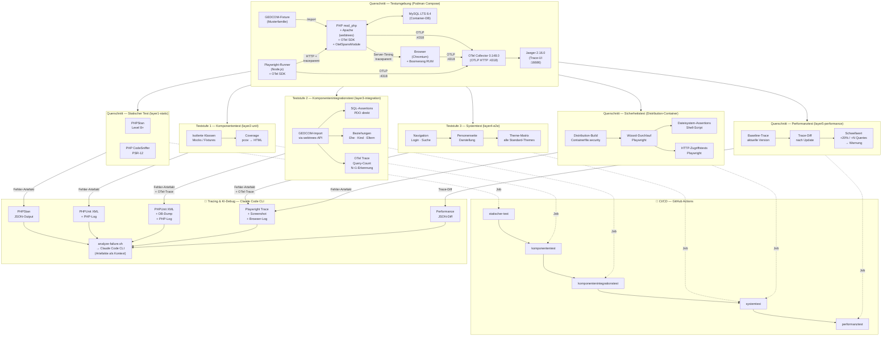

<!-- SPDX-License-Identifier: AGPL-3.0-or-later -->

# Teststrategie — webtrees-testing-platform

Dieses Dokument ist die konsolidierte Teststrategie-Dokumentation für die
webtrees-testing-platform. Es fasst alle getroffenen Entscheidungen zusammen
und enthält ein sofort renderbares Mermaid-Diagramm der Architektur.
ISTQB-Terminologie (Glossar de_DE v4.7.1) ist sprachlich und inhaltlich führend.

---

## Getroffene Designentscheidungen

| Dimension            | Entscheidung                                                                 |
|----------------------|------------------------------------------------------------------------------|
| **Scope**            | webtrees Core (nicht `sitemirror`/eigene Module) — potenzielle Open-Source-Contribution |
| **Auslöser**         | Vor jedem webtrees-Versions-Update (Regressionsschutz)                       |
| **Laufzeitumgebung** | Podman 5.8.1 + podman-compose 1.5.0 (Fedora-nativ, rootless)                |
| **PHP-Version**      | Nur PHP 8.5 (Latest Stable) — keine Vorgängerversionen, unabhängig von webtrees-Core-Support |
| **CI/CD**            | GitHub Actions (Ambition: Contribution zum webtrees-Projekt)                 |
| **Testdaten**        | GEDCOM-Fixture (Musterfamilie) als reproduzierbarer Import                   |
| **DB-Zugriff**       | Direktes SQL gegen Container-DB (MySQL im selben Compose-Stack)              |
| **Systemtest-Framework** | Playwright, Chromium only, rein funktional                                |
| **Theme-Coverage**   | Alle webtrees-Standard-Themes (funktional, kein Visual Regression)           |
| **Performance**      | Relativer Vergleich: Baseline alte Version vs. neue Version, gleiche Fixtures |
| **Reporting**        | HTML (PHPUnit Coverage HTML + Playwright HTML Reporter)                      |
| **Tracing**          | Strukturierte Fehlerartefakte pro Teststufe (Logs, Traces, DB-Dump) — lokal abrufbar |
| **KI-Debug**         | Claude Code CLI als lokales Analyse-Tool bei Testfehler; Artefakte werden als Kontext übergeben |
| **OpenTelemetry**    | Vollständige Trace-Kette über 4 Schichten: Auto-Instrumentation (PDO + PSR-15 + PSR-18), OtelSpansModule (semantische Spans, Server-Timing-Header), Browser-RUM (Boomerang + OTel-Plugin via Apache mod_substitute), Playwright Root-Spans (traceparent-Propagation via page.route()). Protokoll: OTLP HTTP/Protobuf (:4318). Jaeger (2.16.0) lokal (:16686). Deaktivierbar via OTEL_SDK_DISABLED=true. |
| **Code Coverage**    | pcov + php-coveralls (wie webtrees Core selbst)                              |
| **Static Analysis**  | PHPStan + PHPCS (wie webtrees Core selbst)                                   |
| **Verzeichnis**      | Eigenständiges Repo (`webtrees-testing-platform`), unabhängig von Deployment-Repo und `smoke-tests/` |
| **Repo-Platzierung** | Eigenständiges Repo (`webtrees-testing-platform`) — für Upstream-Contribution Testcode extrahierbar |
| **RE-Methodik**      | Code-first + Gap-Analyse existierender Tests + GEDCOM-5.5.1-Abgleich         |
| **Prioritäts-Domänen** | GEDCOM Import/Export (23 Testfälle), Suche & Navigation (39 Testfälle)      |
| **Testfall-Format**  | Feature-Matrix: Code-Stelle → Anforderung → Testart → Teststufe → Priorität |
| **Wartbarkeit**      | Höchste Priorität — monatelange Pause darf kein Blocker sein                 |
| **Upstream-Tests**   | Separater Branch im lokalen webtrees-Checkout (`${WEBTREES_SOURCE}`) — Stubs mit echten Tests füllen, als PR an webtrees Core; zunächst redundant, nach Upstream-Akzeptanz rückbaubar |
| **Terminologie**     | ISTQB-Glossar (de_DE) v4.7.1 durchgängig — Komponententest, Komponentenintegrationstest, Systemtest, Testart |
| **Stufenstruktur**   | 3 Teststufen (Komponenten-, Komponentenintegrations-, Systemtest) + Querschnitte (Testumgebung, Statischer Test, Performanztest, CI/CD, OTel, KI-Debug) |
| **Endekriterien**    | Pro Teststufe definiert; Eingangskriterien implizit durch sequentielle Job-Kette |
| **Testorakel**       | 5 Orakelquellen pro Domäne: `demo.ged`, GEDCOM-5.5.1-Standard, DB-Schema, DOM-Selektoren, Baseline-Traces |
| **Fehlermanagement** | CI-Gate (rot = blockiert); Upstream-Fehlerzustände als Issues bei `fisharebest/webtrees` |
| **Risikomanagement** | Produktrisiken tabellarisch (Wahrscheinlichkeit × Auswirkung), Projektrisiken als Prosa |
| **Testentwurfsverfahren** | Pro Domäne: Äquivalenzklassenbildung, Grenzwertanalyse, Entscheidungstabellentest, Anwendungsfall-Test, erfahrungsbasierter Test |
| **Überdeckung**      | Ratchet — Anweisungsüberdeckung (pcov) darf nur steigen; kein absoluter Zielwert |
| **Testkonventionen** | AAA-Pattern, FIRST-Prinzipien, `test_<feature>_<szenario>_<ergebnis>`, Data Provider ab ≥3 Äquivalenzklassen |
| **Verfolgbarkeit**   | `@see`-Annotation mit Feature-Matrix-IDs in Testdateien; bidirektional per `grep` |
| **Sicherheitstest**  | Zwei-Track-Architektur: Fachtest (Dev-Source, Mount) vs. Sicherheitstest (Distribution-ZIP, produktionsidentisch). Eigener Container-Build (`Containerfile.security`), Upstream-Setup-Wizard via Playwright, Dateisystem-Assertions via Shell |

---

## Zuordnung Layer ↔ ISTQB-Teststufe

> Das Projekt verwendet Code-Verzeichnisse (`layer1`–`layer5`) und Makefile-Targets
> als organisatorische Einheiten. Die folgende Tabelle ordnet sie den ISTQB-Teststufen
> und Querschnitten zu. Im gesamten Dokument ist die ISTQB-Terminologie führend;
> Layer-Bezeichnungen stehen in Klammern, wo ein Bezug zum Code nötig ist.

| Code (Makefile / Verzeichnis) | ISTQB-Teststufe / Querschnitt |
|-------------------------------|-------------------------------|
| `layer1-static/` / `make test-static` | Querschnitt — Statischer Test |
| `layer2-unit/` / `make test-unit` | Teststufe 1 — Komponententest |
| `layer3-integration/` / `make test-integration` | Teststufe 2 — Komponentenintegrationstest |
| `layer4-e2e/` / `make test-e2e` | Teststufe 3 — Systemtest |
| `layer5-performance/` / `make test-performance` | Querschnitt — Performanztest |
| `layer4-e2e/tests/security/` + `scripts/security-filesystem-checks.sh` / `make test-security` | Querschnitt — Sicherheitstest |

---

## Mermaid-Diagramm (sofort renderbar)

In [Mermaid Live Editor](https://mermaid.live) oder VS Code / GitHub direkt rendern.



> **Aktuelle Testfall-Zahlen** sind volatil und daher nicht im Diagramm enthalten.
> Stand via `make test-all` oder in den CI-Artefakten des letzten GitHub-Actions-Laufs.
> Trace-Auswertung (4-Stufen-Hierarchie): `make trace-report`.

---

## Getroffene Infrastruktur-Entscheidungen (N1–N7)

> Entschieden am 2026-03-26. Diese Entscheidungen konkretisieren die Designentscheidungen
> oben und bilden die Grundlage für die Implementierung.

---

### N1 — Container-Runtime: Podman + podman-compose

| Aspekt | Entscheidung |
|---|---|
| **Runtime** | Podman 5.8.1 (rootless, Fedora-nativ) |
| **Orchestrierung** | podman-compose 1.5.0 (`/usr/bin/podman-compose`) |
| **Compose-Datei** | `compose.yaml` (nicht `docker-compose.yaml`) |
| **Format** | Standard Compose Specification |

**Begründung:** Podman und podman-compose sind bereits auf dem Entwicklungssystem installiert.
Podman läuft rootless (kein Daemon, keine Root-Rechte), ist auf Fedora das native
Container-Tool und liest das Standard-Compose-Format. Docker ist nicht installiert und
wird nicht benötigt.

**Einschränkung:** podman-compose unterstützt nicht alle `depends_on.condition`-Features.
Stattdessen werden explizite Health-Checks und ein `wait-for-it.sh`-Skript verwendet.

---

### N2 — Verzeichnisstruktur: Eigenständiges Repo `webtrees-testing-platform`

```
webtrees-testing-platform/
├── compose.yaml                    # Podman Compose Stack-Definition
├── Containerfile.webtrees          # PHP 8.5 + Apache mod_php
├── Containerfile.playwright        # Node.js 22 + Playwright + Chromium
├── Containerfile.security          # Distribution-Container (Multi-Stage Build)
├── Makefile                        # make up / down / test-all / test-N / clean
├── .env.example                    # Template: DB-Creds, OTel-Config
├── README.md                       # Deutsch: Strategie + Quickstart
├── CLAUDE.md                       # AI-Kontext: Testaufruf, Layer-Architektur, SELinux
├── docs/
│   └── testing-bigpicture.md       # Dieses Dokument (Teststrategie)
├── scripts/
│   ├── setup-webtrees.sh          # Auto-Installer (config.ini.php, Migration, GEDCOM-Import)
│   ├── generate-privacy-fixture.sh # Template → GEDCOM-Generator (__YEAR_MINUS_N__ ersetzen)
│   ├── build-security-image.sh    # Build-Helper für Distribution-Container (podman build --volume)
│   ├── security-filesystem-checks.sh # 9 Dateisystem-Assertions (pre/post-wizard)
│   ├��─ analyze-failure.sh         # Artefakt-Sammler → Claude Code CLI
│   ├── export-traces.sh           # OTel-Traces als JSON exportieren
│   ├── truncate-perfschema.sh     # MySQL PerfSchema vor Testlauf leeren
│   ├── extract-perfschema.sh      # PerfSchema-Daten als JSON (4 Tabellen + summary.txt)
│   ├── trace-report.py            # OTLP NDJSON Parser + 4-Stufen-Hierarchie-Report
│   ├── trace-report.sh            # Bash-Wrapper für trace-report.py
│   └── wait-for-it.sh            # TCP-Port-Readiness-Check (vendored)
├── fixtures/
│   ├── demo.ged                   # webtrees Core (72 Individuen, 29 Familien)
│   ├── gedcom-l-muster.ged       # Deutsches Muster (CC BY 4.0, 37 Individuen)
│   ├── privacy-test-template.ged  # Privacy-GEDCOM-Template (30+ Personen, __YEAR_MINUS_N__)
│   ├── invalid-empty.txt          # Leere Datei (0 Bytes) — Upload-Validierung (G21)
│   ├── invalid-text.txt           # Textdatei (kein GEDCOM) — Upload-Validierung (G21)
│   ├── invalid-no-head.ged        # GEDCOM ohne HEAD — Upload-Validierung (G21)
│   └── invalid-binary.bin         # Binärdatei (16 Bytes) — Upload-Validierung (G21)
├── layer1-static/
│   └── run.sh                     # PHPStan + PHPCS im Container
├── layer2-unit/
│   ├── run.sh                     # PHPUnit Unit-Suite
│   └── phpunit-unit.xml           # Config (SQLite in-memory wie webtrees Core)
├── layer3-integration/
│   ├── run.sh                     # PHPUnit Integration-Suite
│   ├── phpunit-integration.xml    # Config (MySQL)
│   ├── bootstrap.php              # Autoloader (webtrees + DombrinksBlagen-Namespace)
│   └── tests/                     # 19 Testklassen (2 Basis + 17 Tests, 274 Testfälle)
│       ├── MysqlTestCase.php
│       ├── PrivacyTestCase.php    # Basisklasse Privacy-Tests (GEDCOM-Generator, Rollen-Helper)
│       ├── AutoCompleteIntegrationTest.php
│       ├── ChartModuleIntegrationTest.php
│       ├── GedcomImportTest.php
│       ├── GedcomServiceIntegrationTest.php
│       ├── ListModuleIntegrationTest.php
│       ├── RelationshipDbTest.php
│       ├── RelationshipServiceIntegrationTest.php
│       ├── RomanNumeralsIntegrationTest.php
│       ├── SearchIntegrationTest.php
│       ├── TreeOperationsTest.php
│       ├── PrivacySmokeTest.php   # P1 Infrastruktur-Smoke (5 Tests)
│       ├── IsDeadTest.php         # P08–P13 isDead()-Algorithmus (17 Tests)
│       ├── PrivacyVisibilityTest.php # P01–P07, P14–P15 Sichtbarkeit (22 Tests)
│       ├── ResnPrivacyTest.php    # P16–P21 RESN + default_resn (16 Tests)
│       ├── RelationshipPrivacyTest.php # P22–P23 Relationship Privacy (5 Tests)
│       ├── PrivacySearchTest.php  # P24 Privacy in Suchergebnissen (5 Tests)
│       └── AccessControlTest.php  # P27–P29 Zugriffskontrolle (12 Tests)
├── layer4-e2e/
│   ├── playwright.config.ts       # baseURL = http://webtrees:80 (testIgnore: security/)
│   ├── playwright-security.config.ts # Security-Playwright-Config (Distribution-Container)
│   ├── helpers/
│   │   ├── otel-fixture.ts        # Playwright Root-Span + traceparent (page.route()) + Baggage
│   │   ├── theme-switch.ts        # Shared Utility: Theme-Switching (5 Themes)
│   │   └── privacy-roles.ts      # Privacy-Rollen-Login (visitor, member, editor, moderator, manager, relationship)
│   └── tests/
│       ├── security/                  # Sicherheitstests (getrennt von funktionalen E2E)
│       │   ├── wizard-setup.spec.ts   # SEC-WZ01–WZ04 (Setup-Projekt, läuft zuerst)
│       │   ├── data-access.spec.ts    # SEC-H03–H06
│       │   ├── public-access.spec.ts  # SEC-PUB02–PUB04
│       │   ├── setup-lock.spec.ts     # SEC-W01
│       │   ├── media-access.spec.ts   # SEC-M01–M03
│       │   └── security-headers.spec.ts # SEC-HDR01–HDR04
│       ├── login.spec.ts          # S32 (theme-unabhängig)
│       ├── auth.spec.ts           # S33, S34 (theme-unabhängig)
│       ├── navigation.spec.ts     # S23, S20, S09 (× 5 Themes)
│       ├── individual.spec.ts     # S23 (× 5 Themes)
│       ├── family.spec.ts         # S24 (× 5 Themes)
│       ├── records.spec.ts        # S26–S30 (× 5 Themes)
│       ├── calendar.spec.ts       # S31 (× 5 Themes)
│       ├── search-forms.spec.ts   # S38, S39 (× 5 Themes)
│       ├── user-pages.spec.ts     # S35–S37 (× 5 Themes)
│       ├── homepage.spec.ts       # S40 (× 5 Themes)
│       ├── pedigree.spec.ts       # S14 (× 5 Themes)
│       ├── source-list.spec.ts    # S20 (× 5 Themes)
│       ├── upload-validation.spec.ts # G21 (Admin, kein Theme-Loop)
│       ├── search-replace.spec.ts # S13 (× 5 Themes + 1 Visitor)
│       ├── privacy-visibility.spec.ts # P02–P03, P14, P25 (5 Tests)
│       ├── privacy-resn.spec.ts   # P16–P19 (7 Tests)
│       ├── privacy-search.spec.ts # P24 (4 Tests)
│       ├── privacy-charts.spec.ts # P26 (2 Tests)
│       ├── privacy-relationship.spec.ts # P22 (3 Tests)
│       └── access-control.spec.ts # P27–P29 (5 Tests)
├── layer5-performance/
│   ├── playwright.config.ts       # Performance-spezifische Config (timeout 60s, retries 0)
│   ├── helpers/
│   │   └── otel-fixture.ts        # Root-Span + traceparent + Baggage (identisch zu layer4)
│   ├── run.sh                     # Perf-Messung + Baseline-Vergleich
│   ├── baselines/                 # Versionierte Baseline-JSONs (z.B. 2.2.5.json)
│   └── tests/
│       ├── perf-homepage.spec.ts
│       ├── perf-search.spec.ts
│       └── perf-pedigree.spec.ts
├── modules/
│   └── otel-spans/
│       ├── module.php              # Modul-Einstiegspunkt
│       └── OtelSpansModule.php     # Semantische Spans, Server-Timing-Header, Baggage-Korrelation
├── otel/
│   ├── otel-collector-config.yaml  # Collector-Pipeline (OTLP HTTP :4318 → Jaeger + File)
│   ├── boomerang-init.js           # Boomerang OTel-Plugin-Initialisierung (service: webtrees-browser)
│   └── boomerang-apache.conf       # mod_substitute Injection-Config (INFLATE;SUBSTITUTE;DEFLATE)
├── upstream/                      # gitignored — automatisch geklonter webtrees-Checkout
│   └── webtrees/                  # (via scripts/clone-upstream.sh)
├── artifacts/                     # gitignored — Laufzeit-Artefakte
│   ├── layer1/ … layer5/
└── .github/workflows/
    └── webtrees-tests.yaml        # GitHub Actions Workflow (Entwurf)
```

**Begründung:** `webtrees-testing-platform` ist ein eigenständiges Repo, unabhängig vom
Deployment-Repo und `smoke-tests/` (Live-Site-Tests). Die webtrees-Source (Default: `./upstream/webtrees`, konfigurierbar via `WEBTREES_SOURCE`) wird per read-only Bind-Mount in den Container
eingebunden — kein Code wird kopiert oder modifiziert.

`artifacts/` wird in `.gitignore` eingetragen. `layer5-performance/baselines/` ist absichtlich
versioniert — das ist der Kern des Baseline-Vergleichs.

---

### N3 — GEDCOM-Fixture: `demo.ged` (primär) + deutsches Muster (sekundär)

| Fixture | Quelle | Umfang | Zweck |
|---|---|---|---|
| `demo.ged` | `${WEBTREES_SOURCE}/tests/data/demo.ged` | 72 Individuen, 29 Familien (brit. Königshaus) | Primär-Fixture für alle Schichten |
| `gedcom-l-muster.ged` | `github/gedcom_muster/muster_GEDCOM_UTF-8.ged` | 37 Individuen, 18 Familien | i18n / Deutsch-Testing |
| `privacy-test-template.ged` | Eigene Erstellung | 30+ Individuen, 7+ Familien (dynamische Datums-Platzhalter) | Privacy & Zugriffskontrolle (P01–P29) |

**Begründung:** `demo.ged` ist die kanonische Testdatei von webtrees selbst (verwendet in
`ImportGedcomTest`). Sie deckt Mehrgenerationen-Beziehungen, mehrere Ehen, Medien-Referenzen
und Quellen ab. Das deutsche Muster (CC BY 4.0, Verein für Computergenealogie) ergänzt
für Lokalisierungstests.

**Setup:** Alle Fixture-Dateien liegen in `fixtures/`. Das `setup-webtrees.sh`-Skript
importiert sie beim Container-Start als drei separate Bäume (`demo`, `muster`, `privacy`).
Die Privacy-Fixture wird dynamisch aus dem Template generiert (`generate-privacy-fixture.sh`).

---

### N4 — Implementierungsreihenfolge: Bottom-up, Testumgebung → Teststufe 3

| Phase | Stufe / Querschnitt | Kern-Deliverable |
|---|---|---|
| 1 | Querschnitt — Testumgebung | `compose.yaml`, Containerfiles, `setup-webtrees.sh`, `Makefile` |
| 2 | Querschnitt — Statischer Test | `layer1-static/run.sh` (PHPStan + PHPCS im Container) |
| 3 | Teststufe 1 — Komponententest | `phpunit-unit.xml`, SQLite in-memory (wie webtrees Core) |
| 4 | Teststufe 2 — Komponentenintegrationstest | `MysqlTestCase.php`, neue Tests (GEDCOM-Import, Beziehungen, Bäume) |
| 5 | Teststufe 3 — Systemtest | `Containerfile.playwright`, Playwright-Tests (Login, Navigation, Themes) |
| 6 | Querschnitt — Performanztest | Playwright-Metrics, Baseline-JSONs, Vergleichsskript |
| 7 | Querschnitt — CI/CD, OTel, KI-Debug | `analyze-failure.sh`, OTel-Stack, GitHub Actions Workflow |

**Begründung:** Jede höhere Teststufe hängt von der Testumgebung (Container-Stack) ab.
Teststufe 1 nutzt SQLite in-memory wie webtrees Core selbst — das validiert die
Container-Umgebung ohne MySQL-Abhängigkeit. MySQL-spezifische Tests kommen erst in
Teststufe 2 mit einer eigenen `MysqlTestCase`-Basis-Klasse.

---

### N5 — `analyze-failure.sh`: Artefakt-Sammler → Claude Code CLI

**Aufruf:**
```bash
./scripts/analyze-failure.sh        # Alle Teststufen
./scripts/analyze-failure.sh 2      # Nur Teststufe 2
```

**Funktionsweise:**
1. Sammelt Artefakte aus `artifacts/` je nach Teststufe:
   - Statischer Test: PHPStan JSON, PHPCS JSON
   - Teststufe 1: PHPUnit XML + PHP-Fehlerlog (via `podman logs`)
   - Teststufe 2: PHPUnit XML + DB-Dump (`mysqldump`, nur Testschema) + PHP-Log + OTel-Trace-JSON
   - Teststufe 3: Playwright Trace (.zip) + Screenshots + Browser-Konsole-Log + OTel-Trace-JSON
   - Performanztest: Performance-JSON-Diff (Baseline vs. aktuell) + OTel-Trace-Diff
2. Formatiert alles als Markdown-Kontext-Dokument
3. Startet Claude Code CLI mit vorgeladenem Kontext

**In GitHub Actions:** Artefakte werden zusätzlich via `actions/upload-artifact` hochgeladen
(7 Tage Retention), damit Analyse auch ohne lokalen Container-Rebuild möglich ist.

---

### N6 — OTel-Integration: Vollständige Trace-Kette (4 Schichten)

> Entschieden 2026-03-26, implementiert bis 2026-04-01.

| Schicht | Mechanismus | Service-Name in Jaeger | Protokoll |
|---|---|---|---|
| PHP Auto-Instrumentation | PDO + PSR-15 + PSR-18 Auto-Instrumentierung | `webtrees` | OTLP HTTP/Protobuf :4318 |
| PHP OtelSpansModule | Semantische Spans (40+ Routes), Server-Timing-Header, Baggage-Korrelation | `webtrees` (Scope: `otel-spans`) | — (in-process) |
| Browser-RUM | Boomerang + OTel-Plugin via Apache mod_substitute, Server-Timing-Brücke | `webtrees-browser` | OTLP HTTP :4318 |
| Playwright Root-Spans | Ein Root-Span pro Testfall, traceparent-Propagation via page.route() | `playwright-tests` | OTLP HTTP :4318 |

**Gemeinsames Protokoll:** OTLP HTTP/Protobuf auf Port 4318. Alle vier Schichten senden an denselben Endpunkt.
Deaktivierung via `OTEL_SDK_DISABLED=true` → Zero Overhead (PHP-SDK-Guard + Boomerang-Injection-Guard).

---

#### N6a — PHP Auto-Instrumentation (PDO, PSR-15, PSR-18)

| Aspekt | Entscheidung |
|---|---|
| **Tiefe** | Nur Auto-Instrumentation — kein webtrees-Core-Change |
| **Installation** | `composer require` bedingt in `setup-webtrees.sh` (nur wenn `OTEL_SDK_DISABLED != true`) |
| **Aktivierung** | ENV-Variablen in `compose.yaml` |
| **Deaktivierung** | `OTEL_SDK_DISABLED=true` → Zero Overhead |
| **Export lokal** | Jaeger UI (http://localhost:16686) |
| **Export CI** | File-Exporter → `artifacts/traces.json` |

**Composer-Pakete:**

- `open-telemetry/sdk`
- `open-telemetry/exporter-otlp`
- `open-telemetry/opentelemetry-auto-pdo`
- `open-telemetry/opentelemetry-auto-psr18`
- `open-telemetry/opentelemetry-auto-psr15`

PHP-Extensions `protobuf` + `grpc` im `Containerfile.webtrees` (via `pecl install`).

**ENV-Variablen (in `compose.yaml`):**
```yaml
OTEL_PHP_AUTOLOAD_ENABLED: "true"
OTEL_SERVICE_NAME: "webtrees"
OTEL_EXPORTER_OTLP_ENDPOINT: "http://otel-collector:4318"
OTEL_EXPORTER_OTLP_PROTOCOL: "http/protobuf"
OTEL_SDK_DISABLED: "false"
OTEL_TRACES_EXPORTER: "otlp"
OTEL_METRICS_EXPORTER: "none"
OTEL_LOGS_EXPORTER: "none"
```

**OTel Collector Config (`otel/otel-collector-config.yaml`):**
```yaml
receivers:
  otlp:
    protocols:
      grpc:
        endpoint: 0.0.0.0:4317
      http:
        endpoint: 0.0.0.0:4318
        cors:
          allowed_origins: ["http://localhost:8080", "http://webtrees:80", "http://webtrees"]
          allowed_headers: ["*"]
          max_age: 7200
exporters:
  otlp/jaeger:
    endpoint: jaeger:4317
    tls:
      insecure: true
  file:
    path: /artifacts/traces.json
    append: true
service:
  pipelines:
    traces:
      receivers: [otlp]
      exporters: [otlp/jaeger, file]
```

**Begründung:** Auto-Instrumentation fängt alle PDO-Queries und HTTP-Calls automatisch ab —
ohne eine Zeile webtrees-Code zu ändern. Protokollwechsel gRPC → HTTP/Protobuf war notwendig,
damit Browser-Spans (Boomerang) denselben Endpunkt nutzen können.

---

#### N6b — OtelSpansModule (semantische Spans)

| Aspekt | Entscheidung |
|---|---|
| **Implementierung** | webtrees-Modul unter `modules/otel-spans/` — kein Core-Change |
| **Mount** | Bind-Mount in `compose.yaml` → `modules_v4/otel_spans` |
| **Span-Klassifikation** | 40+ ROUTE_MAP-Einträge, Span-Name `webtrees.<action>` (z.B. `webtrees.individual.show`) |
| **Server-Timing-Header** | `traceparent;desc="00-{traceId}-{spanId}-01"` in PHP-Responses für gemappte Routes |
| **Baggage-Korrelation** | `test.run_id` + `test.case_id` aus eingehenden Baggage-Headern als Span-Attribute |
| **Guard** | `class_exists(Globals::class)` — Graceful Degradation bei deaktiviertem SDK |

**Begründung:** Auto-Instrumentation liefert keine semantischen Span-Namen — `webtrees.individual.show`
ist aussagekräftiger als `GET /index.php`. Der Server-Timing-Header ist der einzige standardkonforme
Kanal, um `traceparent` vom PHP-Server in den Browser zu propagieren, ohne webtrees-Code zu ändern.

---

#### N6c — Browser-RUM: Boomerang + OTel-Plugin

| Aspekt | Entscheidung |
|---|---|
| **RUM-Bibliothek** | Boomerang 1.815.1 + `@opentelemetry/instrumentation-document-load` |
| **Injection** | Apache `mod_substitute` mit `INFLATE;SUBSTITUTE;DEFLATE`-Filterkette — kein webtrees-Core-Change |
| **Konfiguration** | `otel/boomerang-init.js` + `otel/boomerang-apache.conf` |
| **Collector-URL** | `http://otel-collector:4318/v1/traces` (Container-Hostname, nicht localhost) |
| **Deaktivierung** | Injection nur wenn `OTEL_SDK_DISABLED != true` |
| **Trace-Korrelation** | Boomerang liest `traceparent` aus Server-Timing-Header → Browser-Spans im selben Trace |

**Begründung:** Browser-RUM ohne Build-Pipeline (kein Grunt, kein Webpack), kein webtrees-Core-Change.
Die `INFLATE;SUBSTITUTE;DEFLATE`-Filterkette ist notwendig, da webtrees Responses komprimiert ausliefert.

---

#### N6d — Playwright Root-Spans (Testfall-Korrelation)

| Aspekt | Entscheidung |
|---|---|
| **SDK** | `@opentelemetry/api`, `sdk-trace-node`, `exporter-trace-otlp-http`, `resources`, `semantic-conventions` im Playwright-Container |
| **Fixture** | `layer4-e2e/helpers/otel-fixture.ts`, `layer5-performance/helpers/otel-fixture.ts` |
| **Mechanismus** | Root-Span pro Testfall; `traceparent` via `page.route()` in alle webtrees-Requests injiziert |
| **Baggage** | `test.run_id` (UUID pro `make`-Aufruf) + `test.case_id` (Testfall-Name, alphanumerisch bereinigt) |
| **Ausnahme** | OTLP-Requests an `otel-collector:4318` werden von `page.route()` ausgenommen |
| **Ergebnis** | Alle PHP-Spans eines Testfalls teilen dieselbe `trace_id` wie der Playwright-Root-Span |

**Begründung:** `page.route()` ersetzt `page.setExtraHTTPHeaders()`, weil Header selektiv
pro Request-URL gesetzt werden können — OTLP-Requests dürfen kein `traceparent` erhalten.

---

#### N6e — PerfSchema-Extraktion und Trace-Report

| Aspekt | Entscheidung |
|---|---|
| **Scripts** | `truncate-perfschema.sh`, `extract-perfschema.sh`, `trace-report.py`, `trace-report.sh` |
| **Makefile-Targets** | `perfschema-truncate`, `perfschema-extract`, `trace-report` |
| **Automatisierung** | `make test-e2e` und `make test-performance` rufen truncate/extract/report automatisch auf |
| **Span-Hierarchie** | `trace-report.py` klassifiziert in 4 Stufen: Playwright, Browser (RUM), PHP Custom, PHP Auto |

---

### N7 — GitHub Actions Workflow

| Aspekt | Entscheidung |
|---|---|
| **Datei** | `.github/workflows/webtrees-tests.yaml` |
| **Trigger** | `push` + `pull_request`, `workflow_dispatch` |
| **Matrix** | PHP 8.5 (Latest Stable, keine Vorgängerversionen) |
| **Runner** | `ubuntu-latest` (Podman vorinstalliert) |
| **Job-Kette** | `testumgebung` → `statischer-test` → `komponententest` → `komponentenintegrationstest` → `systemtest` → `performanztest` |
| **Artefakte** | Coverage-HTML, Playwright-Report, Performance-Diff, OTel-Traces (7 Tage Retention) |

**Setup-Schritt (in jedem Job):**
```yaml
- name: Install podman-compose
  run: pip install podman-compose
```

**`workflow_dispatch` Input (für manuelles Testen vor Version-Update):**
```yaml
inputs:
  webtrees_ref:
    description: 'webtrees git ref to test (branch, tag, commit)'
    default: 'main'
```

**Begründung:** Die Job-Kette spiegelt die Stufenhierarchie wider — bei einem Fehler in einer
niedrigeren Teststufe brechen die höheren ab. Die PHP-Matrix testet ausschließlich mit PHP 8.5
(Latest Stable) — Vorgängerversionen werden bewusst nicht getestet, unabhängig davon welche
Versionen webtrees Core offiziell unterstützt. `workflow_dispatch` erlaubt manuelles Testen
eines spezifischen webtrees-Refs vor einem Versions-Update.

---

## Container-Stack-Spezifikation

### 6+2 Container, 2 Netzwerke

> Der Fachtest-Stack umfasst 6 Container in einem gemeinsamen Netzwerk. Für Sicherheitstests
> (`make test-security`) kommen 2 weitere Container hinzu, die über ein separates Compose-Profil
> (`--profile security`) gestartet werden. Sie teilen weder Netzwerk noch Volumes mit dem
> Fachtest-Stack.

| Container | Image | Zweck | Host-Port | Volume-Mounts |
|---|---|---|---|---|
| `webtrees` | `Containerfile.webtrees` | PHP 8.5 + Apache mod_php + webtrees | 8080:80 | `${WEBTREES_SOURCE}` → `/var/www/html` (ro), Named Vol → `/var/www/html/data/` (rw), `fixtures/` → `/fixtures` (ro) |
| `mysql` | `docker.io/library/mysql:lts` | Datenbank (MySQL LTS 8.4) | 3306:3306 | Named Vol → `/var/lib/mysql` |
| `playwright` | `Containerfile.playwright` | Node.js 22 + Chromium (headless) + OTel SDK | — | `layer4-e2e/` + `layer5-performance/` → `/tests` (ro), `artifacts/` → `/artifacts` (rw) |
| `otel-collector` | `docker.io/otel/opentelemetry-collector-contrib:0.148.0` | OTel Sidecar (OTLP HTTP :4318, gRPC :4317) | 4317:4317, 4318:4318 | `otel/otel-collector-config.yaml` → `/etc/otelcol/config.yaml` (ro), `artifacts/` → `/artifacts` (rw) |
| `jaeger` | `docker.io/jaegertracing/jaeger:2.16.0` | Trace-Visualisierung | 16686:16686 | — |
| `adminer` | `docker.io/library/adminer` | DB-Admin (optional, nur Debug) | 8081:8080 | — |
| `webtrees-security` | `Containerfile.security` | Distribution-Build (ZIP entpackt) + Apache (Profil: security) | 8082:80 | Named Vol → `/var/www/html/data/` (rw) |
| `mysql-security` | `docker.io/library/mysql:lts` | Datenbank — Security-Track (Profil: security) | 3307:3306 | Named Vol → `/var/lib/mysql` |

### Netzwerk-Topologie

```
webtrees-test-net (Bridge)
├── webtrees    ←→  mysql           (PDO, Port 3306)
├── webtrees    →   otel-collector  (OTLP HTTP, Port 4318)
├── playwright  →   webtrees        (HTTP + traceparent, Port 80)
├── playwright  →   otel-collector  (OTLP HTTP, Port 4318)
├── browser     →   otel-collector  (OTLP HTTP, Port 4318, via otel-collector-Hostname)
├── otel-collector → jaeger         (OTLP gRPC, Port 4317 intern)
└── adminer     →   mysql           (Port 3306)

webtrees-security-net (Bridge, Profil: security)
├── webtrees-security ←→ mysql-security  (PDO, Port 3306)
└── playwright        →  webtrees-security (HTTP, Port 80)
```

### MySQL-Konfiguration

```yaml
environment:
  MYSQL_ROOT_PASSWORD: webtrees_test
  MYSQL_DATABASE: webtrees_test
  MYSQL_USER: webtrees
  MYSQL_PASSWORD: webtrees_test
command: >
  --character-set-server=utf8mb4
  --collation-server=utf8mb4_bin
  --performance-schema-instrument='stage/%=ON'
  --performance-schema-consumer-events-stages-current=ON
  --performance-schema-consumer-events-stages-history=ON
```

Collation `utf8mb4_bin` entspricht `DB::COLLATION_UTF8[DB::MYSQL]` in webtrees Core.
PerfSchema-Flags aktivieren Stage-Instrumentierung für `make perfschema-extract`.

### setup-webtrees.sh — Automatischer Installer

1. `composer install` + `composer require` OTel-Pakete im Container (bedingt auf `OTEL_SDK_DISABLED != true`)
2. `data/config.ini.php` generieren (MySQL-Credentials des Containers)
3. DB-Migration via `MigrationService::updateSchema()`
4. Privacy-Fixture generieren (`generate-privacy-fixture.sh`)
5. GEDCOM-Import: `demo.ged` → Baum `demo`, `gedcom-l-muster.ged` → Baum `muster`, `privacy-test.ged` → Baum `privacy`
6. Test-User anlegen: Admin (`admin`), 4 rollenbasierte User (member, editor, moderator, manager), Relationship-Privacy-User (`test-relationship`)

Der Setup-Wizard wird vollständig umgangen (programmatischer Install).

---

## Fachliche Anforderungen — Reverse-Engineering-Methodik

> Die fachlichen Anforderungen werden nicht aus einer Spezifikation abgeleitet (es gibt keine),
> sondern systematisch aus dem Code reverse-engineered. Ergänzende Quellen: existierende
> Tests (Gap-Analyse) und der GEDCOM 5.5.1-Standard (Compliance-Abgleich).

---

### RE-Methodik: 4 Schritte

**Schritt 1 — Code-Topologie erfassen (Feature-Discovery)**

Jedes Feature wird als Call-Chain identifiziert:

```
Route (WebRoutes.php)
  → RequestHandler (Http/RequestHandlers/)
    → Service (Services/)
      → DB / GedcomRecord / Elements
```

Die **öffentlichen Methoden der Service-Klassen** sind die fachlichen Fähigkeiten.
Jede public Method = mindestens ein Testfall. Private Methoden werden indirekt über
die public API getestet.

**Schritt 2 — Gap-Analyse der existierenden Tests**

Nicht die Dateianzahl zählt, sondern die **Assertionsdichte**:
- **Stub-Test** (`testClass()` / 1 Assertion "Klasse existiert") = **ungetestet**
- **Trivialer Test** (2–3 Assertions, keine fachliche Logik) = **minimal getestet**
- **Substanzieller Test** (fachliche Assertions, Fixtures, Datenprüfung) = **getestet**

Ein Code-Analyse-Skript kann diese Klassifizierung automatisieren:
`grep -c 'assert' tests/app/Services/*Test.php` zeigt die Assertionsdichte pro Datei.

**Schritt 3 — GEDCOM-Standard-Abgleich (Domäne Import/Export)**

| Prüfpunkt | Quelle | Methode |
|---|---|---|
| Unterstützte Tags | `app/Elements/` (216 Klassen) vs. GEDCOM 5.5.1 Tag-Liste | Diff |
| Encoding-Varianten | `GedcomEncodingFilter` | Code-Lesen |
| Custom-Tags (Ancestry, FamilySearch, etc.) | `app/Gedcom.php` (13 Custom-Tag-Klassen) | Code-Lesen |
| Zeilenlänge, CONC/CONT | `GedcomExportService::wrapLongLines()` | Komponententest |
| Date-Formate | `app/Date/` Klassen | Vergleich mit GEDCOM-Spec |

**Schritt 4 — Feature-Matrix aufbauen**

Für jede Prioritäts-Domäne: tabellarische Zuordnung
Code-Stelle → abgeleitete Anforderung → Testart → Priorität → Teststufe.

---

### Befund: Gap-Analyse der existierenden webtrees-Tests

> Stand: webtrees 2.2.6-dev. Analyse vom 2026-03-26.

**Gesamtbild:**
- 1233 Testdateien in `tests/app/`, 5 in `tests/feature/`
- **~95% sind Stub-Tests** (nur `testClass()` — verifiziert, dass die PHP-Klasse existiert)
- **~4% sind triviale Tests** (wenige Assertions, keine fachliche Tiefe)
- **~1% sind substanzielle Tests** (echte fachliche Assertions mit Datenprüfung)

#### Domäne: GEDCOM Import/Export

| Komponente | Public Methods | Test-Status | Assertions |
|---|---|---|---|
| `GedcomImportService` | 3 (`importRecord`, `updatePlaces`, `updateRecord`) | Stub | 1 (`testClass`) |
| `GedcomExportService` | 5 (`downloadResponse`, `export`, `createHeader`, `wrapLongLines`, Konstruktor) | Stub | 1 (`testClass`) |
| `ImportGedcomAction` (Handler) | 1 | Stub | 1 |
| `ImportGedcomPage` (Handler) | 1 | Stub | 1 |
| `ExportGedcomClient` (Handler) | 1 | Stub | 1 |
| `ExportGedcomServer` (Handler) | 1 | Stub | 1 |
| `GedcomEncodingFilter` | — | Substanziell | Encoding-Tests vorhanden |
| `ImportGedcomTest` (Feature) | — | Minimal | 1 Test: `demo.ged` importieren (keine Ergebnisprüfung) |
| Element-Klassen | 216 | 212 Tests | Meist Pattern-Validierung (gut) |

**Ungetestete Kernlogik (Import):**
- Record-Import mit Typ-Erkennung (INDI, FAM, SOUR, …)
- Place-Hierarchie-Aufbau beim Import
- Date-Parsing und Index-Aktualisierung
- Name-Extraktion und Soundex-Generierung
- Inline-Media-Konvertierung
- Legacy-Format-Konvertierung (TNG, PLAC_DEFN)

**Ungetestete Kernlogik (Export):**
- 4 Export-Formate: GEDCOM, ZIP, ZIP+Media, GEDZIP
- Privacy-Filterung nach Access-Level (PRIV_NONE, PRIV_USER, PRIV_PRIVATE, PRIV_HIDE)
- Encoding-Konvertierung (UTF-8 → ANSEL, Windows-1252, etc.)
- Zeilenumbrüche (CRLF/LF) und CONC/CONT-Wrapping
- Header-Generierung mit Metadaten
- Media-Datei-Einbettung in ZIP-Export

#### Domäne: Suche und Navigation

| Komponente | Public Methods | Test-Status | Assertions |
|---|---|---|---|
| `SearchService` | 20 Suchmethoden | Minimal | 1 Testmethode, prüft nur "Collection nicht leer" |
| `SearchGeneralPage` (Handler) | 1 | Stub | 1 |
| `SearchAdvancedPage` (Handler) | 1 | Stub | 1 |
| `SearchPhoneticPage` (Handler) | 1 | Stub | 1 |
| `SearchQuickAction` (Handler) | 1 | Stub | 1 |
| `SearchReplacePage` (Handler) | 1 | Stub | 1 |
| 13 Chart-Module | je 1–3 | Stub | je 1 (`testClass`) |
| 10 List-Module | je 1–3 | Stub | je 1 (`testClass`) |
| `IndividualListTest` (Feature) | — | **Substanziell** | 7 Testmethoden, ~50 Assertions (Collation, Initialen, Nachnamen) |
| 16 AutoComplete/TomSelect | je 1 | Stub | je 1 |

**Ungetestete Kernlogik (Suche):**
- Allgemeine Suche: Query-Parsing (Anführungszeichen, CJK-Splitting, Leerzeichen)
- Suche über 6 Record-Typen (Individuals, Families, Sources, Notes, Repositories, Locations)
- Erweiterte Suche: 75 GEDCOM-Felder mit Datum-Modifikatoren (±0 bis ±20 Jahre)
- Phonetische Suche: Russell-Soundex und Daitch-Mokotoff-Soundex
- Paginierung, Offset, Limit
- Cross-Tree-Suche (über mehrere Stammbäume)
- Zugriffskontrolle auf Suchergebnisse
- Search-and-Replace (Bulk-Editor, erfordert Edit-Recht)

**Ungetestete Kernlogik (Navigation):**
- 13 Chart-Typen: kein einziger Rendering-Test
- Chart-Parameter und -Optionen (Generationstiefe, Layout, etc.)
- 10 List-Module: nur IndividualList substanziell getestet
- Sortierung und Collation (locale-spezifisch)
- AutoComplete/TomSelect-AJAX-Endpoints (16 Stück)

---

### Feature-Matrix: GEDCOM Import/Export

> Abgeleitet aus Code-Analyse von `GedcomImportService`, `GedcomExportService`,
> `GedcomEncodingFilter`, `Elements/`, Request-Handlern und dem GEDCOM 5.5.1-Standard.
>
> Teststufen: 1 = Komponententest, 2 = Komponentenintegrationstest, 3 = Systemtest

| # | Feature | Abgeleitete Anforderung | Teststufe | Prio |
|---|---|---|---|---|
| G01 | Record-Import (INDI) | Individuum importieren → korrekte DB-Einträge (name, date, place) | 2 | Hoch |
| G02 | Record-Import (FAM) | Familie importieren → Beziehungen korrekt verknüpft (HUSB, WIFE, CHIL) | 2 | Hoch |
| G03 | Record-Import (SOUR, NOTE, REPO, OBJE) | Nebenrecords importieren → DB-Einträge korrekt | 2 | Mittel |
| G04 | Place-Hierarchie | Import mit PLAC-Tags → Orts-Hierarchie in `place_location` aufgebaut | 2 | Hoch |
| G05 | Date-Parsing | GEDCOM-Datumsformate (exakt, Bereich, vor/nach, ca.) → korrekte date1/date2-Felder | 1 | Hoch |
| G06 | Name-Extraktion | NAME-Tags → Vorname, Nachname, Suffix korrekt gesplittet + Soundex generiert | 1 | Hoch |
| G07 | Encoding (UTF-8) | UTF-8-GEDCOM importieren → keine Zeichenverluste | 2 | Hoch |
| G08 | Encoding (ANSEL, CP1252) | Nicht-UTF-8-GEDCOM importieren → korrekte Konvertierung | 2 | Mittel |
| G09 | Inline-Media | Eingebettete OBJE-Records → separate Media-Objekte erzeugt | 2 | Mittel |
| G10 | Legacy-Formate | TNG-PLAC, _PLAC_DEFN → korrekt konvertiert | 2 | Niedrig |
| G11 | Custom-Tags | Ancestry/FamilySearch/RootsMagic-Tags → erkannt und nicht verworfen | 1 | Mittel |
| G12 | XREF-Vergabe | Neue Records erhalten eindeutige XREFs, keine Kollisionen | 2 | Hoch |
| G13 | Export GEDCOM | Baum exportieren → valide GEDCOM-Datei, importierbar | 2 | Hoch |
| G14 | Export ZIP | Export als ZIP → Datei enthält .ged + korrekte Struktur | 2 | Mittel |
| G15 | Export ZIP+Media | Export mit Mediendateien → Dateien im Archiv vorhanden | 2 | Mittel |
| G16 | Export Privacy | Export mit Access-Level → geschützte Records ausgeblendet/anonymisiert | 2 | Hoch |
| G17 | Export Encoding | Export mit gewähltem Encoding (UTF-8, ANSEL) → korrekte Ausgabe | 1 | Mittel |
| G18 | Export CONC/CONT | Lange Zeilen → korrekt in CONC/CONT aufgeteilt (max. 253 Zeichen) | 1 | Mittel |
| G19 | Export Header | HEAD-Record enthält korrekte Metadaten (Source, Date, GEDC Version) | 1 | Mittel |
| G20 | Import → Export Roundtrip | demo.ged importieren → exportieren → Diff minimal (nur Metadaten) | 3 | Hoch |
| G21 | Upload-Validierung | Ungültige Datei (kein GEDCOM) → Fehlermeldung, kein Import | 3 | Mittel |
| G22 | Element-Validierung | 216 Element-Klassen → Tag-Patterns und erlaubte Kinder korrekt | 1 | Mittel |
| G23 | GEDCOM 5.5.1 Compliance | Unterstützte Tags vs. Standard-Tag-Liste → Abweichungen dokumentiert | 1 | Niedrig |
| G24 | Referenzintegrität (CheckTree) | GEDCOM-Datenbank auf verwaiste XREFs und fehlende Verknüpfungen prüfen → Report-Handler antwortet 200 OK, keine Fehler bei valider demo.ged | 2 | Mittel |

---

### Feature-Matrix: Suche und Navigation

> Abgeleitet aus Code-Analyse von `SearchService` (20 public Methods),
> 9 Search-Handlern, 13 Chart-Modulen, 10 List-Modulen, 16 AutoComplete-Handlern.
>
> Teststufen: 1 = Komponententest, 2 = Komponentenintegrationstest, 3 = Systemtest

| # | Feature | Abgeleitete Anforderung | Teststufe | Prio |
|---|---|---|---|---|
| S01 | Allgemeine Suche (Personen) | Suchbegriff → passende Individuen zurückgegeben | 2 | Hoch |
| S02 | Allgemeine Suche (Familien) | Suchbegriff → passende Familien zurückgegeben | 2 | Hoch |
| S03 | Allgemeine Suche (Quellen, Notizen, Repos) | Suchbegriff → passende Records je Typ | 2 | Mittel |
| S04 | Query-Parsing | Anführungszeichen, Mehrwort-Suche, CJK-Splitting korrekt | 1 | Hoch |
| S05 | Erweiterte Suche (Felder) | 75 GEDCOM-Felder → Feld-spezifische Filterung | 2 | Hoch |
| S06 | Erweiterte Suche (Datum-Modifikatoren) | Geburtsdatum ±5 Jahre → korrekte Eingrenzung | 2 | Hoch |
| S07 | Phonetische Suche (Russell) | Russell-Soundex → ähnlich klingende Namen gefunden | 2 | Mittel |
| S08 | Phonetische Suche (Daitch-Mokotoff) | DM-Soundex → osteuropäische Namensvarianten gefunden | 2 | Mittel |
| S09 | Quick-Search (XREF) | "I123" eingeben → direkt zum Record weitergeleitet | 3 | Mittel |
| S10 | Paginierung | Suche mit >50 Ergebnissen → Offset/Limit korrekt | 2 | Mittel |
| S11 | Cross-Tree-Suche | Suche über 2+ Bäume → Ergebnisse aus allen Bäumen | 2 | Mittel |
| S12 | Zugriffskontrolle (Suche) | Eingeschränkte Records → nicht in Suchergebnissen für Visitor | 2 | Hoch |
| S13 | Search-and-Replace | Bulk-Ersetzung in GEDCOM → nur bei Edit-Recht möglich | 3 | Mittel |
| S14 | Chart: Stammbaum (Pedigree) | Person mit 3+ Generationen → Chart rendert korrekt | 3 | Hoch |
| S15 | Chart: Nachkommen | Person mit Kindern/Enkeln → Descendancy-Chart korrekt | 3 | Mittel |
| S16 | Chart: Beziehungsfinder | 2 Personen → Verwandtschaftspfad gefunden und dargestellt | 3 | Hoch |
| S17 | Chart: Fächerchart (Fan) | Person → Kreisförmige Ahnentafel gerendert | 3 | Niedrig |
| S18 | Chart: alle 13 Typen | Jeder Chart-Typ → rendert ohne Fehler (Smoke) | 3 | Mittel |
| S19 | Liste: Personen (Nachnamen) | Nachnamen-Initialen → korrekte Filterung, Collation | 2 | Hoch |
| S20 | Liste: alle 10 Typen | Jeder List-Typ → rendert ohne Fehler, zeigt Einträge | 3 | Mittel |
| S21 | AutoComplete (Personen) | Tipp-Vorschläge → passende Individuen per AJAX | 2 | Mittel |
| S22 | AutoComplete (Orte) | Ort eintippen → Ortsvorschläge korrekt | 2 | Mittel |
| S23 | Navigation: Personenseite | XREF aufrufen → Fakten, Familien, Events korrekt dargestellt | 3 | Hoch |
| S24 | Navigation: Familienseite | Familien-XREF → Ehepartner, Kinder, Events korrekt | 3 | Hoch |
| S26 | Navigation: Quellenseite | Quellen-XREF aufrufen → Titel, Zitate, verknüpfte Records dargestellt | 3 | Hoch |
| S27 | Navigation: Medienseite | Medien-XREF aufrufen → Bild/Datei-Info, verknüpfte Records dargestellt | 3 | Mittel |
| S28 | Navigation: Notizseite | Notiz-XREF aufrufen → Notiztext dargestellt | 3 | Mittel |
| S29 | Navigation: Aufbewahrungsort-Seite | Repository-XREF aufrufen → Name, Adresse, verknüpfte Quellen | 3 | Mittel |
| S30 | Navigation: Einreicherseite | Submitter-XREF aufrufen → Name dargestellt | 3 | Niedrig |
| S31 | Kalenderansicht | Kalender (Monats-/Jahresansicht) aufrufen → rendert, Events sichtbar | 3 | Hoch |
| S32 | Anmeldeseite (Login) | /login aufrufen → Formular sichtbar, Login/Fehler funktional | 3 | Hoch |
| S33 | Registrierungsseite | /register aufrufen → Formular sichtbar, keine HTTP-Fehler | 3 | Mittel |
| S34 | Passwort-Zurücksetzung | /password-request aufrufen → Formular sichtbar | 3 | Mittel |
| S35 | Benutzerseite (Meine Seite) | /my-page aufrufen → Benutzer-Blöcke gerendert, keine HTTP-Fehler | 3 | Hoch |
| S36 | Kontaktseite | /contact aufrufen → Kontaktformular sichtbar | 3 | Mittel |
| S37 | Berichtsliste | /report aufrufen → verfügbare Berichte gelistet | 3 | Mittel |
| S38 | Erweiterte Suche (Seitenaufruf) | /search-advanced aufrufen → Formular mit Feldfiltern sichtbar | 3 | Hoch |
| S39 | Phonetische Suche (Seitenaufruf) | /search-phonetic aufrufen → Formular sichtbar | 3 | Mittel |
| S40 | Navigation: Homepage (Baumseite) | Homepage/Baumseite aufrufen → Baumstatistik oder Willkommensblock dargestellt, keine HTTP-Fehler | 3 | Hoch |

---

### Feature-Matrix: Datenschutz & Zugriffskontrolle

> Abgeleitet aus Code-Analyse von `Individual::canShow()`, `Individual::canShowByType()`,
> `Individual::isDead()`, `GedcomRecord::canEdit()`, `Fact::canEdit()`,
> Tree-Preferences (Privacy-Einstellungen), User-Preferences (Relationship Privacy).
>
> Teststufen: 2 = Komponentenintegrationstest, 3 = Systemtest.
> Rollen: B = Besucher, M = Mitglied, E = Bearbeiter, Mo = Moderator, V = Verwalter.

| # | Feature | Abgeleitete Anforderung | Rollen | Teststufe | Prio |
|---|---|---|---|---|---|
| P01 | Stammbaum-Sichtbarkeit | `REQUIRE_AUTHENTICATION=1`: Besucher sieht keine Daten. `=0`: Besucher sieht öffentliche Daten. | B, M | 2, 3 | Hoch |
| P02 | Verstorbene Personen zeigen | `SHOW_DEAD_PEOPLE=PRIV_PRIVATE`: Besucher sieht Verstorbene. `=PRIV_USER`: Nur Mitglieder+. | B, M, V | 2, 3 | Hoch |
| P03 | Lebende Personen zeigen (Override) | `HIDE_LIVE_PEOPLE=0`: Privacy deaktiviert. `=1`: Privacy aktiv. | B, M, V | 2, 3 | Hoch |
| P04 | MAX_ALIVE_AGE — Altersgrenze | Grenzwertanalyse: Person geboren vor genau 120 Jahren (Grenze), ±1 Jahr. | B, M | 2 | Hoch |
| P05 | KEEP_ALIVE_YEARS_BIRTH | Verstorbene mit Geburt innerhalb N Jahren bleibt geschützt. Grenzwert: ==N, ==N+1. | B, M | 2 | Hoch |
| P06 | KEEP_ALIVE_YEARS_DEATH | Verstorbene mit Tod innerhalb N Jahren bleibt geschützt. Grenzwert: ==N, ==N+1. | B, M | 2 | Hoch |
| P07 | KEEP_ALIVE kombiniert | Beide KEEP_ALIVE gesetzt — OR-Logik. | B, M | 2 | Mittel |
| P08 | isDead(): Expliziter Tod | `1 DEAT Y` / `1 DEAT\n2 DATE` / `1 DEAT\n2 PLAC` → `isDead()=true`. | — | 2 | Hoch |
| P09 | isDead(): Datiertes Event > MAX_ALIVE_AGE | Irgendein Event älter als MAX_ALIVE_AGE → tot. Grenzwert ±1. | — | 2 | Hoch |
| P10 | isDead(): Geburt vorhanden + jung | Geburtsdatum < MAX_ALIVE_AGE, kein DEAT → `isDead()=false`. | — | 2 | Hoch |
| P11 | isDead(): Inferenz Eltern | Eltern-Events > MAX_ALIVE_AGE+45 → tot. Grenzwert. | — | 2 | Hoch |
| P12 | isDead(): Inferenz Ehepartner | Heirat > MAX_ALIVE_AGE−10 oder Ehepartner-Event > MAX_ALIVE_AGE+40 → tot. | — | 2 | Mittel |
| P13 | isDead(): Inferenz Kinder/Enkel | Kinder-Event > MAX_ALIVE_AGE−15, Enkel-Event > MAX_ALIVE_AGE−30 → tot. | — | 2 | Mittel |
| P14 | Namen vertraulicher Personen | `SHOW_LIVING_NAMES` × 3 Stufen (PRIV_PRIVATE, PRIV_USER, PRIV_NONE). | B, M, V | 2, 3 | Hoch |
| P15 | Vertrauliche Beziehungen | `SHOW_PRIVATE_RELATIONSHIPS=1`: leere Boxen in Charts. `=0`: komplett ausgeblendet. | B, M | 2, 3 | Mittel |
| P16 | RESN none (Record) | `1 RESN none` → für alle sichtbar, überschreibt isDead()-Logik. | B, M, V | 2, 3 | Hoch |
| P17 | RESN privacy (Record) | `1 RESN privacy` → nur Mitglieder+ sehen Record. | B, M, V | 2, 3 | Hoch |
| P18 | RESN confidential (Record) | `1 RESN confidential` → nur Verwalter/Admin sehen Record. | B, M, V | 2, 3 | Hoch |
| P19 | RESN auf Fakten-Ebene | `2 RESN privacy` auf BIRT → Person sichtbar, Fakt nur für M+. `2 RESN confidential` auf DEAT → nur für V+. | B, M, V | 2, 3 | Hoch |
| P20 | default_resn (Individuum) | DB-Eintrag `xref=..., tag_type=NULL` → gesamter Record eingeschränkt. | B, M, V | 2 | Mittel |
| P21 | default_resn (Faktentyp) | DB-Eintrag `tag_type=BIRT` → alle BIRT eingeschränkt. Kombiniert: `xref+tag_type`. | B, M, V | 2 | Mittel |
| P22 | Relationship Privacy (Pfadlänge) | `PREF_TREE_PATH_LENGTH=2`: nahe Verwandte sichtbar, entfernte/unverwandte nicht. `=0`: deaktiviert. | M | 2, 3 | Mittel |
| P23 | Relationship Privacy (kein XREF) | Pfadlänge > 0, aber kein `PREF_TREE_ACCOUNT_XREF` → Fallback: alles sichtbar. | M | 2 | Mittel |
| P24 | Privacy in Suchergebnissen | Geschützte Person nicht in Suchergebnissen für Besucher. Für Mitglieder+: enthalten. | B, M, V | 2, 3 | Hoch |
| P25 | Personenseite: Vertraulich-Platzhalter | Besucher → „Vertraulich"/„Private". Name ggf. sichtbar (SHOW_LIVING_NAMES). | B, M, V | 3 | Hoch |
| P26 | Charts: Vertrauliche Boxen | Ahnentafel mit vertraulichen Personen → leere Boxen oder ausgeblendet. | B, M | 3 | Mittel |
| P27 | Bearbeiter: Datensatz bearbeiten | Fakt hinzufügen → pending change in DB. `auto_accept` → sofort akzeptiert. | E | 2, 3 | Hoch |
| P28 | Moderator: Änderungen akzeptieren | Moderator akzeptiert/verwirft Pending Change → DB-Status aktualisiert. | Mo | 2, 3 | Hoch |
| P29 | RESN locked / Zugriffsverbot | B/M: kein Edit. E auf RESN-locked: kein Edit. V: Edit erlaubt. `privacy, locked`: additiv. | B, M, E, V | 2, 3 | Hoch |

> **Querschnittsanforderung Theme-Abdeckung (Phase 5c):** Jeder Systemtest-Testfall (Teststufe 3) für tree-gebundene Seiten
> MUSS alle 5 Standard-Themes abdecken: `webtrees`, `clouds`, `colors`, `fab`, `xenea`. Theme-Abdeckung ist keine eigene
> Testbedingung mehr (S25 aufgelöst), sondern eine strukturelle Eigenschaft jedes Testfalls. Ausnahmen: `auth.spec.ts` (S33, S34)
> und `login.spec.ts` (S32) — nicht tree-gebunden, kein Theme-Loop.

> **E2E-Gap-Analyse (2026-03-27):** Abgleich der vorhandenen Playwright-Specs (`layer4-e2e/tests/`)
> mit den 170 GET-Routen in `WebRoutes.php` (webtrees Upstream). Von ~47 für eingeloggte
> Nicht-Admin-Nutzer erreichbaren Seiten-Routen werden 8 URLs in den bestehenden Specs
> abgedeckt. S26–S39 schließen die wichtigsten Lücken. Nicht aufgenommen: Editor-Formulare
> (Add/Edit-Seiten, erfordern Schreibrechte), Admin-Panel-Seiten, AJAX-Endpoints (TomSelect),
> Asset-Routen. Korrektur: S24 (Familienseite) war fehlzugeordnet — `navigation.spec.ts`
> testet `/tree/demo/family-list` (→ S20), nicht `/tree/demo/family/{xref}`.

---

### Feature-Matrix: Sicherheit (SEC)

> Sicherheitstests prüfen, ob die Schutzmechanismen des webtrees-Upstream-Codes in einer
> produktionsidentischen Distribution-Instanz greifen. Eigener Container-Build, eigene
> Datenbank, Setup-Wizard via Playwright. Zwei Testverfahren: Shell-Assertions (Dateisystem)
> und Playwright-HTTP-Tests (Zugriffskontrolle, Header).

| # | Feature | Abgeleitete Anforderung | Prio | Status |
|---|---------|-------------------------|------|--------|
| SEC-H01 | `.htaccess` Existenz | `data/.htaccess` in Distribution vorhanden | Hoch | Grün |
| SEC-H02 | `.htaccess` Inhalt | Enthält `Require all denied` (Apache 2.4) | Hoch | Grün |
| SEC-H03 | HTTP-Zugriff `data/` blockiert | `GET /data/` → HTTP 403 | Hoch | Grün |
| SEC-H04 | HTTP-Zugriff `config.ini.php` blockiert | `GET /data/config.ini.php` → 403 | Hoch | Grün |
| SEC-H05 | HTTP-Zugriff `data/media/` blockiert | `GET /data/media/` → 403 | Hoch | Grün |
| SEC-H06 | URL-Encoding umgeht `.htaccess` nicht | Encoding-Varianten → jeweils 403 | Hoch | Grün |
| SEC-D01 | `data/index.php` Existenz | Datei in Distribution vorhanden | Mittel | Grün |
| SEC-D02 | `data/index.php` Redirect-Logik | Enthält `header('Location: ../index.php')` | Mittel | Grün |
| SEC-C01 | Config PHP-Guard | `config.ini.php` hat `; <?php return; ?>` als erste Zeile | Hoch | Grün |
| SEC-C02 | Config DB-Credentials | `config.ini.php` enthält dbhost, dbuser, dbpass, dbname | Hoch | Grün |
| SEC-C03 | Config Datei-Permissions | world-readable (644) — kein `chmod` im Wizard | Hoch | Rot (Upstream-Befund) |
| SEC-M01 | Direkter Media-Zugriff blockiert | `GET /data/media/<datei>` → 403 | Mittel | Grün |
| SEC-M02 | Media-Route ohne Auth | App-Route als Visitor → 302 (Redirect zu Login) | Mittel | Grün |
| SEC-M03 | Media-Route mit Auth | App-Route als Member → 200 | Mittel | Grün |
| SEC-PUB01 | `public/index.php` Existenz | Datei in Distribution vorhanden | Mittel | Grün |
| SEC-PUB02 | `public/index.php` keine PHP-Execution | Statischer Inhalt (Source sichtbar, nicht ausgeführt) | Mittel | Grün |
| SEC-PUB03 | Kein Directory Listing `/public/` | `GET /public/` → kein Datei-Listing | Mittel | Grün |
| SEC-PUB04 | Path-Traversal blockiert | `GET /public/../data/config.ini.php` → kein Dateiinhalt | Mittel | Grün |
| SEC-W01 | Wizard nach Setup gesperrt | Setup-URL → kein Setup-Formular | Hoch | Grün |
| SEC-WZ01 | Wizard erscheint bei Erstaufruf | Frische Instanz → Setup-Formular | Hoch | Grün |
| SEC-WZ02 | Wizard prüft Schreibrechte | Schritt 2: data/ beschreibbar | Hoch | Grün |
| SEC-WZ03 | Wizard erzeugt `config.ini.php` | Datei existiert nach Wizard-Abschluss | Hoch | Grün |
| SEC-WZ04 | Wizard sperrt sich selbst | Kein erneuter Setup nach Abschluss | Hoch | Grün |
| SEC-HDR01 | `X-Content-Type-Options` | Header = `nosniff` | Niedrig | Grün |
| SEC-HDR02 | `X-Frame-Options` | Header = `SAMEORIGIN` oder `DENY` | Niedrig | Grün |
| SEC-HDR03 | `Referrer-Policy` | Header gesetzt (nicht leer) | Niedrig | Grün |
| SEC-HDR04 | Server-Banner | Apache-Versionsstring sichtbar | Niedrig | Rot (Deployment-Empfehlung) |

---

### Testfall-Verteilung nach Teststufe

| Teststufe | GEDCOM (G01–G23) | Suche/Nav (S01–S39) | Privacy (P01–P29) | Sicherheit (SEC) | Gesamt |
|---|---|---|---|---|---|
| Teststufe 1 — Komponententest | G05, G06, G11, G17, G18, G19, G22, G23 (8) | S04 (1) | — | — | **9** |
| Teststufe 2 — Komponentenintegrationstest (Dateisystem) | G01–G04, G07–G10, G12–G16, G24 (14) | S01–S03, S05–S08, S10–S12, S19, S21, S22 (13) | P01–P24, P27–P29 (27) | SEC-H01–H02, SEC-D01–D02, SEC-C01–C03, SEC-PUB01, SEC-WZ03 (9) | **63** |
| Teststufe 3 — Systemtest (HTTP/Playwright) | G20, G21 (2) | S09, S13–S18, S20, S23–S24, S26–S40 (25) | P01–P03, P14–P19, P22, P24–P29 (18) | SEC-H03–H06, SEC-M01–M03, SEC-PUB02–PUB04, SEC-W01, SEC-WZ01–WZ04, SEC-HDR01–HDR04 (18) | **63** |
| **Nur Teststufe 2** | — | — | P04–P13, P20–P21, P23 (13) | SEC-H01–H02, SEC-D01–D02, SEC-C01–C02, SEC-PUB01 (7) | — |
| **Nur Teststufe 3** | — | — | P25, P26 (2) | SEC-H03–H06, SEC-M01–M03, SEC-PUB02–PUB04, SEC-W01, SEC-WZ01–WZ02, SEC-WZ04, SEC-HDR01–HDR04 (17) | — |
| **Beide Teststufen** | — | — | 14 Features (P01–P03, P14–P19, P22, P24, P27–P29) | SEC-C03, SEC-WZ03 (2) | — |
| **Summe** | **24** | **39** | **29** | **26** | **118** |

### Prioritätsverteilung

| Priorität | G+S | P | SEC | Gesamt | Anteil |
|---|---|---|---|---|---|
| Hoch | 26 | 19 | 14 | **59** | 50% |
| Mittel | 32 | 10 | 8 | **50** | 43% |
| Niedrig | 4 | 0 | 4 | **8** | 7% |

---

### Entscheidung: Reverse-Engineering-Quellen

| Quelle | Einsatz | Methode |
|---|---|---|
| **Code-first** | Primär — alle Anforderungen werden aus dem Code abgeleitet | Service-API → Feature, Route → Handler → Testbedingung |
| **Gap-Analyse existierende Tests** | Priorisierung — Stub-Tests = ungetestet = hohe Prio | Assertionsdichte messen, Stubs identifizieren |
| **GEDCOM 5.5.1 Standard** | Compliance — Tag-Abdeckung, Encoding, Date-Formate | Element-Klassen vs. Standard-Tags abgleichen |

Die Domäne **Beziehungsberechnung** ist bewusst als niedrigere Priorität eingestuft.
**Privacy/Zugriffskontrolle** wurde in Phase 11 vollständig umgesetzt (P01–P29, siehe
Feature-Matrix oben).

---

## Endekriterien pro Teststufe

> Eingangskriterien sind implizit durch die sequentielle Job-Kette definiert:
> Jede Stufe startet nur, wenn alle vorgelagerten Stufen erfolgreich waren.

| Teststufe / Querschnitt | Endekriterien |
|---|---|
| Statischer Test | PHPStan Level 8: 0 Errors; PHPCS PSR-12: 0 Violations |
| Teststufe 1 — Komponententest | Alle Feature-Matrix-Komponententests grün (G05, G06, G11, G17–G19, G22, G23, S04); Anweisungsüberdeckung ≥ vorheriger Wert (Ratchet) |
| Teststufe 2 — Komponentenintegrationstest | Alle Feature-Matrix-Integrationstests grün (G01–G04, G07–G10, G12–G16, G24, S01–S03, S05–S08, S10–S12, S19 (inkl. Nachnamen-Collation via handle()), S21, S22, P01–P24, P27–P29) |
| Teststufe 3 — Systemtest | Alle Systemtestfälle grün über alle 5 Standard-Themes (G20, G21, S09, S13–S18, S20, S23–S24, S26–S40); S32–S34 theme-unabhängig grün; Privacy-Systemtests grün (P01–P03, P14–P19, P22, P24–P29) |
| Performanztest | Kein Szenario >20% über Baseline; kein Szenario mit >+2 DB-Queries gegenüber Baseline |
| Sicherheitstest | Alle MUSS-Prüfpunkte (SEC-H01–H06, SEC-C01–C03, SEC-W01, SEC-WZ01–WZ04) grün; SOLL-Prüfpunkte grün oder als Upstream-Befund dokumentiert; KANN-Prüfpunkte (SEC-HDR01–HDR04) dokumentiert |

---

## Testorakel — Orakelquellen pro Domäne

> Ein **Testorakel** (ISTQB) ist die Informationsquelle zur Ermittlung erwarteter Ergebnisse.
> Konkrete erwartete Werte werden im Testcode definiert, nicht in diesem Dokument.

| Orakel | Gilt für Feature-Matrix-IDs | Methode |
|---|---|---|
| `demo.ged` (bekannte Inhalte: 72 Individuen, 29 Familien) | G01–G04, G07–G12, S01–S03, S19 | DB-Count, Feldwerte prüfen, Beziehungsstruktur verifizieren |
| GEDCOM 5.5.1-Standard (Kapitel 2–4) | G05, G17–G19, G22, G23 | Spec-Abgleich: Tag-Liste, Datumsformate, Encoding-Regeln, CONC/CONT |
| webtrees-DB-Schema (`DB::MYSQL` Constraints) | G12, G13, S10 | XREF-Eindeutigkeit, Fremdschlüssel, Collation-Verhalten |
| Erwartetes DOM (Playwright-Selektoren) | S09, S13–S18, S20, S23–S24, S26–S40, P25–P29 | Element-Existenz, Struktur, Textinhalt; kein Screenshot-Vergleich |
| Vorversion (Baseline-Traces) | Performanztest | Trace-Diff: Ladezeit ≤+20%, Query-Count ≤+2 |
| `privacy-test-template.ged` (30+ Personen, dynamische Daten) | P01–P24, P27–P29 | DB-Sichtbarkeit per `canShow()`/`canEdit()`, Rollen × Einstellungen × Personenzustand |
| webtrees Privacy-Quellcode (`Individual::canShowByType()`, `isDead()`, `GedcomRecord::canEdit()`) | P01–P29 | Code-Analyse: Rollenmatrix, Grenzwerte, Inferenz-Logik als Orakel |
| Upstream-Quellcode: `data/.htaccess` (statische Datei) | SEC-H01, SEC-H02 | Dateiinhalt als Referenz: `Require all denied` |
| Upstream-Quellcode: `data/index.php` (statische Datei) | SEC-D01, SEC-D02 | Dateiinhalt als Referenz: `header('Location: ../index.php')` |
| Upstream-Quellcode: `resources/views/setup/config.ini.phtml` | SEC-C01, SEC-C02 | Template definiert erwartetes Format (PHP-Guard, INI-Keys) |
| Apache HTTP-Spezifikation (RFC 7231, Status 403) | SEC-H03–SEC-H06, SEC-M01 | HTTP 403 = Zugriff verboten; Body darf keine Credentials enthalten |
| Upstream-Quellcode: `ReadConfigIni.php`, `SetupWizard.php` | SEC-W01, SEC-WZ01–SEC-WZ04 | Middleware-Logik: `file_exists()` → Lock; Wizard-HTML-Selektoren |
| Upstream-Quellcode: `PublicFiles.php` | SEC-PUB02–SEC-PUB04 | `file_get_contents()` statt PHP-Execution; `!str_contains($path, '..')` |
| Upstream-Quellcode: `SecurityHeaders.php` | SEC-HDR01–SEC-HDR03 | Middleware setzt Header-Werte direkt im Code |
| Upstream-Quellcode: `Auth::checkMediaAccess()`, `MediaFileDownload` | SEC-M02, SEC-M03 | Rollenbasierte Zugriffskontrolle: Visitor → kein Zugriff, Member → Zugriff |
| Dateisystem-Semantik: `stat()` Permissions | SEC-C03 | umask-Default des PHP-Prozesses; world-readable = potenzielle Schwäche |
| Apache-Konfiguration: `ServerTokens` Default | SEC-HDR04 | Default `ServerTokens Full` → Versionsinfo; gehärtete Config → `Prod` |

---

## Testentwurfsverfahren pro Domäne

> ISTQB-Testentwurfsverfahren (Testverfahren) beschreiben, **wie** Testbedingungen und
> Testfälle systematisch abgeleitet werden. Zuordnung pro Domäne, nicht pro Einzeleintrag.

| Verfahren (ISTQB) | Domäne / Feature-Matrix-IDs | Begründung |
|---|---|---|
| **Äquivalenzklassenbildung** | G05, G08, G17, S04, S07–S08 | Eingaben mit klar abgrenzbaren Klassen: 5 GEDCOM-Datumstypen, 4 Encoding-Varianten, Suchsyntax-Varianten, 2 Soundex-Algorithmen |
| **Grenzwertanalyse** | G18, S06, S10 | Numerische Grenzen: Zeilenlänge exakt 253/254 Zeichen (CONC/CONT), Datumstoleranz ±0/±1/±20 Jahre, Paginierung 0/1/50/51 Ergebnisse |
| **Entscheidungstabellentest** | G16, S12 | Kombinatorik: 4 Access-Levels × 6 Record-Typen = 24 Privacy-Kombinationen; Rolle × Record-Sichtbarkeit |
| **Anwendungsfall-Test** | G20, G21, S09, S13–S18, S23–S24, S26–S40 | Systemtest-Szenarien mit Nutzerinteraktion: Import-Export-Roundtrip, Chart-Rendering, Seitennavigation, Record-Seiten, Auth-Formulare, Kalender |
| **Erfahrungsbasierter Test** | G10, G11, S17 | Keine formale Spezifikation verfügbar: Legacy-Formate (TNG), Custom-Tags (Ancestry, FamilySearch), Nischen-Charts |
| **Grenzwertanalyse** | P04–P06, P08–P13 | Datumsgrenzen: MAX_ALIVE_AGE ±1, KEEP_ALIVE ±1, isDead()-Inferenz-Offsets (Eltern +45, Ehepartner −10/+40, Kinder −15, Enkel −30) |
| **Äquivalenzklassenbildung** | P16–P19, P20–P21 | RESN-Werte (none, privacy, confidential) × Rollen; default_resn-Typen (xref, tag_type, xref+tag_type) |
| **Entscheidungstabellentest** | P14–P15, P24 | SHOW_LIVING_NAMES (3 Stufen) × Rollen; Suche × Privacy-Zustand × Rolle |
| **Anwendungsfall-Test** | P25–P29 | End-to-End-Szenarien: Seitenaufruf → Sichtbarkeitsprüfung → Edit → Pending Change → DB-Persistenz |
| **Paarweiser Test** | P01–P03 | Kombinatorik: REQUIRE_AUTHENTICATION × HIDE_LIVE_PEOPLE × SHOW_DEAD_PEOPLE × Rolle — paarweise statt volles Produkt |
| **Entscheidungstabellentest** | SEC-H03–SEC-H06, SEC-M01–SEC-M03 | Kombination URL-Pfad × HTTP-Methode × erwarteter Status (403/200/302). Entscheidungstabelle: `.htaccess` greift ja/nein × Auth vorhanden ja/nein |
| **Erfahrungsbasierter Test** | SEC-H06, SEC-PUB04 | URL-Encoding-Varianten und Path-Traversal-Muster aus OWASP Testing Guide. Keine formale Spezifikation für Umgehungsversuche |
| **Anwendungsfall-Test** | SEC-WZ01–SEC-WZ04 | End-to-End-Szenario: Frische Distribution → Wizard durchlaufen → lauffähige Instanz (6 Wizard-Schritte) |
| **Äquivalenzklassenbildung** | SEC-HDR01–SEC-HDR04, SEC-PUB02–SEC-PUB03 | Header: vorhanden/korrekt vs. fehlend/falsch. `public/`-Zugriff: Datei vs. Verzeichnis vs. Traversal |
| **Grenzwertanalyse** | SEC-C03 | Datei-Permissions: Grenze bei world-readable-Bit (0644 vs. 0640 vs. 0600) |

---

## Produktrisiken und Projektrisiken

### Produktrisiken

> Leiten die Priorisierung der Feature-Matrix her (ISTQB: **risikobasiertes Testen**).

| Risiko-ID | Risiko | Wahrscheinlichkeit | Auswirkung | Maßnahme (Feature-Matrix-IDs) |
|---|---|---|---|---|
| R1 | GEDCOM-Import verliert Daten (Records, Beziehungen, Orte) | Mittel | Kritisch | G01–G04, G07–G09 (alle Hoch) |
| R2 | Privacy-Leak beim Export (geschützte Records sichtbar) | Niedrig | Kritisch | G16 (Hoch) |
| R3 | Suche liefert falsche/unvollständige Ergebnisse | Mittel | Hoch | S01–S02, S04, S12 (alle Hoch) |
| R4 | Import-Export-Roundtrip nicht verlustfrei | Mittel | Hoch | G20 (Hoch) |
| R5 | Charts rendern fehlerhaft nach Update | Mittel | Mittel | S14, S16, S18 (Hoch/Mittel) |
| R6 | Encoding-Konvertierung fehlerhaft (Zeichenverlust) | Niedrig | Hoch | G07, G08, G17 (Hoch/Mittel) |
| R7 | Performance-Regression nach webtrees-Update | Mittel | Mittel | Performanztest mit Baseline-Vergleich |
| R8 | Privacy-Leak: Lebende Person für Besucher sichtbar | Mittel | Kritisch | P01–P07, P10–P11, P22–P24 |
| R9 | Privacy-Leak: Vertrauliche Fakten (Geburtsdatum, SSN) sichtbar | Niedrig | Kritisch | P17–P19 |
| R10 | isDead()-Fehlklassifikation an Datumsgrenzen | Mittel | Hoch | P08–P13 |
| R11 | RESN-Tags werden ignoriert oder falsch interpretiert | Niedrig | Hoch | P16–P21 |
| R12 | Bearbeiter kann ohne Berechtigung Daten ändern | Niedrig | Hoch | P27–P29 |
| R13 | Relationship Privacy zeigt entfernte/unverwandte Personen | Niedrig | Mittel | P22–P23 |
| R14 | DB-Credentials über HTTP zugänglich (`data/config.ini.php`) | Niedrig | Kritisch | SEC-H03, SEC-H04, SEC-H06 |
| R15 | Setup-Wizard nach Ersteinrichtung erneut aufrufbar (Admin-Takeover) | Niedrig | Kritisch | SEC-W01, SEC-WZ04 |
| R16 | Mediendateien ohne Zugriffskontrolle per Direkt-URL abrufbar | Niedrig | Hoch | SEC-M01–SEC-M03, SEC-H05 |
| R17 | Path-Traversal ermöglicht Dateizugriff außerhalb `/public/` | Niedrig | Kritisch | SEC-PUB04 |
| R18 | Fehlende Security-Headers ermöglichen Clickjacking/MIME-Sniffing | Mittel | Mittel | SEC-HDR01–SEC-HDR03 |
| R19 | `config.ini.php` world-readable (fehlender `chmod` im Wizard) | Mittel | Hoch | SEC-C03 |
| R20 | Schutzdateien (`data/.htaccess`, `data/index.php`) fehlen in Distribution | Niedrig | Kritisch | SEC-H01, SEC-H02, SEC-D01, SEC-D02 |
| R21 | Server-Banner verrät Apache-Version (Information Disclosure) | Hoch | Niedrig | SEC-HDR04 |

### Projektrisiken

- **Upstream lehnt PR ab:** Saubere Commit-Historie, webtrees-Coding-Standards (PSR-12, PHPStan Level 2), kleine fokussierte PRs pro Domäne minimieren das Risiko. Fallback: Tests bleiben im eigenen Repo nutzbar.
- **Container-Stack funktioniert nicht auf GitHub Actions:** Phase 1 (Testumgebung) wird als erstes implementiert und auf GitHub Actions validiert, bevor weitere Teststufen aufgebaut werden.
- **Monatelange Pause zwischen Implementierungsphasen:** Wartbarkeit ist höchste Priorität (Designentscheidung). Testkonventionen, Verfolgbarkeit und selbstdokumentierende Testnamen adressieren dieses Risiko.
- **webtrees-Update ändert interne APIs:** Tests basieren auf öffentlichen Service-APIs, nicht auf internen Implementierungsdetails. Komponentenintegrationstests nutzen die webtrees-API, nicht direkte DB-Manipulation.

---

## Überdeckungsstrategie — Ratchet

> Anweisungsüberdeckung (ISTQB: Statement Coverage) via pcov, gemessen im Komponententest.

**Strategie:** Die Anweisungsüberdeckung darf nur steigen, niemals sinken.

| Aspekt | Entscheidung |
|---|---|
| **Überdeckungsart** | Anweisungsüberdeckung (pcov) |
| **Zielwert** | Kein absoluter Wert — Ratchet-Prinzip |
| **Mechanismus** | CI prüft: aktuelle Überdeckung ≥ vorherige Überdeckung |
| **Baseline** | Wird beim ersten vollständigen Testlauf automatisch gesetzt |
| **Scope** | Service-Klassen der Feature-Matrizen (G01–G23, S01–S24, S26–S40, P01–P29) |
| **Reporting** | Coverage-HTML als CI-Artefakt (7 Tage Retention) |

### Ist-Stand (Teststufe 2, Stand: 2026-04-03)

> Basis: `make test-integration-quick` (3 Testklassen: SearchIntegrationTest,
> PrivacyVisibilityTest, TreeOperationsTest) — vor diesem Implementierungsplan.
> Voller Lauf (`make test-integration`) ergibt höhere Werte.

| Metrik | Wert (Quick-Lauf) |
|---|---|
| Anweisungsüberdeckung | 9,0% (3.969 / 44.070 Statements) |
| Methodenüberdeckung | 7,4% (329 / 4.442 Methoden) |
| Dateien mit 0%-Coverage | 1.191 von 1.365 |
| Pakete mit >50%-Coverage | CustomTags (97,2%), GedcomFilters (81,5%) |
| Pakete mit 0%-Coverage | Census, Cli, CommonMark, Exceptions, Report, Statistics, SurnameTradition |
| Größte unabgedeckte Pakete | Module (10.531 Stmt), Http (9.032 Stmt), Report (3.137 Stmt), Census (2.552 Stmt) |

**Begründung:** Das Projekt startet bei ~0% substanzieller Überdeckung (95% Stub-Tests).
Ein willkürlicher Zielwert (z. B. 80%) wäre spekulativ. Die Ratchet-Strategie schützt
gegen Rückschritte und garantiert monotones Wachstum. Jeder echte Test ist ein Gewinn.

**Sicherheitstest-Track:** Anweisungsüberdeckung (pcov) ist für den Sicherheitstest nicht
anwendbar — der Distribution-Container enthält kein pcov, keine Dev-Dependencies und keinen
PHPUnit-Runner. Die Tests prüfen von außen (HTTP, Dateisystem), nicht von innen.
Stattdessen gelten drei alternative Metriken:

| Aspekt | Metrik |
|---|---|
| **Prüfpunkt-Abdeckung** | 26/26 Prüfpunkte implementiert und ausgeführt |
| **Angriffsmuster-Abdeckung** | URL-Encoding (9 Varianten), Path-Traversal (5 Varianten) durchlaufen |
| **Vektor-Abdeckung** | Alle 8 Angriffsvektoren durch mindestens einen Prüfpunkt adressiert |

**Vektor-zu-Prüfpunkt-Mapping:**

| Vektor | Adressiert durch |
|---|---|
| V1 — Direktzugriff `data/` | SEC-H03, SEC-H04, SEC-H06 |
| V2 — Direktzugriff `data/media/` | SEC-H05, SEC-M01 |
| V3 — Datei-Permissions | SEC-C03 |
| V4 — Directory Listing | SEC-PUB03 |
| V5 — Wizard nach Setup | SEC-W01, SEC-WZ04 |
| V6 — Fehlende `.htaccess` | SEC-H01, SEC-H02 |
| V7 — Path-Traversal | SEC-PUB04 |
| V8 — Security-Headers | SEC-HDR01–SEC-HDR04 |

---

## Fehlermanagement

> Pragmatischer Prozess für ein Ein-Personen-Projekt. Kein formaler Issue-Lifecycle.

**Prinzip:** CI-Gate = Fehlermanagement. Rot = blockiert, Grün = freigegeben.

| Fehlerzustand in... | Vorgehen |
|---|---|
| **Eigener Testinfrastruktur** | Direkt im Code beheben (Fix-Commit), kein separater Issue-Tracker |
| **webtrees Core** | Issue bei `fisharebest/webtrees` erstellen; Referenz auf Feature-Matrix-ID; ggf. Fix-PR |
| **Testdaten (Fixture)** | Fixture korrigieren, Testerwartungen anpassen |
| **Apache-Konfiguration** (z.B. Server-Banner) | Dokumentieren als Deployment-Empfehlung. Kein Upstream-Issue, da nicht webtrees-Code. |

`analyze-failure.sh` unterstützt die Grundursachenanalyse (ISTQB: Grundursachenanalyse)
durch Artefakt-Sammlung und Claude Code CLI als Analyse-Tool.

---

## Testkonventionen

> Verbindliche Regeln für alle PHPUnit-Tests in diesem Repo und im Upstream-Branch.
> Basiert auf ISTQB-Grundprinzipien und Mariia Vain "Unit Testing Best Practices in PHP".

### AAA-Pattern (Arrange-Act-Assert)

Jeder Test folgt der Dreigliederung:

```php
public function test_import_indi_record_creates_correct_db_entries(): void
{
    // Arrange — Testobjekt und Testdaten vorbereiten
    $service = new GedcomImportService();
    $gedcom  = file_get_contents(__DIR__ . '/fixtures/single-indi.ged');

    // Act — zu testende Aktion ausführen
    $service->importRecord($tree, $gedcom);

    // Assert — erwartetes Ergebnis prüfen
    $this->assertSame(1, DB::table('individuals')->count());
}
```

Die Kommentare `// Arrange`, `// Act`, `// Assert` sind optional — die Struktur muss erkennbar sein.

### FIRST-Prinzipien

| Prinzip | Regel | Umsetzung |
|---|---|---|
| **Fast** | Tests sollen schnell laufen | Keine Sleeps; DB-Fixtures minimal; Teststufe 1 mit SQLite in-memory |
| **Independent** | Tests sind voneinander unabhängig | Kein shared State zwischen Testmethoden; jeder Test baut eigene Fixtures auf |
| **Repeatable** | Gleiche Ergebnisse in jeder Umgebung | Container-Stack garantiert identische Umgebung; deterministische Fixtures |
| **Self-validating** | Test entscheidet selbst: bestanden/fehlgeschlagen | PHPUnit-Assertions; kein manuelles Prüfen von Logdateien |
| **Timely** | Tests zeitnah zum Code schreiben | Feature-Matrix als Leitfaden; Tests vor oder parallel zum Feature |

### Namenskonvention

**Format:** `test_<feature>_<szenario>_<erwartetes_ergebnis>`

```
test_import_indi_record_creates_correct_db_entries
test_export_with_privacy_hides_restricted_records
test_search_with_quoted_phrase_returns_exact_match
test_date_parsing_with_range_sets_both_date_fields
test_conc_wrapping_at_253_chars_splits_correctly
```

- Englisch (Upstream-Kompatibilität)
- Snake_case (PHP-Konvention für Testmethoden)
- Kein `testXyz`-CamelCase (schlechter lesbar bei langen Namen)

### Data Provider

**Pflicht bei ≥3 Äquivalenzklassen.** Verhindert Codeduplizierung und macht Testfälle erweiterbar.

```php
/**
 * @see docs/testing-bigpicture.md G05
 */
#[DataProvider('gedcomDateProvider')]
public function test_date_parsing_creates_correct_fields(
    string $gedcomDate, string $expectedDate1, string $expectedDate2
): void {
    // ...
}

public static function gedcomDateProvider(): array
{
    return [
        'exact date'   => ['1 JAN 1900', '1900-01-01', ''],
        'date range'   => ['BET 1900 AND 1910', '1900-00-00', '1910-00-00'],
        'before date'  => ['BEF 1900', '', '1900-00-00'],
        'after date'   => ['AFT 1900', '1900-00-00', ''],
        'approx date'  => ['ABT 1900', '1900-00-00', ''],
    ];
}
```

### Ein Verhalten pro Test

Jede Testmethode prüft **ein logisches Verhalten**. Mehrere Assertions sind erlaubt,
wenn sie dasselbe Verhalten aus verschiedenen Perspektiven prüfen. Verboten: ein Test,
der Import UND Export UND Suche in einer Methode prüft.

### Private Methoden

Private und protected Methoden werden **ausschließlich indirekt** über die öffentliche
API getestet. Wenn eine private Methode schwer testbar ist, deutet das auf Refactoring-Bedarf hin.

---

## Verfolgbarkeit

> ISTQB: Fähigkeit, explizite Beziehungen zwischen Arbeitsergebnissen darzustellen.

**Mechanismus:** `@see`-Annotation mit Feature-Matrix-IDs in jeder Testdatei.

```php
/**
 * @covers \Fisharebest\Webtrees\Services\GedcomImportService
 * @see docs/testing-bigpicture.md G01, G02, G04
 */
class GedcomImportServiceTest extends MysqlTestCase
{
    // ...
}
```

**Bidirektionale Abfrage:**
- Vorwärts (Anforderung → Test): `grep -r "G01" layer*/` bzw. `grep -r "SEC-H01" layer4-e2e/ scripts/`
- Rückwärts (Test → Anforderung): `@see`-Zeile in der Testdatei (`// @see SEC-H01` in Playwright, `# @see SEC-H01` in Shell)

Keine separate Traceability-Matrix im Dokument — die Verfolgbarkeit lebt im Code und
kann bei Bedarf per Skript extrahiert werden.

---

## Implementierungs-Fahrplan

> Status: **Alle Phasen implementiert (1–12).** Abdeckung 100% (62/62 Features G+S, 29/29 Features P, 26/26 Features SEC).
> Detailplan und Umsetzungsbericht: Phasen 1–10 in `docs/plan-phase-next-coverage.md`.

| Phase | Status | Ergebnis |
|---|---|---|
| Phase 1 — Testumgebung (Container-Stack) | **Verifiziert** | 5-Container-Stack stabil (webtrees, MySQL, Playwright, OTel-Collector, Jaeger). SELinux `:z` Labels, vendor-Volume Overlay, Apache FallbackResource, PHP-Healthcheck. |
| Phase 2 — Statischer Test | **Verifiziert** | `layer1-static/run.sh` läuft. 704 PHPStan-Findings + 2150 PHPCS-Warnings — alles upstream webtrees-Core (2.2.6-dev), kein eigener Code betroffen. |
| Phase 3 — Komponententest | **Verifiziert** | 3278/3283 webtrees Core-Tests pass. 5 Failures in `MaintenanceModeServiceTest` (read-only Bind-Mount, erwartbar). 76 Warnings (fehlende Locale-Dateien). |
| Phase 4 — Komponentenintegrationstest | **Verifiziert** | 178 eigene Tests grün über 11 Testklassen (MysqlTestCase + 10 Tests, 1 skipped). Umfasst GEDCOM-Import, Beziehungen, Bäume, Suche, Charts, Listen, AutoComplete, RomanNumerals, GedcomService, RelationshipService. |
| Phase 5 — Systemtest | **Verifiziert** | 150 Playwright E2E-Tests (149 passed, 1 flaky). 14 Spec-Dateien, 27 Testbedingungen × 5 Themes + 6 theme-unabhängige. Shared Utility `theme-switch.ts`. |
| Phase 7a — OTel PHP-Instrumentation aktivieren | **Implementiert** | PHP-Extensions (`protobuf`, `grpc`) im Containerfile. Composer-Pakete (`open-telemetry/sdk`, `exporter-otlp`, `auto-pdo`, `auto-psr18`) bedingt in `setup-webtrees.sh`. N6-Doku aktualisiert. |
| Phase 5b — Systemtest (E2E-Routenabdeckung) | **Implementiert** | Theme-Matrix rewritten (5 Themes × 10 Seiten = 50 Tests). 6 neue Spec-Dateien: `family.spec.ts` (S24, 3 Tests), `records.spec.ts` (S26–S30, 4 Tests), `calendar.spec.ts` (S31, 2 Tests), `search-forms.spec.ts` (S38–S39, 2 Tests), `auth.spec.ts` (S33–S34, 2 Tests), `user-pages.spec.ts` (S35–S37, 3 Tests). Korrektur: `navigation.spec.ts` S24→S20. S28 übersprungen (kein NOTE-Record in `demo.ged`). |
| Phase 5c — Systemtest (Theme-Integration in Einzel-Specs) | **Implementiert** | `theme-matrix.spec.ts` aufgelöst — Theme-Loop in jede tree-gebundene Spec integriert. 3 neue Specs (`homepage.spec.ts`, `pedigree.spec.ts`, `source-list.spec.ts`). Shared Utility `helpers/theme-switch.ts`. S25 aufgelöst als Querschnittsanforderung, S40 (Homepage) neu. 130 Testfälle (vorher 74), alle 130 grün. |
| Phase 6 — Performanztest | **Verifiziert** | 3/3 Playwright-Perf-Tests grün. Erste Baselines: Homepage 619ms, Pedigree 655ms, Suche 561ms. |
| Phase 7 — Querschnitt (CI/CD, OTel, KI-Debug) | **Implementiert** | `analyze-failure.sh`, `export-traces.sh`, `webtrees-tests.yaml` (GitHub Actions). OTel-Collector + Jaeger laufen. |
| Phase 8 — Testabdeckung steigern (Komponentenintegrationstest) | **Implementiert** | 8 APs: 48 neue Tests in 5 Testklassen. Erweiterte Suche/Phonetik (S05–S08, S10–S11), Encoding-Import (G08), Inline-Media/Custom-Tags (G09, G11), Export ZIP (G14, G15), Export Encoding (G17), Chart-Smoke (S18 13/13), Listen-Smoke (S20 10/10), Legacy/Compliance (G10, G23). |
| Phase 8a — Testabdeckung steigern (Komponententest als Nebenprodukt) | **Nicht umgesetzt** | Bedingt: Kein Erkenntnisgewinn aus Phase 8, der Upstream-Stub-Befüllung erfordert. Features durch Phase 8 abgedeckt. |
| Phase 9 — Testabdeckung steigern (Systemtest) | **Implementiert** | 5 APs: 4 Fixture-Dateien, 20 neue Tests. Notizseite (S28) auf `muster`-Tree, Upload-Validierung (G21) neue Spec, Search-and-Replace (S13) neue Spec, G22 Status-Update. |
| Phase 10 — Abschluss (Testlauf + Fehlerbereinigung) | **Implementiert** | `make test-all` grün über alle 5 Layer. 2 Iterationsrunden Fehlerbereinigung. 62/62 Features abgedeckt (100%). |
| Phase 11 — Privacy & Zugriffskontrolle | **Implementiert** | 108 neue Tests (82 Teststufe 2 + 26 Teststufe 3). Feature-Matrix P01–P29 vollständig abgedeckt. 3 Iterationsrunden Fehlerbereinigung, 18 Fixes. |
| Phase 12 — Sicherheitstest | **Verifiziert** | 26 Prüfpunkte (SEC-H01–SEC-HDR04). Distribution-Container (`Containerfile.security`), Setup-Wizard via Playwright, 9 Dateisystem-Assertions + 21 Playwright-HTTP-Tests. 24/26 grün, 1 Upstream-Befund (SEC-C03: config.ini.php world-readable), 1 Deployment-Empfehlung (SEC-HDR04: Apache Server-Banner). |

---

## Upstream-Contribution: Test-Stubs mit echten Tests füllen

> **Separates Vorhaben**, unabhängig von diesem Repo.
> Ziel: PR an `fisharebest/webtrees` — Testabdeckung im Core verbessern.

### Abgrenzung

| Aspekt | `webtrees-testing-platform/` (dieses Repo) | Upstream-Branch (`${WEBTREES_SOURCE}`) |
|---|---|---|
| **Ort** | `webtrees-testing-platform/` (dieses Repo) | `${WEBTREES_SOURCE}` (Default `./upstream/webtrees`) |
| **Abhängigkeit** | Bindet `${WEBTREES_SOURCE}` nur lesend ein | Ändert webtrees-Code direkt (nur `tests/`) |
| **Zweck** | Eigene Testinfrastruktur (Container, OTel, Playwright) | Bestehende Stubs → echte Tests |
| **Zielgruppe** | Eigenbedarf (Regressionstests vor Updates) | Upstream-Community (PR) |
| **Redundanz** | Zunächst bewusst redundant | Nach Upstream-Akzeptanz: dieses Repo nutzt Core-Tests statt eigener |
| **Testframework** | PHPUnit + Playwright (eigene Infra) | PHPUnit (webtrees-eigene Infra: `TestCase.php`, SQLite in-memory) |

### Vorgehen

1. **Branch erstellen** im lokalen webtrees-Checkout (`${WEBTREES_SOURCE}`, z. B. `fill-test-stubs`)
2. **Stubs identifizieren** — alle Testdateien mit nur `testClass()`-Methode (siehe Gap-Analyse: ~95%)
3. **Priorisierung** — Feature-Matrizen G01–G23 und S01–S24, S26–S40 als Leitfaden:
   - Zuerst Komponententest-Stubs (Teststufe 1): `GedcomExportServiceTest`, `SearchServiceTest` etc.
   - Dann Komponentenintegrationstest-Stubs (Teststufe 2): Handler-Tests für Import/Export, Suche
4. **Tests schreiben** — innerhalb der bestehenden webtrees-Test-Infrastruktur:
   - `TestCase.php` als Basisklasse (SQLite in-memory, `importTree()`)
   - PHPUnit 12.x Assertions
   - `demo.ged` als Fixture (bereits in `tests/data/`)
   - Bestehende Coding-Standards (PSR-12, PHPStan Level 2)
5. **PR vorbereiten** — saubere Commit-Historie, ein Commit pro Service/Domäne

### Scope der Stub-Befüllung

| Domäne | Stubs → echte Tests | Orientierung |
|---|---|---|
| GEDCOM Import | `GedcomImportServiceTest` | G01–G04, G07–G12 |
| GEDCOM Export | `GedcomExportServiceTest` | G13–G19 |
| Suche | `SearchServiceTest` | S01–S08, S10–S12 |
| Handler (Import) | `ImportGedcomActionTest`, `ImportGedcomPageTest` | G20, G21 |
| Handler (Export) | `ExportGedcomClientTest`, `ExportGedcomServerTest` | G13 |
| Handler (Suche) | `SearchGeneralPageTest`, `SearchAdvancedPageTest`, `SearchPhoneticPageTest` | S01, S05, S07 |
| Charts | 13 Chart-Modul-Tests | S14–S18 (Rendering-Smoke) |
| Lists | 10 List-Modul-Tests | S19, S20 |
| AutoComplete | 16 TomSelect-Handler-Tests | S21, S22 |

### Abgrenzung zu diesem Repo

- **Kein Container-Stack nötig** — webtrees Core-Tests laufen mit SQLite in-memory
- **Kein Playwright** — nur PHPUnit, Handler-Tests über `RequestHandler`-Interface
- **Kein OTel** — reine Assert-basierte Tests
- **Bestehende CI nutzen** — webtrees hat `.github/workflows/phpunit.yaml`

### Redundanz und Rückbau

Zunächst entstehen ähnliche Tests an zwei Stellen:
- Dieses Repo: Teststufe 1 und 2 → eigene Testfälle
- `${WEBTREES_SOURCE}/tests/app/` → gefüllte Stubs

**Nach Upstream-Akzeptanz:**
- Dieses Repo entfernt redundante Komponenten- und Komponentenintegrationstests
- Dieses Repo konzentriert sich auf Bereiche, die Upstream nicht abdeckt: Testumgebung (Container-Stack), Systemtest mit Playwright (Teststufe 3), Performance-Baselines (Performanztest), OTel-Tracing
- Die Feature-Matrizen G01–G23 und S01–S24, S26–S40 bleiben als Referenz erhalten

### Status

| Schritt | Status | Ergebnis |
|---|---|---|
| Branch erstellen | Geplant | — |
| Stub-Inventur automatisieren | **Erledigt** | 202 Stubs identifiziert (26 Service, 176 Module). |
| Prio 1: Basis-Service-Stubs | **Erledigt** | 3 Service-Stubs gefüllt: `GedcomImportServiceTest`, `GedcomExportServiceTest`, `TreeServiceTest`. |
| Prio 2a: Service-Tests vertiefen | **Erledigt** | 5 Service-Tests erweitert: `GedcomImportServiceTest` (15→), `GedcomExportServiceTest` (11→), `GedcomServiceTest` (11→), `RelationshipServiceTest` (5→), `SearchServiceTest` (12→). |
| Prio 2b: Chart/List-Smoke | **Erledigt** | 11 Module-Tests von Stubs gefüllt: 6 Chart-Module (Ancestors, Pedigree, Descendancy, CompactTree, Fan, Hourglass), 7 List-Module (Individual, Family, Source, Repository, Note, Media, Submitter). 27 Tests. |
| Prio 3a: AutoComplete/Suche | **Erledigt** | 3 AutoComplete-Handler-Tests gefüllt (Place, Surname, Citation). 4 neue SearchService-Tests (Place, Media, Submitter). 1 Test übersprungen (upstream Bug). |
| Prio 3b: Encoding/Media | **Erledigt** | 3 neue GedcomImportService-Tests (multi-line CONT/CONC, empty fields, media objects). FamilyList + MediaList Module-Tests. |
| Prio 4: Restliche Stubs | **Erledigt** | `RomanNumeralsServiceTest` vollständig gefüllt (38 Tests via DataProvider). |
| Upstream-Bug dokumentiert | **Erledigt** | `FamilyFactory::mapper()` TypeError bei Privat-Familien (betrifft PRIV_NONE/PRIV_USER Export + Citation AutoComplete). |
| PR vorbereiten und einreichen | Geplant | — |
| **Gesamt** | **137 Tests** | **450 Assertions, 1 Skipped (upstream Bug), 0 Failures** |

### Abdeckungsmatrix: Feature-Matrix → Testabdeckung

#### GEDCOM Import/Export (G01–G23)

| # | Feature | Upstream (SQLite) | Eigene Infra (MySQL) | Eigene Infra (Playwright) | Status |
|---|---|---|---|---|---|
| G01 | Record-Import (INDI) | `GedcomImportServiceTest` ✅ | `GedcomImportTest` ✅ | — | **Abgedeckt** |
| G02 | Record-Import (FAM) | `GedcomImportServiceTest` ✅ | `GedcomImportTest` + `RelationshipDbTest` ✅ | — | **Abgedeckt** |
| G03 | Record-Import (Nebenrecords) | `GedcomImportServiceTest` ✅ | `GedcomImportTest` ✅ | — | **Abgedeckt** |
| G04 | Place-Hierarchie | `GedcomImportServiceTest` ✅ | `GedcomImportTest` ✅ | — | **Abgedeckt** |
| G05 | Date-Parsing | `GedcomImportServiceTest` ✅ | — | — | **Abgedeckt** |
| G06 | Name-Extraktion + Soundex | `GedcomImportServiceTest` ✅ | — | — | **Abgedeckt** |
| G07 | Encoding (UTF-8) | `GedcomImportServiceTest` ✅ | `GedcomImportTest` ✅ | — | **Abgedeckt** |
| G08 | Encoding (ANSEL, CP1252) | `GedcomImportServiceTest` (CONT/CONC, empty fields) ✅ | `GedcomImportTest` ✅ (4 Tests: ANSEL/CP1252 Post-Konvertierung) | — | **Abgedeckt** |
| G09 | Inline-Media | `GedcomImportServiceTest` (media objects) ✅ | `GedcomImportTest` ✅ (3 Tests: OBJE-Split, Dateireferenzen, Verknüpfung) | — | **Abgedeckt** |
| G10 | Legacy-Formate | — | `GedcomImportTest` ✅ (4 Tests: _PLAC_DEFN, _PLAC, Koordinaten) | — | **Abgedeckt** |
| G11 | Custom-Tags | `GedcomImportServiceTest` (media files) ✅ | `GedcomImportTest` ✅ (3 Tests: Ancestry, FamilySearch, RootsMagic) | — | **Abgedeckt** |
| G12 | XREF-Eindeutigkeit | `GedcomImportServiceTest` ✅ | `GedcomImportTest` ✅ | — | **Abgedeckt** |
| G13 | Export GEDCOM | `GedcomExportServiceTest` ✅ | `TreeOperationsTest` ✅ | — | **Abgedeckt** |
| G14 | Export ZIP | — (upstream-Tests decken Sort by XREF ab, nicht ZIP-Format) | `TreeOperationsTest` ✅ (3 Tests: ZIP valide, .ged enthalten, GEDZIP) | — | **Abgedeckt** |
| G15 | Export ZIP+Media | — (upstream-Tests decken Download-Response ab, nicht ZIP+Media) | `TreeOperationsTest` ✅ (2 Tests: Mediendateien im ZIP, Referenzen) | — | **Abgedeckt** |
| G16 | Export Privacy | `GedcomExportServiceTest` ✅ (PRIV_HIDE; PRIV_NONE/USER → upstream Bug) | `TreeOperationsTest` ✅ (PRIV_NONE + PRIV_USER Regressions-Guard) | — | **Abgedeckt** |
| G17 | Export Encoding | `GedcomExportServiceTest` (CONC) ✅ | `TreeOperationsTest` ✅ (3 Tests: UTF-8, ANSEL, CP1252) | — | **Abgedeckt** |
| G18 | Export CONC/CONT | `GedcomExportServiceTest` ✅ | — | — | **Abgedeckt** |
| G19 | Export Header | `GedcomExportServiceTest` ✅ | — | — | **Abgedeckt** |
| G20 | Import→Export Roundtrip | `GedcomExportServiceTest` (INDI/FAM-Counts nach Export) ✅ | — | — | **Abgedeckt** |
| G21 | Upload-Validierung | — | — | `upload-validation.spec.ts` ✅ (4 Tests: leere/Text/NoHead/Binär-Datei) | **Abgedeckt** |
| G22 | Element-Validierung | 212 Element-Tests (substanziell, Pattern-Validierung) ✅ | — | — | **Abgedeckt** |
| G23 | GEDCOM 5.5.1 Compliance | — | `GedcomImportTest` ✅ (1 Test: Standard-Tags OCCU/RELI/NATI nicht verworfen) | — | **Abgedeckt** |
| G24 | Referenzintegrität | — | `CheckTreeIntegrationTest` ✅ (200 OK + nicht-leerer Body auf demo.ged) | — | **Abgedeckt** |

#### Suche und Navigation (S01–S39)

| # | Feature | Upstream (SQLite) | Eigene Infra (MySQL) | Eigene Infra (Playwright) | Status |
|---|---|---|---|---|---|
| S01 | Allg. Suche (Personen) | `SearchServiceTest` ✅ (8 Tests) | — | — | **Abgedeckt** |
| S02 | Allg. Suche (Familien) | `SearchServiceTest` ✅ | — | — | **Abgedeckt** |
| S03 | Allg. Suche (SOUR, NOTE, REPO) | `SearchServiceTest` ✅ (Sources, Repos, Submitters) | — | — | **Abgedeckt** |
| S04 | Query-Parsing | `SearchServiceTest` ✅ (Multi-word, non-matching) | — | — | **Abgedeckt** |
| S05 | Erweiterte Suche (Felder) | — | `SearchIntegrationTest` ✅ (5 Tests: Name, Nachname, Sterbedatum, Multi-Feld, leere Felder) | — | **Abgedeckt** |
| S06 | Erweiterte Suche (Datum) | — | `SearchIntegrationTest` ✅ (3 Tests: ±0, ±5, ±20 Jahre) | — | **Abgedeckt** |
| S07 | Phonetische Suche (Russell) | `GedcomImportServiceTest` (Soundex generation) ✅ | `SearchIntegrationTest` ✅ (2 Tests: Treffer + kein Treffer) | — | **Abgedeckt** |
| S08 | Phonetische Suche (DM) | `GedcomImportServiceTest` (DM Soundex generation) ✅ | `SearchIntegrationTest` ✅ (2 Tests: Treffer + kein Treffer) | — | **Abgedeckt** |
| S09 | Quick-Search (XREF) | — | — | `navigation.spec.ts` ✅ | **Abgedeckt** |
| S10 | Paginierung | `SearchServiceTest` (Place search with limits) ✅ | `SearchIntegrationTest` ✅ (3 Tests: Limit, Offset, Offset+Limit) | — | **Abgedeckt** |
| S11 | Cross-Tree-Suche | — | `SearchIntegrationTest` ✅ (2 Tests: Ergebnisse aus beiden Bäumen, Tree-spezifischer Name) | — | **Abgedeckt** |
| S12 | Zugriffskontrolle (Suche) | `SearchServiceTest` ✅ (Guest vs Admin) | — | — | **Abgedeckt** |
| S13 | Search-and-Replace | — | — | `search-replace.spec.ts` ✅ (2×5 Themes + 1 Visitor) | **Abgedeckt** |
| S14 | Chart: Pedigree | `PedigreeChartModuleTest` ✅ (4 Styles) | — | `pedigree.spec.ts` ✅ (5 Themes × 2 Tests) | **Abgedeckt** |
| S15 | Chart: Nachkommen | `DescendancyChartModuleTest` ✅ (3 Styles) | — | — | **Abgedeckt** |
| S16 | Chart: Beziehungsfinder | `RelationshipServiceTest` ✅ (nameFromPath) | `RelationshipServiceIntegrationTest` ✅ (legacyNameAlgorithm: direkte Pfade, Onkel/Tante, Großeltern, Ehepartner) | — | **Abgedeckt** |
| S17 | Chart: Fächerchart | `FanChartModuleTest` ✅ | — | — | **Abgedeckt** |
| S18 | Chart: alle 13 Typen (Smoke) | 6 Chart-Tests ✅ + `StatisticsChartModuleTest` ✅ | `ChartModuleIntegrationTest` ✅ (5 Tests: Timeline, Lifespan, FamilyBook, Relationships, Branches) | — | **Abgedeckt** (13/13) |
| S19 | Liste: Personen (Nachnamen) | `IndividualListModuleTest` ✅ (handle, show_all, listIsEmpty) | `ListModuleIntegrationTest` ✅ (initial-Filter 'W' via handle()) | `navigation.spec.ts` ✅ | **Abgedeckt** |
| S20 | Liste: alle 10 Typen (Smoke) | 7 List-Tests ✅ (Individual, Family, Source, Repository, Note, Media, Submitter) | `ListModuleIntegrationTest` ✅ (3 Tests: Location, PlaceHierarchy, Branches) | — | **Abgedeckt** (10/10) |
| S21 | AutoComplete (Personen) | `AutoCompleteSurnameTest` ✅ | — | — | **Abgedeckt** |
| S22 | AutoComplete (Orte) | `AutoCompletePlaceTest` ✅ (match + no-match) | — | — | **Abgedeckt** |
| S23 | Navigation: Personenseite | — | — | `individual.spec.ts` ✅ | **Abgedeckt** |
| S24 | Navigation: Familienseite | — | — | `family.spec.ts` ✅ (3 Tests) | **Abgedeckt** |
| S26 | Navigation: Quellenseite | — | — | `records.spec.ts` ✅ | **Abgedeckt** |
| S27 | Navigation: Medienseite | — | — | `records.spec.ts` ✅ | **Abgedeckt** |
| S28 | Navigation: Notizseite | — | — | `records.spec.ts` ✅ (NOTE-Seite auf `muster`-Tree, 5 Themes) | **Abgedeckt** |
| S29 | Navigation: Aufbewahrungsort | — | — | `records.spec.ts` ✅ | **Abgedeckt** |
| S30 | Navigation: Einreicherseite | — | — | `records.spec.ts` ✅ | **Abgedeckt** |
| S31 | Kalenderansicht | — | — | `calendar.spec.ts` ✅ (Monat + Jahr) | **Abgedeckt** |
| S32 | Anmeldeseite (Login) | — | — | `login.spec.ts` ✅ | **Abgedeckt** |
| S33 | Registrierungsseite | — | — | `auth.spec.ts` ✅ | **Abgedeckt** |
| S34 | Passwort-Zurücksetzung | — | — | `auth.spec.ts` ✅ | **Abgedeckt** |
| S35 | Benutzerseite (Meine Seite) | — | — | `user-pages.spec.ts` ✅ | **Abgedeckt** |
| S36 | Kontaktseite | — | — | `user-pages.spec.ts` ✅ | **Abgedeckt** |
| S37 | Berichtsliste | — | — | `user-pages.spec.ts` ✅ | **Abgedeckt** |
| S38 | Erweiterte Suche (Seitenaufruf) | — | — | `search-forms.spec.ts` ✅ | **Abgedeckt** |
| S39 | Phonetische Suche (Seitenaufruf) | — | — | `search-forms.spec.ts` ✅ | **Abgedeckt** |
| S40 | Navigation: Homepage (Baumseite) | — | — | `homepage.spec.ts` ✅ (5 Themes × 2 Tests) | **Abgedeckt** |

#### Datenschutz & Zugriffskontrolle (P01–P29)

| # | Feature | Eigene Infra (MySQL) | Eigene Infra (Playwright) | Status |
|---|---|---|---|---|
| P01 | Stammbaum-Sichtbarkeit | `PrivacyVisibilityTest` ✅ | `privacy-visibility.spec.ts` ✅ | **Abgedeckt** |
| P02 | Verstorbene Personen zeigen | `PrivacyVisibilityTest` ✅ | `privacy-visibility.spec.ts` ✅ | **Abgedeckt** |
| P03 | Lebende Personen zeigen (Override) | `PrivacyVisibilityTest` ✅ | `privacy-visibility.spec.ts` ✅ | **Abgedeckt** |
| P04 | MAX_ALIVE_AGE — Altersgrenze | `IsDeadTest` + `PrivacyVisibilityTest` ✅ | — | **Abgedeckt** |
| P05 | KEEP_ALIVE_YEARS_BIRTH | `PrivacyVisibilityTest` ✅ | — | **Abgedeckt** |
| P06 | KEEP_ALIVE_YEARS_DEATH | `PrivacyVisibilityTest` ✅ | — | **Abgedeckt** |
| P07 | KEEP_ALIVE kombiniert | `PrivacyVisibilityTest` ✅ | — | **Abgedeckt** |
| P08 | isDead(): Expliziter Tod | `IsDeadTest` ✅ | — | **Abgedeckt** |
| P09 | isDead(): Datiertes Event > MAX_ALIVE_AGE | `IsDeadTest` ✅ | — | **Abgedeckt** |
| P10 | isDead(): Geburt vorhanden + jung | `IsDeadTest` ✅ | — | **Abgedeckt** |
| P11 | isDead(): Inferenz Eltern | `IsDeadTest` ✅ | — | **Abgedeckt** |
| P12 | isDead(): Inferenz Ehepartner | `IsDeadTest` ✅ | — | **Abgedeckt** |
| P13 | isDead(): Inferenz Kinder/Enkel | `IsDeadTest` ✅ | — | **Abgedeckt** |
| P14 | Namen vertraulicher Personen | `PrivacyVisibilityTest` ✅ | `privacy-visibility.spec.ts` ✅ | **Abgedeckt** |
| P15 | Vertrauliche Beziehungen | `PrivacyVisibilityTest` ✅ | — | **Abgedeckt** |
| P16 | RESN none (Record) | `ResnPrivacyTest` ✅ | `privacy-resn.spec.ts` ✅ | **Abgedeckt** |
| P17 | RESN privacy (Record) | `ResnPrivacyTest` ✅ | `privacy-resn.spec.ts` ✅ | **Abgedeckt** |
| P18 | RESN confidential (Record) | `ResnPrivacyTest` ✅ | `privacy-resn.spec.ts` ✅ | **Abgedeckt** |
| P19 | RESN auf Fakten-Ebene | `ResnPrivacyTest` ✅ | `privacy-resn.spec.ts` ✅ | **Abgedeckt** |
| P20 | default_resn (Individuum) | `ResnPrivacyTest` ✅ | — | **Abgedeckt** |
| P21 | default_resn (Faktentyp) | `ResnPrivacyTest` ✅ | — | **Abgedeckt** |
| P22 | Relationship Privacy (Pfadlänge) | `RelationshipPrivacyTest` ✅ | `privacy-relationship.spec.ts` ✅ | **Abgedeckt** |
| P23 | Relationship Privacy (kein XREF) | `RelationshipPrivacyTest` ✅ | — | **Abgedeckt** |
| P24 | Privacy in Suchergebnissen | `PrivacySearchTest` ✅ | `privacy-search.spec.ts` ✅ | **Abgedeckt** |
| P25 | Personenseite: Vertraulich-Platzhalter | — | `privacy-visibility.spec.ts` ✅ | **Abgedeckt** |
| P26 | Charts: Vertrauliche Boxen | — | `privacy-charts.spec.ts` ✅ | **Abgedeckt** |
| P27 | Bearbeiter: Datensatz bearbeiten | `AccessControlTest` ✅ | `access-control.spec.ts` ✅ | **Abgedeckt** |
| P28 | Moderator: Änderungen akzeptieren | `AccessControlTest` ✅ | `access-control.spec.ts` ✅ | **Abgedeckt** |
| P29 | RESN locked / Zugriffsverbot | `AccessControlTest` ✅ | `access-control.spec.ts` ✅ | **Abgedeckt** |

#### Sicherheit (SEC-H01–SEC-HDR04)

| # | Feature | Shell-Assertions | Playwright-Security | Status |
|---|---------|-----------------|---------------------|--------|
| SEC-H01 | `.htaccess` Existenz | `security-filesystem-checks.sh` ✅ | — | **Abgedeckt** |
| SEC-H02 | `.htaccess` Inhalt | `security-filesystem-checks.sh` ✅ | — | **Abgedeckt** |
| SEC-H03 | HTTP-Zugriff `data/` blockiert | — | `data-access.spec.ts` ✅ | **Abgedeckt** |
| SEC-H04 | HTTP-Zugriff `config.ini.php` blockiert | — | `data-access.spec.ts` ✅ | **Abgedeckt** |
| SEC-H05 | HTTP-Zugriff `data/media/` blockiert | — | `data-access.spec.ts` ✅ | **Abgedeckt** |
| SEC-H06 | URL-Encoding umgeht `.htaccess` nicht | — | `data-access.spec.ts` ✅ | **Abgedeckt** |
| SEC-D01 | `data/index.php` Existenz | `security-filesystem-checks.sh` ✅ | — | **Abgedeckt** |
| SEC-D02 | `data/index.php` Redirect-Logik | `security-filesystem-checks.sh` ✅ | — | **Abgedeckt** |
| SEC-C01 | Config PHP-Guard | `security-filesystem-checks.sh` ✅ | — | **Abgedeckt** |
| SEC-C02 | Config DB-Credentials | `security-filesystem-checks.sh` ✅ | — | **Abgedeckt** |
| SEC-C03 | Config Datei-Permissions | `security-filesystem-checks.sh` ⚠ | — | **Upstream-Befund** |
| SEC-M01 | Direkter Media-Zugriff blockiert | — | `media-access.spec.ts` ✅ | **Abgedeckt** |
| SEC-M02 | Media-Route ohne Auth | — | `media-access.spec.ts` ✅ | **Abgedeckt** |
| SEC-M03 | Media-Route mit Auth | — | `media-access.spec.ts` ✅ | **Abgedeckt** |
| SEC-PUB01 | `public/index.php` Existenz | `security-filesystem-checks.sh` ✅ | — | **Abgedeckt** |
| SEC-PUB02 | `public/index.php` keine PHP-Execution | — | `public-access.spec.ts` ✅ | **Abgedeckt** |
| SEC-PUB03 | Kein Directory Listing `/public/` | — | `public-access.spec.ts` ✅ | **Abgedeckt** |
| SEC-PUB04 | Path-Traversal blockiert | — | `public-access.spec.ts` ✅ | **Abgedeckt** |
| SEC-W01 | Wizard nach Setup gesperrt | — | `setup-lock.spec.ts` ✅ | **Abgedeckt** |
| SEC-WZ01 | Wizard erscheint bei Erstaufruf | — | `wizard-setup.spec.ts` ✅ | **Abgedeckt** |
| SEC-WZ02 | Wizard prüft Schreibrechte | — | `wizard-setup.spec.ts` ✅ | **Abgedeckt** |
| SEC-WZ03 | Wizard erzeugt `config.ini.php` | `security-filesystem-checks.sh` ✅ | `wizard-setup.spec.ts` ✅ | **Abgedeckt** |
| SEC-WZ04 | Wizard sperrt sich selbst | — | `wizard-setup.spec.ts` ✅ | **Abgedeckt** |
| SEC-HDR01 | `X-Content-Type-Options` | — | `security-headers.spec.ts` ✅ | **Abgedeckt** |
| SEC-HDR02 | `X-Frame-Options` | — | `security-headers.spec.ts` ✅ | **Abgedeckt** |
| SEC-HDR03 | `Referrer-Policy` | — | `security-headers.spec.ts` ✅ | **Abgedeckt** |
| SEC-HDR04 | Server-Banner | — | `security-headers.spec.ts` ⚠ | **Deployment-Empfehlung** |

#### Zusammenfassung Abdeckung

| Status | G-Features | S-Features (S01–S24, S26–S40) | P-Features (P01–P29) | SEC-Features (SEC-H01–HDR04) | Gesamt |
|---|---|---|---|---|---|
| **Abgedeckt** | 23 | 39 | 29 | 24 | **115** (98%) |
| Davon mit Einschränkung (Upstream-Bug) | 1 (G16) | 0 | 0 | 1 (SEC-C03) | **2** (2%) |
| Deployment-Empfehlung | 0 | 0 | 0 | 1 (SEC-HDR04) | **1** (<1%) |

---

## Bekannte Fehler im Teststack

### HOST-Bug: SELinux MCS-Label-Konflikt (Fedora/rootless Podman)

**Symptom:** `podman-compose exec webtrees bash -c "ls /var/www/html"` → Permission denied
**Ursache:** `github/webtrees` (Bind-Mount-Quelle) trägt noch MCS-Kategorien (z. B. `:c607,c731`) eines früheren Containers. Der neue Container hat andere Kategorien (z. B. `:c431,c971`) → SELinux verweigert den Zugriff.
**Betrifft:** Nur diesen Dev Desktop (Fedora + SELinux + rootless Podman). Auf anderen Systemen ohne SELinux tritt dieser Fehler nicht auf.
**Recovery (manuell, einmalig nach Auftreten):**
```bash
chcon -R -l s0 /pfad/zum/webtrees-checkout/
make down && make up
```
**Status:** Nicht automatisch behebbar (Host-spezifisch). Dokumentiert in CLAUDE.md unter „SELinux-Falle".

---

### Upstream-Bug: `FamilyFactory::mapper()` TypeError bei Privat-Familien

**Symptom:** `TypeError` in `FamilyFactory::mapper()` beim Zugriff auf Familien mit Privacy-Level PRIV_NONE oder PRIV_USER.
**Ursache:** Die Mapper-Funktion gibt `null` für eingeschränkte Familien zurück, ohne dass der aufrufende Code dies erwartet.
**Betrifft:** Export mit Privacy-Filterung (G16, Access-Levels PRIV_NONE/PRIV_USER) und Citation-AutoComplete (Prio 3a).
**Status:** Offen. Upstream-Bug bei `fisharebest/webtrees` zu melden. Tests für betroffene Access-Levels sind übersprungen (`1 Skipped`).

---

### Upstream-Befund: `config.ini.php` world-readable (SEC-C03)

**Symptom:** Setup-Wizard erzeugt `config.ini.php` mit Permissions 644 (world-readable).
**Ursache:** `SetupWizard::createConfigFile()` nutzt `file_put_contents()` ohne anschließendes `chmod`. Die Datei erbt den umask-Default des PHP-Prozesses.
**Betrifft:** Shared-Hosting-Umgebungen, in denen andere Nutzer die Datei lesen können (DB-Credentials).
**Status:** Dokumentiert als Upstream-Befund. Test `SEC-C03` bleibt rot mit Annotation.

---

### Deployment-Empfehlung: Apache Server-Banner (SEC-HDR04)

**Symptom:** HTTP-Response enthält `Server: Apache/2.x.x ...` mit vollständiger Versionsangabe.
**Ursache:** Apache ServerTokens Default (`Full`) gibt Versionsinfo preis. Kein webtrees-Code, sondern Apache-Konfiguration.
**Empfehlung:** `ServerTokens Prod` in der Apache-Konfiguration der Produktionsumgebung setzen.
**Status:** Test `SEC-HDR04` als `test.fixme()` markiert (erwartetes Scheitern, nicht blockierend).

---

## Aktuelle Testergebnisse

**Aktuelle Testergebnisse** finden sich in den CI-Artefakten des letzten GitHub-Actions-Laufs
(7 Tage Retention) oder lokal via `make test-all`. Die Artefakte pro Teststufe liegen in
`artifacts/layer1/` bis `artifacts/layer5/`.

---

## Änderungshistorie

*Erstellt: 2026-03-26 — Basis: Anforderungsgespräch (Scope, Infra, Tests, Reporting)*
*Aktualisiert: 2026-03-26 — Infrastruktur-Entscheidungen N1–N7 dokumentiert*
*Aktualisiert: 2026-03-26 — RE-Methodik, Gap-Analyse, Feature-Matrizen (48 Testfälle) ergänzt*
*Aktualisiert: 2026-03-26 — Upstream-Contribution (Stubs füllen) als separates Vorhaben aufgenommen*
*Aktualisiert: 2026-03-26 — PHP-Version auf 8.5 (Latest Stable) festgelegt*
*Aktualisiert: 2026-03-26 — ISTQB-Review: Terminologie (Glossar de_DE v4.7.1), Stufenstruktur (3 Teststufen + Querschnitte), Endekriterien, Testorakel, Testentwurfsverfahren, Produktrisiken, Überdeckung (Ratchet), Testkonventionen (AAA/FIRST), Verfolgbarkeit, Fehlermanagement*
*Aktualisiert: 2026-03-27 — Alle 7 Phasen verifiziert (28/28 Tests grün). Upstream-Stubs: 3 Service-Tests gefüllt (25 neue Tests, 148 Assertions). Stub-Inventur abgeschlossen (202 Stubs).*
*Aktualisiert: 2026-03-27 — Vollständige Abdeckungsmatrix G01–G23/S01–S25. Detailplan für offene Stubs: 4 Prioritätsstufen, 24 Arbeitspakete, ~160 neue Tests geplant.*
*Aktualisiert: 2026-03-27 — Plan vollständig umgesetzt (Prio 2a–4). 137 Tests, 450 Assertions, 0 Failures. 23 Dateien modifiziert (7 Services, 13 Modules, 3 Handlers). Abdeckung von 30% auf 62% gesteigert. Upstream-Bug FamilyFactory::mapper() dokumentiert.*
*Aktualisiert: 2026-03-27 — E2E-Gap-Analyse (Layer 4): Abgleich Playwright-Specs vs. WebRoutes.php (170 GET-Routen). 14 neue Feature-Matrix-Einträge (S26–S39), Korrekturen S24 (Fehlzuordnung) und S25 (nur Default-Theme). Gesamtabdeckung 50% (31/62), 22 offene Testbedingungen. Phase 5b im Implementierungs-Fahrplan ergänzt.*
*Aktualisiert: 2026-03-27 — Detailplan Phase 5b: AP 5b-1 (Theme-Matrix 5×10, ~50 Tests) und AP 5b-2 (Routen-Specs, ~19 Tests). Theme-Korrektur: „minimal" → „colors" (kein Theme namens minimal im aktuellen webtrees). Theme-Switching via POST /theme/{name} dokumentiert.*
*Aktualisiert: 2026-03-27 — Code-Review des Dokuments gegen vorliegenden Code. Korrekturen: (1) PHP-FPM → mod_php (Containerfile nutzt `php:8.5-apache`, nicht FPM). (2) Repo-Pfade: `webtrees-tests/` / `dombrinksblagen/` → `webtrees-testing-platform/` / `../webtrees-upstream/webtrees/` (eigenständiges Repo seit Extraktion). (3) Testfall-Zählfehler: Teststufe-2-Counts je 14→13, Summen 64→62, Prioritätsverteilung neu berechnet (Hoch 26, Mittel 32, Niedrig 4). (4) G14/G15 Abdeckungsmatrix korrigiert: Feature-Matrix definiert ZIP/ZIP+Media, upstream-Tests decken Sort-by-XREF/Download-Response ab — beides auf Offen gesetzt. (5) N2 Verzeichnisbaum auf 11 Testklassen aktualisiert, bootstrap.php und playwright.config.ts ergänzt. (6) Phase-4-Status: 12/12→129 Tests über 11 Klassen. (7) OTel-Implementierungslücke dokumentiert (Composer-Pakete nicht im Containerfile). (8) Abdeckungssummary: 47% abgedeckt (29/62), 39% offen (24/62). (9) Phase 7a (OTel PHP-Instrumentation) als Arbeitspaket mit Vorrang vor Phase 5b definiert — OTel-Traces sind Diagnose-Werkzeug für Verifikation und Bugfixing. 4 APs: Composer-Pakete in setup-webtrees.sh (7a-1), PHP-Extensions im Containerfile (7a-2), Jaeger-Verifikation (7a-3), N6-Doku-Update (7a-4).*
*Aktualisiert: 2026-03-27 — Phase 7a + 5b implementiert. (1) OTel: PHP-Extensions `protobuf`+`grpc` im Containerfile, Composer-Pakete bedingt in setup-webtrees.sh (`OTEL_SDK_DISABLED`-Check), N6-Doku aktualisiert. (2) E2E: `theme-matrix.spec.ts` komplett neu (5 Themes × 10 Seiten = 50 Tests). 6 neue Spec-Dateien: `family.spec.ts` (S24, 3 Tests), `records.spec.ts` (S26–S30, 4 Tests), `calendar.spec.ts` (S31, 2 Tests), `search-forms.spec.ts` (S38–S39, 2 Tests), `auth.spec.ts` (S33–S34, 2 Tests), `user-pages.spec.ts` (S35–S37, 3 Tests). Korrektur `navigation.spec.ts`: S24→S20. S28 offen (kein NOTE-Record). Abdeckung 69% (43/62).*
*Aktualisiert: 2026-03-28 — Phase 5c geplant (Theme-Integration in Einzel-Specs). Auflösung `theme-matrix.spec.ts`: Theme-Loop in jede tree-gebundene Spec integrieren. 3 neue Specs (homepage, pedigree, source-list). S25 aufgelöst als Querschnittsanforderung, S40 (Homepage) als neuer Feature-Matrix-Eintrag. Shared Utility `theme-switch.ts`. 11 APs (5c-1 bis 5c-5g). Migrationsstrategie: 5 Schritte (74 → 104 → 180 → 130 Tests). Ziel: 130 Testfälle, alle fachlichen Assertions × 5 Themes.*
*Aktualisiert: 2026-03-28 — Phase 5c implementiert. `theme-matrix.spec.ts` gelöscht, Theme-Loop in 7 bestehende Specs integriert (individual, family, records, calendar, search-forms, user-pages, navigation). 3 neue Specs: `homepage.spec.ts` (S40), `pedigree.spec.ts` (S14), `source-list.spec.ts` (S20). Shared Utility `helpers/theme-switch.ts`. S25 entfernt, S40 eingefügt. Feature-Matrix, Endekriterien, Abdeckungsmatrix, N2, Testentwurfsverfahren, Überdeckungsstrategie aktualisiert. 130/130 Tests grün. Alle 5 Layer grün (3397 Unit + 129 Integration + 130 E2E + 3 Performance).*
*Aktualisiert: 2026-03-28 — Dokument-Refactoring: Abgearbeitete Detailpläne (Phase 5b, 5c, 7a, Upstream-Stubs Prio 2a–4) entfernt. AI-Diagramm-Prompt entfernt. Behobene Known Bugs entfernt, Upstream-Bug FamilyFactory::mapper() als eigener Eintrag aufgenommen. Mapping-Tabelle Layer ↔ ISTQB-Teststufe eingeführt, durchgängig ISTQB-Terminologie. Mermaid-Diagramm aktualisiert (ISTQB-Labels, Layer-Zuordnung). Upstream-Contribution auf Konzept + Ergebnis gekürzt. Testlauf-Snapshot durch Verweis auf CI-Artefakte ersetzt.*
*Aktualisiert: 2026-03-28 — Phasen 8–10 geplant (Testabdeckung steigern). Phase 8: 8 APs Komponentenintegrationstest (~48 Tests) für 10 offene + 7 teilweise Features. Phase 8a: bedingte Upstream-Stubs (G11, G17, G23). Phase 9: 5 APs Systemtest (~20 Tests) für S28, G21, S13, G22. Phase 10: Abschluss mit `make test-all` und Fehlerbereinigung. Detailplan in `docs/plan-phase-next-coverage.md`. Ziel: ≥97% Abdeckung (60-62/62 Features).*
*Aktualisiert: 2026-03-28 — Phasen 8–10 implementiert (Testabdeckung 100%). Phase 8: 48 neue Integrationstests (AP 8-1 bis 8-8) in SearchIntegrationTest, GedcomImportTest, TreeOperationsTest, ChartModuleIntegrationTest, ListModuleIntegrationTest. Phase 8a: nicht umgesetzt (kein Erkenntnisgewinn). Phase 9: 20 neue E2E-Tests (AP 9-1 bis 9-5) — 4 Fixtures, NOTE-Test auf muster-Tree (S28), upload-validation.spec.ts (G21), search-replace.spec.ts (S13), G22 Status-Update. Phase 10: `make test-all` grün (3397 Unit + 178 Integration + 150 E2E + 3 Performance). 2 Iterationsrunden Fehlerbereinigung. Abdeckung 62/62 Features (100%). Abweichungen: G08 Encoding-Tests auf Post-Konvertierung umgestellt (importRecord macht keine Encoding-Konvertierung). 1 flaky E2E-Test (S13 Visitor, Session-Isolation). Detailbericht in `docs/plan-phase-next-coverage.md` Abschnitt 8.*
*Aktualisiert: 2026-03-28 — Phase 11 (Privacy & Zugriffskontrolle) implementiert. Feature-Matrix P01–P29 (29 Features) eingefügt. 108 neue Tests (82 Teststufe 2 in 7 Testklassen + 26 Teststufe 3 in 6 Specs). Produktrisiken R8–R13 ergänzt. Testentwurfsverfahren (Grenzwertanalyse isDead, Äquivalenzklassen RESN, Entscheidungstabelle Rollenmatrix, paarweiser Test Preferences). Endekriterien um P01–P29 erweitert. Abdeckungsmatrix P01–P29 (29/29 abgedeckt). N2-Verzeichnisstruktur: 18 neue Dateien (Template, Generator, Basisklasse, 7 Testklassen, Helper, 6 Specs, 2 Planungsdokumente). Testorakel um Privacy-Fixture und Code-Analyse ergänzt. Gesamtabdeckung 91/91 Features (100%).*
*Aktualisiert: 2026-03-29 — Phase 12 (Sicherheitstest) integriert. Zwei-Track-Architektur als Designentscheidung. Feature-Matrix SEC (26 Prüfpunkte SEC-H01–SEC-HDR04). Mermaid-Diagramm um Security-Subgraph erweitert. Container-Stack: 6+2 Container, 2 Netzwerke (Security-Profil). N2: Containerfile.security, 2 Scripts, playwright-security.config.ts, 6 Security-Specs. Endekriterien, Testorakel (10 Quellen), Testentwurfsverfahren (5 Verfahren), Produktrisiken R14–R21, Überdeckungsstrategie (Vektor-zu-Prüfpunkt-Mapping), Fehlermanagement (Deployment-Empfehlung). Abdeckungsmatrix SEC (24/26 grün, 1 Upstream-Befund SEC-C03, 1 Deployment-Empfehlung SEC-HDR04). Bekannte Fehler: SEC-C03 + SEC-HDR04. Gesamtabdeckung 117 Features (91 G+S+P + 26 SEC).*

