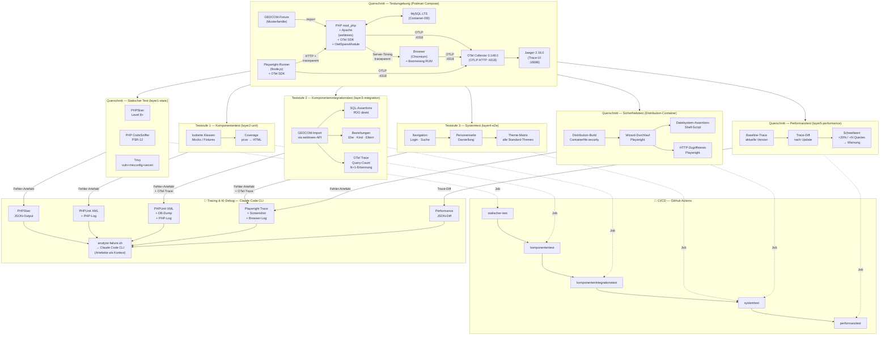

<!-- SPDX-License-Identifier: AGPL-3.0-or-later -->

# Designentscheidungen — webtrees-testing-platform

Dieses Dokument ist Teil der Teststrategie-Dokumentation der webtrees-testing-platform.
Es enthält die 35 getroffenen Designentscheidungen, die Zuordnung der projektinternen
Layer-Struktur zu ISTQB-Teststufen und -Querschnitten sowie das Architektur-Diagramm
des Gesamtstacks. Die ISTQB-Terminologie (Glossar de_DE v4.7.1) ist durchgängig führend.

**Verwandte Dokumente:**

- [Infrastruktur-Entscheidungen](tp_infrastructure_spec.md) — N1–N7 Infrastruktur-Entscheidungen und Container-Stack-Spezifikation
- [Feature-Matrizen](tds_conditions_ref.md) — Testbedingungen (Feature-Matrizen G/S/P/SEC/E/A/K), RE-Methodik, Domänenbeschreibungen
- [Testkonventionen](tp_conventions_spec.md) — AAA-Pattern, FIRST-Prinzipien, Namenskonvention, Data Provider, Verfolgbarkeit
- [Risiken und Fehlermanagement](tp_risks_spec.md) — Produktrisiken, Projektrisiken, bekannte Fehler
- [Überdeckungsstrategie](tp_ratchet_spec.md) — Ratchet, Endekriterien pro Teststufe
- [Testentwurfsverfahren](tds_methodik_spec.md) — Testorakel, Testfall-Verteilung, Prioritätsverteilung
- [Abdeckungsmatrix](tds_coverage_ref.md) — Teststatus und Rückverfolgbarkeit
- [ISTQB-Glossar](ref_istqb-glossar_ref.md) — 589 Begriffe, de_DE (CC BY 4.0)
- [Webtrees-Glossar](ref_webtrees-glossar_ref.md) — Domänenspezifische Begriffe

---

## Getroffene Designentscheidungen

| Dimension            | Entscheidung                                                                 |
|----------------------|------------------------------------------------------------------------------|
| **Scope**            | webtrees Core (nicht `sitemirror`/eigene Module) — potenzielle Open-Source-Contribution |
| **Auslöser**         | Vor jedem webtrees-Versions-Update (Regressionsschutz)                       |
| **Laufzeitumgebung** | Podman 5.8.1 + podman-compose 1.5.0 (Fedora-nativ, rootless)                |
| **PHP-Version**      | Nur PHP 8.5 (Latest Stable) — keine Vorgängerversionen, unabhängig von webtrees-Core-Support |
| **CI/CD**            | GitHub Actions (Ambition: Contribution zum webtrees-Projekt)                 |
| **Testdaten**        | GEDCOM-Fixture (Musterfamilie) als reproduzierbarer Import                   |
| **DB-Zugriff**       | Direktes SQL gegen Container-DB (MySQL im selben Compose-Stack)              |
| **Systemtest-Framework** | Playwright, Chromium only, rein funktional                                |
| **Theme-Coverage**   | Alle webtrees-Standard-Themes (funktional, kein Visual Regression)           |
| **Performance**      | Relativer Vergleich: Baseline alte Version vs. neue Version, gleiche Fixtures |
| **Reporting**        | HTML (PHPUnit Coverage HTML + Playwright HTML Reporter)                      |
| **Tracing**          | Strukturierte Fehlerartefakte pro Teststufe (Logs, Traces, DB-Dump) — lokal abrufbar |
| **KI-Debug**         | Claude Code CLI als lokales Analyse-Tool bei Testfehler; Artefakte werden als Kontext übergeben |
| **OpenTelemetry**    | Vollständige Trace-Kette über 4 Schichten: Auto-Instrumentation (PDO + PSR-15 + PSR-18), OtelSpansModule (semantische Spans, Server-Timing-Header), Browser-RUM (Boomerang + OTel-Plugin via Apache mod_substitute), Playwright Root-Spans (traceparent-Propagation via page.route()). Protokoll: OTLP HTTP/Protobuf (:4318). Jaeger (2.16.0) lokal (:16686). Deaktivierbar via OTEL_SDK_DISABLED=true. |
| **Code Coverage**    | pcov + php-coveralls (wie webtrees Core selbst)                              |
| **Static Analysis**  | PHPStan + PHPCS (wie webtrees Core selbst) + Trivy (Vulnerability-, Misconfig- und Secret-Scan via Container-Image) |
| **Verzeichnis**      | Eigenständiges Repo (`webtrees-testing-platform`), unabhängig von Deployment-Repo und `smoke-tests/` |
| **Repo-Platzierung** | Eigenständiges Repo (`webtrees-testing-platform`) — für Upstream-Contribution Testcode extrahierbar |
| **RE-Methodik**      | Code-first + Gap-Analyse existierender Tests + GEDCOM-5.5.1-Abgleich         |
| **Prioritäts-Domänen** | GEDCOM Import/Export (23 Testfälle), Suche & Navigation (39 Testfälle)      |
| **Testfall-Format**  | Feature-Matrix: Code-Stelle → Anforderung → Testart → Teststufe → Priorität |
| **Wartbarkeit**      | Höchste Priorität — monatelange Pause darf kein Blocker sein                 |
| **Upstream-Tests**   | Separater Branch im lokalen webtrees-Checkout (`${WEBTREES_SOURCE}`) — Stubs mit echten Tests füllen, als PR an webtrees Core; zunächst redundant, nach Upstream-Akzeptanz rückbaubar |
| **Terminologie**     | ISTQB-Glossar (de_DE) v4.7.1 durchgängig — Komponententest, Komponentenintegrationstest, Systemtest, Testart |
| **Stufenstruktur**   | 3 Teststufen (Komponenten-, Komponentenintegrations-, Systemtest) + Querschnitte (Testumgebung, Statischer Test, Performanztest, CI/CD, OTel, KI-Debug) |
| **Endekriterien**    | Pro Teststufe definiert; Eingangskriterien implizit durch sequentielle Job-Kette |
| **Testorakel**       | 5 Orakelquellen pro Domäne: `demo.ged`, GEDCOM-5.5.1-Standard, DB-Schema, DOM-Selektoren, Baseline-Traces |
| **Fehlermanagement** | CI-Gate (rot = blockiert); Upstream-Fehlerzustände als Issues bei `fisharebest/webtrees` |
| **Risikomanagement** | Produktrisiken tabellarisch (Wahrscheinlichkeit × Auswirkung), Projektrisiken als Prosa |
| **Testentwurfsverfahren** | Pro Domäne: Äquivalenzklassenbildung, Grenzwertanalyse, Entscheidungstabellentest, Anwendungsfall-Test, erfahrungsbasierter Test |
| **Überdeckung**      | Ratchet — Anweisungsüberdeckung (pcov) darf nur steigen; kein absoluter Zielwert |
| **Testkonventionen** | AAA-Pattern, FIRST-Prinzipien, `test_<feature>_<szenario>_<ergebnis>`, Data Provider ab ≥3 Äquivalenzklassen |
| **Verfolgbarkeit**   | `@see`-Annotation mit Feature-Matrix-IDs in Testdateien; bidirektional per `grep` |
| **Sicherheitstest**  | Zwei-Track-Architektur: Fachtest (Dev-Source, Mount) vs. Sicherheitstest (Distribution-ZIP, produktionsidentisch). Eigener Container-Build (`Containerfile.security`), Upstream-Setup-Wizard via Playwright, Dateisystem-Assertions via Shell |

---

## Zuordnung Layer ↔ ISTQB-Teststufe

> Das Projekt verwendet Code-Verzeichnisse (`layer1`–`layer5`) und Makefile-Targets
> als organisatorische Einheiten. Die folgende Tabelle ordnet sie den ISTQB-Teststufen
> und Querschnitten zu. Im gesamten Dokument ist die ISTQB-Terminologie führend;
> Layer-Bezeichnungen stehen in Klammern, wo ein Bezug zum Code nötig ist.

| Code (Makefile / Verzeichnis) | ISTQB-Teststufe / Querschnitt |
|-------------------------------|-------------------------------|
| `layer1-static/` / `make test-static` | Querschnitt — Statischer Test |
| `layer2-unit/` / `make test-unit` | Teststufe 1 — Komponententest |
| `layer3-integration/` / `make test-integration` | Teststufe 2 — Komponentenintegrationstest |
| `layer4-e2e/` / `make test-e2e` | Teststufe 3 — Systemtest |
| `layer5-performance/` / `make test-performance` | Querschnitt — Performanztest |
| `layer4-e2e/tests/security/` + `scripts/security-filesystem-checks.sh` / `make test-security` | Querschnitt — Sicherheitstest |

---

## Mermaid-Diagramm (sofort renderbar)

In [Mermaid Live Editor](https://mermaid.live) oder VS Code / GitHub direkt rendern.

> **Aktuelle Testfall-Zahlen** sind volatil und daher nicht im Diagramm enthalten.
> Stand via `make test-all` oder in den CI-Artefakten des letzten GitHub-Actions-Laufs.
> Trace-Auswertung (4-Stufen-Hierarchie): `make trace-report`.
